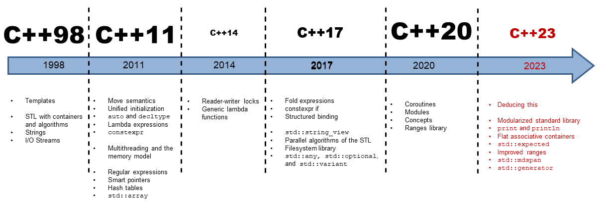

## c++中，到底什么是对象？

 C++ programmers tend to refer to variables as “variables” or “objects” interchangeably.

Most generally, an object is a region of memory that can contain data and has a type.

Some use the term object only to refer to variables or values of class types.

Others distinguish between named and unnamed objects, using the term variable to refer to named objects.

object: A region of memory that has a type. A variable is an object that has a name. 

## 函数传参：指针vs引用

https://stackoverflow.com/questions/114180/pointer-vs-reference

Use pointers if you want to do pointer arithmetic with them (e.g. incrementing the pointer address to step through an array) or if you ever have to pass a NULL-pointer.

Use references otherwise.

## 枚举只对第一个赋值

后面依次累加

## enum/enum class

在C++中，`enum` 和 `enum class` 都用于定义枚举类型，但它们有一些重要的区别。

1. `enum`:
   - 在传统的 `enum` 中，枚举值是在同一个命名空间下的，因此存在命名冲突的风险。
   - `enum` 中的枚举值可以直接被隐式转换为整数，并且在同一作用域内的枚举类型之间可以进行隐式转换。

示例：
```cpp
enum Color {
    RED,
    GREEN,
    BLUE
};
```

2. `enum class`:
   - `enum class` 是在C++11中引入的，它引入了新的作用域规则，枚举值在枚举类型的作用域内，因此不会造成命名冲突。
   - `enum class` 中的枚举值不会被隐式转换为整数，需要显式转换为整数类型。
   - `enum class` 提供了更强的类型安全性，并且不会污染命名空间。

示例：
```cpp
enum class Color {
    RED,
    GREEN,
    BLUE
};
```

总结来说，使用 `enum class` 更加安全，因为它提供了更严格的作用域规则和类型安全性，而传统的 `enum` 则在使用时需要更加小心以避免命名冲突和意外的隐式转换。

## C++中为什么写派生类头文件时对基类不能前置声明而必须包含头文件？

在C++中，派生类的头文件需要包含基类的头文件，而不能只使用前置声明来引用基类。这是因为派生类需要知道基类的具体定义，以便正确地继承基类的成员变量和成员函数。

当你在派生类中包含基类的头文件时，编译器可以确保基类的定义是可用的，并且可以正确地分析派生类与基类之间的关系。这样可以确保派生类能够正确地访问基类的成员，以及正确地重载或覆盖基类的成员函数。

如果只使用前置声明而不包含基类的头文件，编译器在处理派生类时将无法确定基类的具体结构，这样就会导致编译错误或者在链接时出现问题。

因此，为了确保派生类能够正确地继承基类的成员和行为，必须在派生类的头文件中包含基类的头文件。

## c++ 中*&的应用

https://blog.csdn.net/weixin_45650172/article/details/105080470

## c++中dynamic_cast和static_cast在转换指针后是否应判断下是否为空再使用？

在C++中，使用`dynamic_cast`和`static_cast`进行指针转换后，通常需要根据具体情况来判断是否为空再使用。这取决于转换的类型和转换后的使用方式。

1. `dynamic_cast`：
   - 当使用`dynamic_cast`进行指针转换时，如果转换失败（即指针指向的对象类型不匹配），`dynamic_cast`将返回一个空指针（nullptr）。
   - 因此，在使用`dynamic_cast`进行指针转换后，应该始终检查返回的指针是否为空，以确保转换成功，然后再使用转换后的指针。

   ```cpp
   Base* basePtr = new Derived;
   Derived* derivedPtr = dynamic_cast<Derived*>(basePtr);
   if (derivedPtr) {
       // 转换成功，可以安全地使用 derivedPtr
   } else {
       // 转换失败，derivedPtr 为空，不能安全地使用
   }
   ```

2. `static_cast`：
   - 使用`static_cast`进行指针转换时，编译器不会进行运行时类型检查，因此无法保证转换的安全性。如果进行了不安全的类型转换，程序可能会出现未定义的行为。
   - 由于`static_cast`不提供运行时类型检查，转换后的指针不会为空。因此，在使用`static_cast`进行指针转换后，不需要检查返回的指针是否为空。

   ```cpp
   Base* basePtr = new Base;
   Derived* derivedPtr = static_cast<Derived*>(basePtr);
   // 不需要检查 derivedPtr 是否为空
   // 但是需要确保转换的安全性
   ```

总之，在使用`dynamic_cast`进行指针转换后，需要检查返回的指针是否为空，以确保转换的安全性。而在使用`static_cast`进行指针转换后，不需要检查返回的指针是否为空，但需要确保转换的安全性。

## c++中将空指针dynamic_cast会有问题吗？

在C++中，使用`dynamic_cast`对空指针进行类型转换是安全的。`dynamic_cast`会在运行时检查指针所指向的对象的实际类型，并进行相应的转换。如果指针是空指针，`dynamic_cast`会返回空指针，而不会引发任何异常或错误。

例如：

```cpp
#include <iostream>

class Base {
public:
    virtual void foo() {
        std::cout << "Base::foo()" << std::endl;
    }
};

class Derived : public Base {
public:
    void bar() {
        std::cout << "Derived::bar()" << std::endl;
    }
};

int main() {
    Base* basePtr = nullptr;
    Derived* derivedPtr = dynamic_cast<Derived*>(basePtr);
    if (derivedPtr == nullptr) {
        std::cout << "dynamic_cast returned nullptr for a null pointer" << std::endl;
    }
    return 0;
}
```

在上面的示例中，`dynamic_cast`会安全地将空指针`basePtr`转换为`Derived*`类型的指钝`derivedPtr`，并且`derivedPtr`会被设置为`nullptr`。

因此，对于空指针使用`dynamic_cast`是安全的，不会导致任何问题。

## switch语句中必须有default选项吗？

switch语句中不是必须有default选项的。switch语句首先会找满足条件的case值做为执行后面的程序入口，若所有的case都不满足，则找default入口，若未找到则退出整个语句；default只是一个备用入口，有没有都无所谓。

## NULL/nullptr

在C++中，nullptr 是 C++11 标准引入的空指针常量，它是一种特定类型的字面值，可以隐式转换为任意指针类型，而 NULL 则通常被定义为整数 0。nullptr 相比 NULL 有以下几个优势：

1. 类型安全：nullptr 是一种特定的类型，可以隐式转换为任意指针类型，因此在类型安全性上优于 NULL。这意味着在使用 nullptr 时，编译器可以帮助检测指针类型不匹配的错误。

2. 易读性：nullptr 明确表示空指针，而 NULL 可能被定义为整数 0，可能会引起歧义。nullptr 的使用可以使代码更加清晰易懂。

下面是一个简单的例子，说明了 nullptr 相对于 NULL 的优势：

```cpp
#include <iostream>

void foo(char* ptr) {
    std::cout << "Function taking char* pointer\n";
}

void foo(int value) {
    std::cout << "Function taking int value\n";
}

int main() {
    foo(NULL); // 可能会引起歧义，因为NULL可能被定义为整数0
    foo(nullptr); // 明确表示空指针常量，不会引起歧义

    return 0;
}
```

在上面的例子中，如果使用 NULL 调用 foo 函数，可能会引起歧义，因为 NULL 可能被定义为整数 0，导致调用了不希望调用的函数。而使用 nullptr 则能够明确表示空指针，避免了这种歧义。

## 断言assert()函数的使用

https://blog.csdn.net/sanqima/article/details/40832875

## iostream vs stdio

https://www.cnblogs.com/Solstice/archive/2011/07/17/2108715.html

## malloc vs new

https://stackoverflow.com/questions/184537/in-what-cases-do-i-use-malloc-and-or-new

## 异常还是错误码

https://stackoverflow.com/questions/253314/conventions-for-exceptions-or-error-codes

## 短路规则

https://blog.csdn.net/m0_57781693/article/details/129776811

## 模板类与前置声明

在C++中，vector是标准库中的一个模板类，它需要在使用之前进行实例化，而实例化需要知道模板类的定义。因此，如果你想在代码中使用vector，就需要包含`<vector>`头文件以便编译器能够找到vector模板类的定义。

C++中的模板类在使用时需要进行实例化，而实例化需要知道模板类的定义，包括其成员函数和成员变量。如果你尝试对一个模板类进行前置声明而不包含相应的头文件，编译器将无法确定模板类的具体定义，因此会导致编译错误。

因此，为了能够正确地使用vector，你必须包含`<vector>`头文件，以便编译器能够找到并使用vector模板类的定义。

## c++中类的成员变量应设为public还是提供方法去读写？

在 C++ 中，类的成员变量应该根据封装的原则进行设计。封装是面向对象编程中的重要概念，它可以帮助控制对类的成员变量的访问和修改。

一般来说，最好将类的成员变量设为私有（private），并提供公共的方法（成员函数）来读取（get）和设置（set）这些成员变量的值。这种方式可以提供更好的封装性，以及更好的控制和安全性。

例如，对于一个名为 `Person` 的类，可以这样设计：

```cpp
class Person {
private:
    std::string name;
    int age;

public:
    // 公共方法用于读取成员变量的值
    std::string getName() const {
        return name;
    }

    int getAge() const {
        return age;
    }

    // 公共方法用于设置成员变量的值
    void setName(const std::string& newName) {
        name = newName;
    }

    void setAge(int newAge) {
        age = newAge;
    }
};
```

这样设计的好处是，可以控制对成员变量的访问，同时在必要的时候可以添加一些逻辑来确保成员变量的合法性。

当然，并不是所有成员变量都需要通过公共方法进行读写，有些情况下，成员变量可以直接设为公共的（public），这通常用于一些非敏感的数据结构或者为了方便访问而设计的数据成员。

## 介绍下C++中的友元类

在C++中，友元类是一种特殊的类关系，允许一个类的成员函数或整个类访问另一个类的私有或受保护成员。通过将一个类声明为另一个类的友元，可以在友元类中访问该类的私有成员，从而实现更灵活的数据封装和访问控制。

要声明一个类为另一个类的友元，可以在类的定义中使用 `friend` 关键字。例如：

```cpp
class B; // 前向声明类B

class A {
public:
    friend class B; // 声明B为A的友元类
private:
    int privateData;
};
```

在上面的例子中，类A声明了类B为友元类，这意味着类B的成员函数可以访问类A的私有成员。

下面是一个更完整的示例，演示了如何使用友元类：

```cpp
class B; // 前向声明类B

class A {
public:
    A(int data) : privateData(data) {}

    friend class B; // 声明B为A的友元类

private:
    int privateData;
};

class B {
public:
    void accessA(A& a) {
        // 友元类B可以访问类A的私有成员privateData
        std::cout << "B accessing A's private data: " << a.privateData << std::endl;
    }
};

int main() {
    A objA(5);
    B objB;
    objB.accessA(objA); // B通过友元关系访问A的私有成员
    return 0;
}
```

在上面的示例中，类B被声明为类A的友元类，因此类B的成员函数`accessA`可以访问类A的私有成员`privateData`。

需要注意的是，友元关系是单向的，即如果类A声明类B为友元类，那么只有类B可以访问类A的私有成员，反之不成立。友元关系打破了类的封装性，因此应该谨慎使用，以避免破坏类的封装和数据隐藏原则。

## c++版本



`__cplusplus` 是一个预定义的宏，用于在 C++ 程序中表示编译器所遵循的 C++ 标准的版本号。这个宏的值是一个整数，代表编译器所遵循的 C++ 标准的年份。通过检查 `__cplusplus` 的值，可以在代码中进行条件编译，以确保代码在不同版本的 C++ 标准下能够正确编译和执行。

例如，C++98 标准中，`__cplusplus` 的值为 199711；C++11 中，值为 201103；C++14 中，值为 201402；C++17 中，值为 201703；C++20 中，值为 202002。

这个宏通常用于在代码中进行条件编译，以便根据不同的 C++ 标准版本采取不同的行为或使用不同的语言特性，从而确保代码的兼容性和可移植性。

## c++中的vector应该怎么翻译成中文？

在C++中，"vector" 通常被翻译为 "向量" 或 "动态数组"。这两个翻译都是比较常见的，具体选择取决于上下文和你的偏好。一般而言，"向量"更接近其数学含义，而"动态数组"更直观地描述了其在编程中的作用。因此，你可以根据具体情境选择适合的翻译。

## 异常处理
https://zhiruili.github.io/posts/cpp-error-handling/

https://isocpp.org/wiki/faq/exceptions

https://learn.microsoft.com/en-us/cpp/cpp/errors-and-exception-handling-modern-cpp?view=msvc-170

https://learn.microsoft.com/zh-cn/cpp/cpp/errors-and-exception-handling-modern-cpp?view=msvc-170

## COM编程与C++的关系
COM（Component Object Model，组件对象模型）是微软开发的一种用于构建软件组件的技术规范，它允许不同软件模块以二进制形式进行交互和重用。C++与COM的关系密切，主要体现在以下几个方面：

### 1. COM的基础概念

**接口（Interface）：** COM组件通过接口来暴露其功能，接口是抽象类，包含纯虚函数。每个接口都有一个唯一的标识符（IID）。

**对象（Object）：** COM对象是实现了一个或多个COM接口的类实例。

**类工厂（Class Factory）：** 用于创建COM对象的实例，通常实现`IClassFactory`接口。

**参考计数（Reference Counting）：** COM对象的生命周期通过引用计数管理，典型接口`IUnknown`提供`AddRef`和`Release`方法。

### 2. C++在COM中的应用

C++是实现COM组件和客户端的主要编程语言之一。原因如下：

**抽象与封装：** C++的类和继承机制非常适合实现COM的接口和对象模型。

**效率：** C++生成的二进制代码效率高，适合COM要求的高性能场景。

**语言支持：** C++通过微软的IDL（接口定义语言）工具和ATL（Active Template Library）库提供对COM的直接支持。

### 3. 实现COM组件的C++步骤

**定义接口：** 使用IDL定义接口，然后通过MIDL编译器生成C++头文件和类型库。

**实现接口：** 在C++中实现接口的具体功能。

**引用计数管理：** 在实现的类中管理引用计数。

**注册组件：** 在Windows注册表中注册COM组件，使其可供客户端查找。

### 4. 例子

下面是一个简单的C++ COM组件示例代码：

```cpp
#include <windows.h>
#include <unknwn.h> // For IUnknown

// 定义一个简单的COM接口
interface IMyInterface : public IUnknown
{
    virtual HRESULT __stdcall MyMethod() = 0;
};

// 实现该接口的COM对象
class MyComObject : public IMyInterface
{
private:
    long m_refCount;

public:
    MyComObject() : m_refCount(1) {}

    // IUnknown methods
    HRESULT __stdcall QueryInterface(REFIID riid, void **ppvObject)
    {
        if (riid == IID_IUnknown || riid == __uuidof(IMyInterface))
        {
            *ppvObject = static_cast<IMyInterface *>(this);
            AddRef();
            return S_OK;
        }
        *ppvObject = nullptr;
        return E_NOINTERFACE;
    }

    ULONG __stdcall AddRef()
    {
        return InterlockedIncrement(&m_refCount);
    }

    ULONG __stdcall Release()
    {
        long refCount = InterlockedDecrement(&m_refCount);
        if (refCount == 0)
        {
            delete this;
        }
        return refCount;
    }

    // IMyInterface method
    HRESULT __stdcall MyMethod()
    {
        // 实现具体方法逻辑
        return S_OK;
    }
};
```

### 5. 客户端代码

使用C++调用COM组件的代码：

```cpp
#include <windows.h>
#include <combaseapi.h> // For CoCreateInstance

int main()
{
    CoInitialize(nullptr);

    IMyInterface* pMyInterface = nullptr;
    HRESULT hr = CoCreateInstance(
        CLSID_MyComObject,
        nullptr,
        CLSCTX_INPROC_SERVER,
        IID_IMyInterface,
        (void**)&pMyInterface
    );

    if (SUCCEEDED(hr))
    {
        pMyInterface->MyMethod();
        pMyInterface->Release();
    }

    CoUninitialize();
    return 0;
}
```

### 总结

C++与COM紧密结合，通过C++实现和调用COM组件非常普遍。C++的高性能、语言特性及其与Windows操作系统的紧密结合，使其成为开发COM组件和客户端的重要工具。通过了解COM的基本概念和C++实现方法，开发者可以有效利用COM技术进行组件化和模块化开发。

## 为什么COM使用HRESULT作为错误码而不是用C++的异常？
COM（组件对象模型）选择使用HRESULT而不是C++的异常来表示错误码，主要有以下几个原因：

### 1. 语言无关性

**跨语言兼容：** COM的设计目标之一是实现跨语言的组件互操作性。不同编程语言对异常的处理机制各不相同，而HRESULT作为一个整数返回值，可以被任何编程语言轻松解析和处理。这样，COM组件可以在C++、C#、VB等多种编程语言中使用，而无需担心语言之间的异常处理兼容性。

### 2. 二进制兼容性

**二进制标准：** COM定义了一套二进制标准，确保不同组件可以在二进制级别上互操作。异常处理机制在不同编译器和不同编程语言之间可能会有差异，而HRESULT作为一个简单的整数类型，能够保证二进制兼容性。这种设计可以避免因不同编译器对异常处理机制的实现差异而导致的兼容性问题。

### 3. 性能考虑

**低开销：** HRESULT的使用避免了异常处理带来的开销。在C++中，异常处理涉及到栈展开和栈回滚等操作，可能会影响性能。特别是在频繁调用的接口中，使用HRESULT可以显著降低性能开销。

### 4. 简单明了

**明确的错误处理：** HRESULT是一种明确的错误处理机制，每个HRESULT值都代表一种特定的错误或状态。通过检查返回的HRESULT值，调用者可以明确地知道操作是否成功以及失败的原因。而异常机制有时会导致代码结构复杂化，增加理解和维护的难度。

### 5. 历史原因

**设计初衷：** COM技术在20世纪90年代初期设计，当时C++异常机制尚未成熟和广泛使用。设计者选择使用HRESULT这种简单直接的方式来进行错误处理。

### 示例代码

以下是一个示例，展示了如何在COM接口和C++客户端代码中使用HRESULT：

**COM接口实现：**

```cpp
#include <windows.h>
#include <unknwn.h> // For IUnknown

interface IMyInterface : public IUnknown
{
    virtual HRESULT __stdcall MyMethod() = 0;
};

class MyComObject : public IMyInterface
{
private:
    long m_refCount;

public:
    MyComObject() : m_refCount(1) {}

    // IUnknown methods
    HRESULT __stdcall QueryInterface(REFIID riid, void **ppvObject)
    {
        if (riid == IID_IUnknown || riid == __uuidof(IMyInterface))
        {
            *ppvObject = static_cast<IMyInterface *>(this);
            AddRef();
            return S_OK;
        }
        *ppvObject = nullptr;
        return E_NOINTERFACE;
    }

    ULONG __stdcall AddRef()
    {
        return InterlockedIncrement(&m_refCount);
    }

    ULONG __stdcall Release()
    {
        long refCount = InterlockedDecrement(&m_refCount);
        if (refCount == 0)
        {
            delete this;
        }
        return refCount;
    }

    // IMyInterface method
    HRESULT __stdcall MyMethod()
    {
        // 模拟成功的操作
        return S_OK;
    }
};
```

**C++客户端代码：**

```cpp
#include <windows.h>
#include <combaseapi.h> // For CoCreateInstance
#include <iostream>

int main()
{
    CoInitialize(nullptr);

    IMyInterface* pMyInterface = nullptr;
    HRESULT hr = CoCreateInstance(
        CLSID_MyComObject,
        nullptr,
        CLSCTX_INPROC_SERVER,
        IID_IMyInterface,
        (void**)&pMyInterface
    );

    if (SUCCEEDED(hr))
    {
        hr = pMyInterface->MyMethod();
        if (SUCCEEDED(hr))
        {
            std::cout << "MyMethod succeeded!" << std::endl;
        }
        else
        {
            std::cout << "MyMethod failed with HRESULT: " << hr << std::endl;
        }
        pMyInterface->Release();
    }
    else
    {
        std::cout << "CoCreateInstance failed with HRESULT: " << hr << std::endl;
    }

    CoUninitialize();
    return 0;
}
```

### 总结

COM使用HRESULT而不是C++异常来表示错误码，主要是为了保证语言无关性、二进制兼容性、性能和简单明了的错误处理机制。这种设计使得COM组件可以在多种编程语言和环境中稳定、高效地运行。

## dynamic_pointer_cast
- 适用于智能指针
- 专门用于shared_ptr

## 范围accumulate
`[CG] ES.1`

## C++数组初始化方式
在C++中，不能直接使用`int arr[5] = 0;`来初始化数组。这个语法是不合法的，会导致编译错误。因为数组初始化要求一个初始化列表或大括号来指定每个元素的值。

如果你想将整个数组初始化为零，你可以使用以下两种常见的方法：

### 1. 使用大括号初始化为零
这是最直接和常用的方法：
```cpp
int arr[5] = {0}; // 只需将第一个元素初始化为 0，其余元素会自动初始化为 0
```

### 2. 使用大括号进行默认初始化
你也可以省略初始化列表，这会将所有元素都初始化为零：
```cpp
int arr[5] = {}; // 所有元素都会被初始化为 0
```

这两种方式都是合法的，并且会将数组的所有元素初始化为零。

## C++什么情况下会触发移动构造函数和移动赋值函数？
在C++中，移动构造函数和移动赋值函数用于优化对象的拷贝操作，特别是当对象持有动态分配的资源（如内存、文件句柄等）时。移动语义允许资源的所有权从一个对象“移动”到另一个对象，而不是深度拷贝资源，从而提高程序的效率。

### 1. 移动构造函数

**移动构造函数**在以下几种情况下被触发：

- **直接创建新对象时**：如果使用`std::move`将一个对象转化为右值引用，并将其传递给另一个对象的构造函数，如下所示：

  ```cpp
  std::vector<int> vec1 = {1, 2, 3};
  std::vector<int> vec2 = std::move(vec1); // 触发移动构造函数
  ```

- **返回本地对象时**：当一个函数返回一个局部对象时，如果该局部对象支持移动语义，并且编译器可以优化该操作（例如通过返回值优化 (RVO)），移动构造函数可能会被调用。

  ```cpp
  std::vector<int> createVector() {
      std::vector<int> vec = {1, 2, 3};
      return vec; // 可能触发移动构造函数（或者通过RVO直接优化）
  }
  ```

### 2. 移动赋值函数

**移动赋值函数**在以下几种情况下被触发：

- **对象赋值时**：当将一个右值引用对象赋值给另一个对象时，移动赋值函数会被调用。

  ```cpp
  std::vector<int> vec1 = {1, 2, 3};
  std::vector<int> vec2;
  vec2 = std::move(vec1); // 触发移动赋值函数
  ```

- **容器内对象重分配时**：如果容器（如`std::vector`）在增加元素时触发重新分配，且容器内的元素支持移动语义，则可能会调用移动赋值函数。

  ```cpp
  std::vector<std::vector<int>> vecs;
  vecs.push_back({1, 2, 3}); // 可能触发内部元素的移动赋值函数
  ```

### 总结

- **移动构造函数**在创建对象时触发，用于“搬走”一个临时对象或不再使用的对象的资源。
- **移动赋值函数**在赋值操作中触发，用于“搬走”一个对象的资源到另一个已经存在的对象中。

这两者都是通过`std::move`显式地将左值转化为右值引用来启用的，编译器也可能在某些情况下自动选择使用移动语义（如临时对象、函数返回值等）。

## 右值引用有什么用？
右值引用（rvalue reference）是C++11引入的一种新引用类型，用于优化资源管理和提高程序性能。它主要用于实现移动语义（move semantics）和完美转发（perfect forwarding）。

### 右值引用的用途

1. **移动语义（Move Semantics）：**
   传统上，C++中的对象通常通过复制语义进行传递和返回（例如拷贝构造函数和拷贝赋值运算符）。当对象包含大量资源（如动态分配的内存、大型数组等）时，复制操作可能会非常昂贵，涉及深拷贝，降低程序性能。

   右值引用允许我们实现移动语义，这意味着我们可以“移动”资源而不是复制资源。例如，当对象是右值（即临时对象，不再需要保留其资源）时，我们可以将对象的资源“窃取”过来，而不是重新分配和复制资源。

   这是通过C++11中引入的**移动构造函数**和**移动赋值运算符**来实现的。它们使用右值引用作为参数，从而有效地“移动”资源，而不是复制它们。

   ```cpp
   class MyClass {
   public:
       // 移动构造函数
       MyClass(MyClass&& other) noexcept {
           this->data = other.data;
           other.data = nullptr; // 将临时对象的资源置空
       }
   
       // 移动赋值运算符
       MyClass& operator=(MyClass&& other) noexcept {
           if (this != &other) {
               delete[] this->data;
               this->data = other.data;
               other.data = nullptr; // 将临时对象的资源置空
           }
           return *this;
       }
   
   private:
       int* data;
   };
   ```

2. **完美转发（Perfect Forwarding）：**
   在模板编程中，编写一个函数模板，使得它能够接受任意参数并将这些参数完美地传递给另一个函数时，会遇到“转发问题”。简单的传递可能会导致值类别（左值或右值）信息的丢失，导致意外的性能损失或错误的函数重载解析。

   右值引用结合C++11中的`std::forward`可以实现完美转发，它可以确保参数的值类别被正确传递，从而保留参数的原始属性。

   ```cpp
   template<typename T>
   void wrapper(T&& arg) {
       // 完美转发arg到另一个函数
       someFunction(std::forward<T>(arg));
   }
   ```

### 什么时候会用到右值引用？

- 当你需要实现一个高效的对象传递方式，避免不必要的深拷贝时。
- 当你在设计接口时，需要确保参数的精确转发和值类别的保持时。

右值引用通过优化资源管理和提高程序效率，在现代C++编程中起到了非常重要的作用。

## 介绍下C++中的转发引用以及它的好处
转发引用（Forwarding Reference）是C++11中引入的一种引用类型，用于实现**完美转发（Perfect Forwarding）**。转发引用与传统的左值引用和右值引用不同，它具有非常灵活的特性。

### 1. 转发引用的定义

转发引用的语法如下：

```cpp
template<typename T>
void func(T&& param);
```

其中`T&&`在模板参数上下文中被称为转发引用。这种引用的特性使得`param`可以绑定到左值或右值。

**关键点**：
- 当传入的是左值，`T`被推导为左值引用类型`T&`，此时`T&&`会被折叠成`T& &`，即`T&`（左值引用）。
- 当传入的是右值，`T`被推导为非引用类型`T`，此时`T&&`就是一个右值引用。

### 2. 完美转发

完美转发的主要作用是在函数模板中将函数参数完全按照原来的类型（左值或右值）转发给另一个函数，而不会改变其值类别。

例如：

```cpp
#include <utility>

template<typename T>
void wrapper(T&& arg) {
    process(std::forward<T>(arg)); // 完美转发
}

void process(int& x) {
    std::cout << "左值引用" << std::endl;
}

void process(int&& x) {
    std::cout << "右值引用" << std::endl;
}

int main() {
    int a = 5;
    wrapper(a);          // 调用process(int&)，输出 "左值引用"
    wrapper(5);          // 调用process(int&&)，输出 "右值引用"
}
```

在上面的例子中，`std::forward<T>(arg)`用于保持`arg`的原始类型特性。如果`arg`是左值，它会被传递为左值；如果是右值，则会作为右值传递。

### 3. 转发引用的好处

1. **实现高效的泛型代码**：通过转发引用，模板函数能够高效处理不同类型的参数（包括左值和右值），减少不必要的拷贝或移动操作。
   
2. **保持值类别**：通过完美转发，函数可以根据参数的实际值类别（左值或右值）选择最合适的操作，避免意外的性能损失。

3. **提高代码灵活性**：使用转发引用可以编写更加通用的函数模板，使得代码更加灵活和可重用。

### 4. 注意事项

- **与右值引用的区别**：转发引用仅在模板参数推导过程中才有特殊行为；如果`T`是显式指定的（而非通过推导得到），那么`T&&`就变成了普通的右值引用。
- **`std::forward` 的使用**：为了实现完美转发，必须结合`std::forward`来使用，否则将丧失转发引用的优势。

转发引用是C++11中一个强大的工具，它结合了模板和右值引用的优势，使得编写高效的泛型代码成为可能。在现代C++开发中，理解并正确使用转发引用对于提高代码的性能和灵活性非常重要。

## 介绍下C++中的initializer_list及其用途
在C++中，`initializer_list`是一个模板类，用于表示一个常量数组的简单包装器。它提供了一种类型安全的方法来处理初始化列表（initializer list），例如用花括号 `{}` 包围的值列表。`initializer_list` 通常用于构造函数、函数参数以及容器的初始化。

### `initializer_list` 的定义

`initializer_list` 是定义在头文件 `<initializer_list>` 中的类模板。它的定义大致如下：

```cpp
namespace std {
    template<class T>
    class initializer_list {
    public:
        //类型别名
        using value_type = T;
        using reference = const T&;
        using const_reference = const T&;
        using size_type = size_t;

        //构造函数
        initializer_list() noexcept; 

        //常用成员函数
        size_type size() const noexcept;
        const T* begin() const noexcept;
        const T* end() const noexcept;
    };
}
```

### `initializer_list` 的用途

1. **函数参数初始化：**
   使用 `initializer_list` 作为函数参数，允许函数接受一个初始值列表。常见的用例包括实现类似“可变参数”的功能，但类型是固定的。例如：

   ```cpp
   #include <initializer_list>
   #include <iostream>

   void printNumbers(std::initializer_list<int> nums) {
       for (auto num : nums) {
           std::cout << num << " ";
       }
       std::cout << std::endl;
   }

   int main() {
       printNumbers({1, 2, 3, 4, 5}); // 输出: 1 2 3 4 5
       return 0;
   }
   ```

2. **构造对象时的初始化：**
   `initializer_list` 可以用于类的构造函数，允许对象以初始值列表的形式进行初始化。例如：

   ```cpp
   #include <initializer_list>
   #include <iostream>
   #include <vector>

   class MyClass {
   public:
       MyClass(std::initializer_list<int> initList) {
           for (auto i : initList) {
               data.push_back(i);
           }
       }

       void print() {
           for (auto i : data) {
               std::cout << i << " ";
           }
           std::cout << std::endl;
       }

   private:
       std::vector<int> data;
   };

   int main() {
       MyClass obj = {1, 2, 3, 4, 5};
       obj.print(); // 输出: 1 2 3 4 5
       return 0;
   }
   ```

3. **容器的初始化：**
   `initializer_list` 还可以用于标准库容器（如 `std::vector`, `std::set`, `std::map` 等）的初始化，使它们可以以更简洁的方式进行初始化。

   ```cpp
   #include <vector>
   #include <iostream>

   int main() {
       std::vector<int> vec = {1, 2, 3, 4, 5}; // 使用 initializer_list 初始化
       for (const auto& v : vec) {
           std::cout << v << " ";
       }
       std::cout << std::endl; // 输出: 1 2 3 4 5
       return 0;
   }
   ```

### `initializer_list` 的特点

- **类型安全：** `initializer_list` 提供了一种类型安全的方式来初始化对象。
- **只读性：** `initializer_list` 中的元素是常量，因此无法修改其内容。
- **简洁性和可读性：** 使用 `initializer_list` 可以使初始化代码更加简洁和可读。

### 注意事项

- `initializer_list` 只是一个简单的数组包装器，不会持有其元素的所有权。它存储的指针指向由编译器管理的内存。
- 由于是常量引用的语义，`initializer_list` 只能用于读取，而不能用于修改。

总结来说，`initializer_list` 是C++11引入的一种用于简化对象初始化和函数参数传递的机制，使得代码更加简洁和直观，同时提供了类型安全的保障。

## 派生类的析构函数有必要声明为override吗？
在C++中，派生类的析构函数通常被声明为`override`，尽管这不是强制性的。让我们详细探讨这个问题。

### 1. `override`关键字的作用
`override`关键字用于明确表示派生类的某个成员函数是要覆盖其基类中的虚函数。它是C++11引入的一个语法特性，用来提高代码的可读性和安全性。

- **语法检查**：编译器会检查派生类的函数是否真的在基类中有一个具有相同签名的虚函数。如果没有，编译器会报错。这有助于避免由于函数签名错误或其他意外问题导致的覆盖失败。

- **意图明确**：使用`override`可以让代码的读者清楚地知道这个函数是有意覆盖基类中的虚函数的。

### 2. 析构函数中的`override`

虽然析构函数通常是用来在对象销毁时进行清理工作的，但它在继承体系中起到了非常重要的作用。正如前面所述，如果基类的析构函数是虚函数，派生类的析构函数也会自动成为虚函数，即使不显式声明`override`，编译器也会认为它是对基类虚析构函数的覆盖。

因此，在以下情况下，派生类的析构函数应该声明为`override`：

- **清晰表达覆盖关系**：尽管析构函数在基类中已经被声明为虚函数，显式地使用`override`可以明确表示这是对基类虚析构函数的覆盖，增加代码的可读性和维护性。

### 3. 示例

```cpp
class Base {
public:
    virtual ~Base() {
        std::cout << "Base Destructor" << std::endl;
    }
};

class Derived : public Base {
public:
    ~Derived() override {  // 使用 override 明确表示覆盖关系
        std::cout << "Derived Destructor" << std::endl;
    }
};
```

在这个例子中，派生类的析构函数用`override`进行了标记。虽然即使不使用`override`，析构函数的行为也会正常工作，但使用`override`能让代码更清晰且易于维护。

### 总结

将派生类的析构函数声明为`override`并不是必须的，但却是一种推荐的做法。它可以帮助你在代码中更好地表达意图，避免潜在的覆盖问题，并提高代码的可读性和安全性。因此，尽管析构函数默认会覆盖基类的虚析构函数，但最好显式地使用`override`关键字。

## 类成员函数中的静态变量是怎么的逻辑？
在C++中，类的成员函数中可以使用静态变量。静态变量的生命周期从程序开始到程序结束，而它们的作用域则仅限于声明它们的函数内部。也就是说，类成员函数中的静态变量和普通函数中的静态变量行为类似，但它们在面向对象的编程中有着特殊的应用场景。

### 类成员函数中的静态变量

1. **定义与初始化**：
   - 类成员函数中的静态变量只在第一次调用该函数时初始化，而后续的函数调用将不会再次初始化该静态变量。
   - 这个静态变量在整个程序执行期间保持其值，即使函数多次调用也不改变其生命周期。

2. **作用域**：
   - 静态变量的作用域仅限于声明它们的成员函数内部，这意味着它们不能在函数外部访问。
   - 但是，由于它们在整个程序执行期间持续存在，函数的每次调用都会访问相同的静态变量。

3. **例子**：

```cpp
#include <iostream>

class Counter {
public:
    void count() {
        static int counter = 0;  // 静态局部变量
        counter++;
        std::cout << "Counter: " << counter << std::endl;
    }
};

int main() {
    Counter c1, c2;

    c1.count();  // 输出1
    c2.count();  // 输出2
    c1.count();  // 输出3

    return 0;
}
```

### 逻辑分析

- 在上面的例子中，`Counter`类的成员函数`count`包含一个静态局部变量`counter`。该变量只在第一次调用`count`函数时初始化为0，后续调用该函数时不会重新初始化。
  
- 每次调用`count`函数时，`counter`的值都会递增，并且值会在函数调用之间保持不变。即使是通过不同的对象（例如`c1`和`c2`）调用该函数，`counter`变量也是共享的，因为它是静态的。

- 这表明静态变量与类的对象无关，它们与函数本身绑定。这种特性在需要在多个对象之间共享某些状态时非常有用。

### 应用场景

- **计数器**：正如上例所示，静态变量常用于实现计数器，这些计数器可以跨多个函数调用累积值。
  
- **缓存**：静态变量可以用于在类成员函数中缓存某些计算结果，从而避免重复计算，提高效率。

- **唯一实例控制**：静态变量还可以用于实现单例模式，控制某个类的唯一实例。

### 总结

类成员函数中的静态变量在C++中提供了一种在面向对象编程中维护状态的方式。它们在函数调用之间保持值不变，且在类的所有实例间共享，有助于实现全局计数、缓存等功能。理解它们的使用逻辑对于编写高效的C++代码非常重要。

## C++函数声明返回值前的const有意义吗？
在C++中，函数声明时返回值前的 `const` 关键字是否有意义，取决于返回值的类型。

### 1. 返回**值类型**（非指针、非引用）

```cpp
const int foo();
```

在这种情况下，`const` 修饰返回值是**没有意义的**。函数返回的值是一个临时对象，无法直接修改，因此即使没有 `const` 限定，它也是不可修改的。加上 `const` 并不能增加额外的限制或影响代码的行为。

例如：

```cpp
int foo() {
    return 42;
}
```

上面的 `foo()` 返回一个 `int`，即便没有加 `const`，调用方依然不能修改返回的临时值，因为它本身是只读的。

### 2. 返回**引用类型**

```cpp
const int& foo();
```

在这种情况下，`const` 是**有意义的**。`const` 修饰符意味着调用该函数时，返回的引用对象不能被修改。如果函数返回的是一个对象的引用，并且不希望调用者修改它，那么 `const` 就是必须的。

例如：

```cpp
const int& foo() {
    static int value = 42;
    return value;
}

int& bar() {
    static int value = 42;
    return value;
}
```

- 调用 `foo()` 会返回对 `value` 的 `const` 引用，无法通过返回的引用修改 `value`。
- 调用 `bar()` 则返回一个可修改的引用，允许调用者修改 `value`。

```cpp
foo() = 10; // 错误，无法修改 const int&
bar() = 10; // 正确，修改了 value
```

### 3. 返回**指针类型**

```cpp
const int* foo();
```

这里 `const` 的作用是表明返回的指针指向的对象是常量，不能通过该指针修改对象的值。它的含义和引用类型类似，保护了指针指向的数据。

```cpp
int value = 42;
const int* p = foo(); // p 指向 const int，不能修改值
*p = 10; // 错误，不能通过 p 修改指向的值
```

### 总结

- 如果返回类型是**值类型**，如 `int`，`const` 前缀没有意义，因为返回的临时对象本身就是不可修改的。
- 如果返回类型是**引用**或**指针类型**，则 `const` 可以保护返回的对象，防止调用者修改它。在这种情况下，`const` 是有意义的。

## 函数返回智能指针加const的意义
在 C++ 中，返回智能指针时，`const` 修饰符对返回值的影响也取决于智能指针的类型以及是否希望限制调用方对智能指针本身或其所指向对象的操作。以下是具体情况：

### 1. 返回 `std::shared_ptr` 或 `std::unique_ptr` 的情况

如果函数返回值类型是 **智能指针的值类型**，例如 `std::shared_ptr<T>` 或 `std::unique_ptr<T>`，则在返回类型前加上 `const` 没有实际意义：

```cpp
const std::shared_ptr<int> foo();
```

在这种情况下，`const` 限制了返回的智能指针本身，即调用方不能对这个智能指针进行修改，例如重新赋值，但这对智能指针的实际用途意义不大。调用方仍然可以使用返回的智能指针来修改其所指向的对象。

```cpp
auto ptr = foo();   // foo() 返回 const std::shared_ptr<int>
*ptr = 20;          // 可以修改指向的值
ptr = nullptr;      // 错误：ptr 为 const std::shared_ptr<int>，不能重新赋值
```

因此，对值类型的智能指针加上 `const` 在函数返回类型时并没有很强的实际意义，因为一般不会对返回的智能指针对象本身进行修改（例如重新赋值）。

### 2. 返回 `std::shared_ptr<const T>` 或 `std::unique_ptr<const T>`

如果希望智能指针返回后指向的对象不能被修改，可以使用 `const` 来修饰智能指针所指向的类型：

```cpp
std::shared_ptr<const int> foo();
```

这种声明方式比将智能指针本身声明为 `const` 更常用且有意义，因为它确保了调用方无法修改指针指向的对象。即使调用方能够复制这个智能指针或重新赋值智能指针变量，也无法通过该智能指针修改所指向的对象。

例如：

```cpp
auto ptr = foo();   // foo() 返回 std::shared_ptr<const int>
*ptr = 20;          // 错误：指向的对象是 const int，不能修改
```

### 3. 使用 `const` 的 `std::shared_ptr` 或 `std::unique_ptr` 引用

智能指针通常不会返回引用，但假如智能指针是通过引用返回，并且希望不允许调用者修改智能指针本身的引用，可以将返回类型声明为 `const` 引用类型：

```cpp
const std::shared_ptr<int>& foo();
```

这样，调用者可以通过引用访问智能指针，但无法改变智能指针本身（如重新赋值）。不过这种情况比较少见，因为智能指针通常通过值返回，以便管理其生命周期并避免潜在的悬空引用。

### 总结

- **直接将返回的智能指针声明为 `const`**：这种做法通常意义不大，因为智能指针通常是通过值返回的，不会对返回的指针对象本身进行赋值操作。
- **将智能指针声明为指向 `const` 类型**：这是更有意义的做法，可防止调用方修改所指向的对象。
- **使用 `const` 引用返回智能指针**：这在某些场景下有效，但很少见，因为智能指针的生命周期管理通常更适合值传递。


