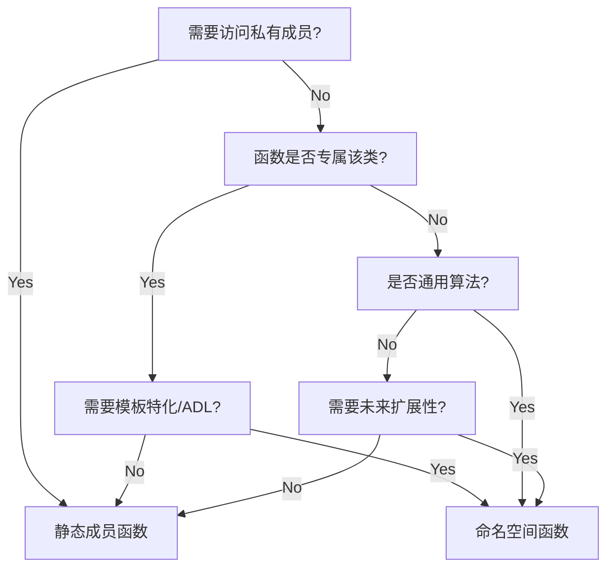

## delete后要不要set null

https://blog.csdn.net/goof/article/details/8212156 我认为悬挂指针不应该被使用

------

c++中在析构函数中内存释放后是否要将指针置为空？

https://stackoverflow.com/questions/3060006/is-it-worth-setting-pointers-to-null-in-a-destructor

有争议

------

C++ Primer关于此问题：在指针即将要离开其作用域之前释放掉它所关联的内存; 如果我们需要保留指针，可以在delete后将nullptr赋予指针。

## C++宏 `#` 的使用

`#` 构串操作符: 将#右边内容转化为字符串

##合并操作符: ##左右直接拼接

## C++中的dynamic_cast和dynamic_pointer_cast

https://blog.csdn.net/jiayizhenzhenyijia/article/details/98209529

## 人为制造一个异常

std::string().at(1); 

## c++万能头文件

 `#include<bits/stdc++.h>`

## 初始化列表顺序问题

剑指offer

101 C47

CCG  C47

## 类的成员是否都要初始化

https://stackoverflow.com/questions/33124542/should-constructor-initialize-all-the-data-members-of-the-class

(Simple) Every constructor should initialize every member variable (either explicitly, via a delegating ctor call or via default construction)

(Simple) Default arguments to constructors suggest an in-class initializer might be more appropriate.

## C++mutable

https://blog.csdn.net/weixin_51684362/article/details/131364670

## 在删除之前是否有任何理由检查 NULL 指针？

https://stackoverflow.com/questions/615355/is-there-any-reason-to-check-for-a-null-pointer-before-deleting

## auto

https://herbsutter.com/2013/08/12/gotw-94-solution-aaa-style-almost-always-auto/

## heap corruption detected after normal block

可能是头文件不同步造成的

## `c.erase( remove( c.begin(), c.end() ,value ) );`

这行代码看起来像是C++中用于从容器中删除特定值的代码。让我解释一下：

```cpp
c.erase( std::remove(c.begin(), c.end(), value), c.end() );
```

这行代码的作用是从容器 `c` 中删除所有等于 `value` 的元素。这是通过结合使用 `std::remove` 和 `erase` 函数来实现的。

`std::remove` 函数实际上并不会真正删除元素，它会将所有等于 `value` 的元素移动到容器的末尾，并返回一个指向新的逻辑结尾之后的位置的迭代器。然后， `erase` 函数会使用这个迭代器，将从这个位置开始的所有元素都从容器中删除。

因此，这行代码的效果是将容器中所有等于 `value` 的元素移动到末尾，然后将它们从容器中删除，最终容器中不再包含任何等于 `value` 的元素。

## `vector<int>().swap( c );`

这行代码的作用是将名为c的vector对象清空并释放其内存，这样可以有效地回收vector占用的内存空间。通常情况下，使用 `clear()` 函数可以清空vector对象，但是它不会释放vector占用的内存，因此在处理大型vector时， `clear()` 可能会导致内存占用过高。

相比之下， `vector<int>().swap(c)` 的方式更加高效，因为它会创建一个临时的匿名vector对象，然后通过swap操作将其和c交换，这会导致c的内部数组指针指向了临时对象的数组，而临时对象则接管了c原来的数组指针。随后，临时对象会被销毁，从而释放了原来c所占用的内存。这样一来，c就变成一个空的vector，而且不再占用任何内存。

总的来说， `vector<int>().swap(c)` 的作用是清空vector对象并释放其内存，这在需要释放大量内存时是一个高效的方法。

## c++类的成员函数中声明 `operator char*() const;` 是什么意思？

在C++中， `operator char*() const;` 是一个类成员函数的声明，它声明了一个类型转换运算符（Type Conversion Operator）。这个运算符允许将一个类的对象转换为 `char*` 类型或者指向 `char` 类型的指针。

具体地说， `operator char*() const;` 声明了一个将类对象转换为 `char*` 类型的运算符，这个运算符是一个 const 成员函数。这意味着当你使用类对象进行 `char*` 类型的转换时，编译器会调用这个成员函数来执行转换操作。

以下是一个简单的示例，说明了如何使用这个类型转换运算符：

```cpp
#include <iostream>

class MyClass {
public:
    operator char*() const {
        return "Hello, World!";
    }
};

int main() {
    MyClass obj;
    const char* str = obj;  // 调用 operator char*() const;
    std::cout << str << std::endl;  // 输出 "Hello, World!"
    return 0;
}
```

在这个示例中， `operator char*() const` 被用来将 `MyClass` 的对象转换为 `char*` 类型，使得我们可以直接将 `MyClass` 对象赋值给 `char*` 类型的变量。

需要注意的是，类型转换运算符应该被谨慎使用，因为它可能会导致意外的类型转换，可能会使代码更难以理解。

## erase迭代器失效问题

根据标准，erase会造成当前位置和之后的迭代器失效，所以这是未定义的行为。
不管能不能运行，还是不要玩雷。

## string转wstring

```cpp
std::string narrowStr = "Hello, World!";
std::wstring wideStr(narrowStr.begin(), narrowStr.end());
```

```cpp
std::string narrowStr = "Hello, World!";
std::wstring wideStr;
std::copy(narrowStr.begin(), narrowStr.end(), std::back_inserter(wideStr));
```

## 找到vector中的最大值

max_element

删除该元素	erase(it)

## 最小堆

 `priority_queue<int, vector<int>, greater<int>>`

push

top返回最小值

pop弹出最小值

## `vector<int>` 搜索某项

```cpp
auto it = std::find(numbers.begin(), numbers.end(), searchItem);

while (it != numbers.end()) {
    std::cout << "Item found at index: " << std::distance(numbers.begin(), it) << std::endl;
    it = std::find(std::next(it), numbers.end(), searchItem);
}
```

```cpp
while (it != numbers.end()) {
    // 计算迭代器的位置（索引）
    int index = std::distance(numbers.begin(), it);
    std::cout << "Item found at index: " << index << std::endl;

    // 继续搜索下一个匹配项
    it = std::find(std::next(it), numbers.end(), searchItem);
}
```

## vector截取原始向量一段

 `std::vector<int> subVector(originalVector.begin() + startIndex, originalVector.begin() + endIndex + 1);`

## 标准库函数对象

例子，降序排列

 `sort(svec.begin(), svec.end(), greater<string>());`

## 按值传递还是引用传递

当 sizeof(ObjectType) > 2 * sizeof(void*) 时要求引用传递，否则要求值传递

https://isocpp.github.io/CppCoreGuidelines/CppCoreGuidelines#Rf-conventional

## bitset用法

初始化bitset `bitset<32> curbs(num);`

bitset遍历 `for (int i = 0; i < curbs.size(); ++i)`

检查某位是否为1 `if (curbs.test(i))`

修改某位为1 `b[i] = true;`

bitset转数字 `retVal = b.to_ulong();`

##  位运算

二进制第i位是否为1 `if ((num >> i) & 1)`

将二进制第i位设置为1 `ans |= 1 << i;` 位左移运算符 << 的优先级比位或运算符 | 更高

## 输出运行时间

```
#define OutputTime														\
	qDebug()<<"//---------------calc time------------------------\n"	\
			<<__func__<<" "<<__LINE__<<" "								\
            <<QTime::currentTime().toString("hh:mm:ss.zzz")    
```

## string操作

统计string中字符1出现的次数 `int cnt = count(s.begin(), s.end(), '1');`

由n个重复字符构造 `string s4(10, 'c'); // s4 is cccccccccc`

## 直接获得vector首尾元素

v.front()

v.back()

## c++头文件中的宏定义应该放在前置声明之前还是之后？

在C++头文件中，通常建议将宏定义放在前置声明之前。这是因为宏定义可能会影响到后续的代码，包括前置声明。通过将宏定义放在前置声明之前，可以确保在进行前置声明时，宏已经被正确定义，从而避免潜在的错误或不一致性。

例如，一个典型的C++头文件可能包括以下内容的顺序：

1. 头文件保护宏（例如 `#ifndef`、`#define`、`#endif`）
2. 其他头文件的引用（例如 `#include <iostream>`）
3. 宏定义（例如 `#define MAX_SIZE 100`）
4. 类或函数的前置声明（例如 `class MyClass;`）
5. 类或函数的实际定义

这种顺序可以确保在进行前置声明时，宏已经被正确定义，从而提高代码的可读性和可维护性。

## 枚举可以不初始化吗

与int一样，必须初始化

https://stackoverflow.com/questions/6842799/enum-variable-default-value

## 预处理变量大小写

Preprocessor variables, including names of header guards, must be unique throughout the program. Typically we ensure uniqueness by basing the guard’s name on the name of a class in the header. To avoid name clashes with other entities in our programs, preprocessor variables usually are written in all uppercase.

## c++中为什么push_back({1, 2})可以，emplace_back({1, 2})会报错?

https://www.zhihu.com/question/438004429

## include guard vs pragma once

https://isocpp.github.io/CppCoreGuidelines/CppCoreGuidelines#Rs-guards

## 最好为所有依赖项显式包含标头，以便代码不会因头文件更改而出错

https://isocpp.github.io/CppCoreGuidelines/CppCoreGuidelines#sf10-avoid-dependencies-on-implicitly-included-names

https://zh-google-styleguide.readthedocs.io/en/latest/google-cpp-styleguide/headers.html#include-what-you-use

## 如何理解queue不能基于vector构造？

```
    vector<int> vec{1,2,3};
    queue<int, vector<int>> q3{vec};
    q3.pop();//加上这行编译就出问题了
    cout << q3.front() << " " << q3.back()<<endl;
```

实测gcc编译器可以基于vector构造queue，但调用pop函数时会报编译错误

## 智能指针作用域

与局部变量一致，离开作用域，指向的内存释放

## string::compare

* 类似C中的strcmp
* C++ primer 5e 9.5.4

## 模板类中的 `operator->`

在C++模板类中， `T* operator->()` 是一个重载运算符，用于返回指向模板类型对象的指针。这个运算符通常在需要通过模板类的实例访问其内部对象的成员时使用。

### 详细解释

1. **定义和用途**：
    - `operator->` 运算符用于对象的指针成员访问。这意味着可以使用类似指针的语法来访问对象的成员。
    - 在模板类中，`T* operator->()` 重载通常用于包装类，这些类封装了一个指向对象的指针，以便于管理对象的生命周期或增加额外的功能。

2. **示例代码**：
    下面是一个简单的示例，展示了如何在模板类中定义和使用 `operator->` ：

    

```cpp
    #include <iostream>
    #include <memory>

    // 一个简单的模板类，封装了指针
    template <typename T>
    class SmartPointer {
    private:
        T* ptr; // 原始指针

    public:
        // 构造函数
        explicit SmartPointer(T* p = nullptr) : ptr(p) {}

        // 析构函数
        ~SmartPointer() {
            delete ptr;
        }

        // 重载 -> 运算符
        T* operator->() {
            return ptr;
        }

        // 重载 * 运算符
        T& operator*() {
            return *ptr;
        }
    };

    // 一个简单的类，用于测试
    class Test {
    public:
        void show() {
            std::cout << "Test::show() called" << std::endl;
        }
    };

    int main() {
        SmartPointer<Test> sp(new Test());
        sp->show(); // 使用重载的 -> 运算符来调用 Test::show()
        return 0;
    }
```

3. **工作原理**：
    - 在上述示例中，`SmartPointer` 类封装了一个指向类型 `T` 的指针 `ptr`。
    - 当使用 `sp->show()` 时，`operator->` 被调用，返回 `ptr`，然后通过 `ptr` 调用 `show()` 方法。
    - 这种机制使得 `SmartPointer` 对象看起来像是指针，可以像使用普通指针那样使用它。

4. **实际应用**：
    - `operator->` 重载在智能指针（如 `std::shared_ptr` 和 `std::unique_ptr`）中广泛使用，使得智能指针可以像原始指针一样进行成员访问。
    - 它还可以用于其他封装类，提供一种安全、便捷的访问内部指针的方法。

通过重载 `operator->` ，模板类可以增强指针的功能，提供更高层次的抽象，同时保持指针使用的简便性和直观性。

## LoadLibrary执行失败原因

加载动态库依赖的动态库或后续依赖的动态库不存在

## stdafx.h的特殊性

必须第一个#include

## string::data和string::c_str区别

在C++中， `std::string::data()` 和 `std::string::c_str()` 是两个用于获取字符串内部字符数组指针的成员函数。虽然它们看起来类似，但在细节上有一些区别。

### `std::string::data()`

* 返回指向字符串内容的指针。
* 在C++11之前，`data()`返回的指针不是以null终止符（`\0`）结尾的，从C++11开始，`data()`函数和`c_str()`函数的行为一致，返回的字符数组是以`\0`结尾的。
* 从C++17开始，返回的指针类型为 `char*`，可以修改字符串的内容（当然前提是你不是用`const`修饰的字符串对象来调用这个方法）。

### `std::string::c_str()`

* 返回指向以null终止符（`\0`）结尾的字符数组的指针。
* 保证返回的字符数组始终以`\0`结尾，这在需要与C风格字符串兼容时非常重要。
* 返回类型是 `const char*`，因此不能通过它来修改字符串的内容。

### 总结区别

1. **用途不同**：`c_str()`主要用于需要与C API交互的场景，保证返回的字符串是以`\0`终止的。而`data()`更通用，可以用于各种需要字符数组指针的场合。
2. **返回类型不同**：`c_str()`返回`const char*`，不能用于修改字符串内容；而在C++17及之后的版本中，`data()`返回`char*`（对于非`const`的`std::string`对象），允许修改字符串内容。
3. **是否以`\0`结尾**：`c_str()`保证以`\0`结尾；`data()`从C++11开始也是如此，但在此之前的版本中，`data()`返回的字符数组未必以`\0`结尾。

所以，在现代C++（C++11及之后）的编程中， `data()` 和 `c_str()` 的行为几乎是一致的，只是 `data()` 允许更灵活的操作。

## C++获取已销毁布尔对象的引用会怎么样？

在C++中，获取已销毁布尔对象（或任何对象）的引用会导致**未定义行为（undefined behavior, UB）**。未定义行为意味着程序的行为是不可预测的，可能会表现为以下几种情况：

1. **程序崩溃**：程序可能会因为访问已销毁对象的内存位置而崩溃，这通常会导致段错误（segmentation fault）。

2. **不正确的值**：引用的对象可能会返回垃圾值，因为该内存位置可能已经被其他数据覆盖或重新分配。

3. **数据损坏**：访问已销毁对象可能会导致意外的内存修改，从而损坏数据或引发其他不可预见的问题。

4. **未观察到的行为**：在某些情况下，程序可能会继续运行，但以错误的方式运行。这些错误可能很难调试，因为它们可能不会立即显现。

具体来说，如果你有一个布尔对象 `bool myBool` ，然后你通过某种方式获取了这个对象的引用 `bool& ref = myBool;` ，接着销毁了这个对象（例如对象超出了作用域），如果你再使用这个引用 `ref` ，就会触发未定义行为。

例如：

```cpp
bool* createBool() {
    bool localBool = true;
    return &localBool;  // 返回局部变量的指针
}

int main() {
    bool* ptr = createBool();  // 获取已经销毁的布尔对象的指针
    bool ref = *ptr;  // 解引用这个指针
    std::cout << ref << std::endl;  // 打印的值是未定义的
    return 0;
}
```

在这个例子中， `localBool` 在 `createBool()` 函数返回时已经被销毁。随后在 `main()` 函数中解引用这个已经销毁的对象将导致未定义行为。

为了避免这种问题，应该确保在访问对象时，它们仍然是有效的，特别是在使用指针和引用时，要格外小心。

## bool初始化问题

在 C++ 中， `bool` 类型的变量是否会被初始化取决于变量的声明位置和是否显式初始化。

1. **局部变量（在函数内部声明的变量）：**
   - 如果你在函数内部声明了一个 `bool` 变量，但没有对它进行显式初始化，那么它的值是未定义的。这意味着它可能持有任何值，无法预测。
   - 示例：

     

```cpp
     void foo() {
         bool myBool;  // 未定义行为，myBool 未初始化
         if (myBool) {
             // 这可能会做任何事情，因为 myBool 的值是未定义的
         }
     }
```

2. **全局变量或静态变量：**
   - 如果 `bool` 变量是在全局作用域（函数外部）或是 `static` 关键字修饰的，那么它将被自动初始化为 `false` 。
   - 示例：

     

```cpp
     bool myBoolGlobal;  // 自动初始化为 false

     void foo() {
         static bool myBoolStatic;  // 自动初始化为 false
     }
```

总结来说：
* **局部变量**（函数内部声明的）：不会自动初始化，需要你显式地赋值。
* **全局变量**和**静态变量**：会自动初始化为 `false`。

## c++自定义构造必须声明默认构造函数吗？

在C++中，如果你定义了一个自定义构造函数，**编译器不会自动生成默认构造函数**。这意味着如果你的类需要一个默认构造函数（即无参数构造函数），你必须显式地声明它。

### 示例解释

```cpp
class MyClass {
public:
    MyClass(int x) { /*...*/ }  // 自定义构造函数
    // MyClass() {}             // 默认构造函数（需要显式声明）
};
```

在上面的代码中， `MyClass` 有一个带参数的构造函数。如果你不显式声明一个默认构造函数 `MyClass()` ，那么你将不能创建没有参数的 `MyClass` 对象：

```cpp
MyClass obj; // 错误：没有默认构造函数
```

### 何时需要声明默认构造函数

你需要显式声明默认构造函数的情形包括：

1. **需要创建默认构造对象**：例如，容器类如`std::vector`在扩展容量时可能需要使用默认构造函数来初始化新分配的元素。
2. **多重继承**：在多重继承的情况下，基类的默认构造函数可能被隐式调用，除非你提供其他的构造函数。
3. **默认参数设置**：当你需要为某些成员变量设置默认值。

### 解决方法

你可以通过显式定义默认构造函数来解决这个问题：

```cpp
class MyClass {
public:
    MyClass() {}          // 显式声明默认构造函数
    MyClass(int x) { /*...*/ }
};
```

或使用默认的构造函数：

```cpp
class MyClass {
public:
    MyClass() = default;  // 使用编译器生成的默认构造函数
    MyClass(int x) { /*...*/ }
};
```

这样， `MyClass obj;` 就可以正常工作了。

## C++默认构造函数可以不声明吗？

是的，C++的默认构造函数可以不声明。如果类中没有用户显式声明任何构造函数，编译器会自动为类生成一个默认构造函数。这个默认构造函数是无参的，执行对象成员的默认初始化。

不过，如果你在类中声明了其他的构造函数（比如带参数的构造函数），但没有声明默认构造函数，那么编译器就不会再自动生成默认构造函数。如果在这种情况下你还想要一个默认构造函数，那么就需要显式地声明它。

举个例子：

```cpp
class MyClass {
public:
    MyClass(int value) { /* 带参数的构造函数 */ }
    // 此时编译器不会为MyClass生成默认构造函数
};

// 如果你希望这个类有一个默认构造函数，你需要显式声明它
class MyClass {
public:
    MyClass() = default; // 声明默认构造函数
    MyClass(int value) { /* 带参数的构造函数 */ }
};
```

总结一下：
* 如果类中没有声明任何构造函数，编译器会自动生成一个默认构造函数。
* 如果类中已经声明了其他构造函数，但没有声明默认构造函数，编译器不会再生成默认构造函数，此时需要手动声明默认构造函数。

## C++写enum class中枚举值如何不写enum class类型？（C++20）

```cpp
enum class Color {
    Red,
    Green,
    Blue
};

using enum Color;

int main() {
    Color color = Red;  // 直接使用枚举值
    return 0;
}
```

## avoid endl

 `[CG] SL.io.50`

## 头文件全局作用域不允许使用using namespace

 `[CG] SF.7`

## C++17花括号初始化逻辑变更?

 `[CG] ES.23`

## 返回值优化 (RVO) 详解

### 返回值优化 (RVO) 详解

**返回值优化 (Return Value Optimization, RVO)** 是C++编译器的一种优化技术，旨在减少对象的拷贝和构造开销。在传统的函数返回值处理中，函数返回的对象可能需要先在函数内部构造一个临时对象，然后再将这个临时对象拷贝或移动到调用者的上下文中。这种过程可能会引入不必要的开销。RVO旨在消除这些不必要的拷贝构造和析构调用，从而提高程序的效率。

### RVO 的工作原理

当一个函数返回一个对象时，RVO允许编译器直接在调用者的栈空间上构造返回的对象，而不是在函数内部构造一个临时对象并将其拷贝或移动到调用者的栈上。

例如，考虑以下代码：

```cpp
#include <string>

std::string createString() {
    std::string temp = "Hello, RVO!";
    return temp;
}

int main() {
    std::string str = createString();
    return 0;
}
```

在传统的处理方式中， `createString` 函数会在其内部创建一个临时 `std::string` 对象，然后返回这个对象。在返回时，可能需要调用 `std::string` 的拷贝构造函数将临时对象拷贝到调用者的 `str` 变量中。之后，临时对象被销毁，调用析构函数。

然而，有了RVO，编译器会直接在 `str` 所在的内存位置上构造返回的字符串对象，而不会创建和拷贝临时对象。这意味着以下步骤：

1. **在调用者的内存位置上**直接构造`temp`对象。
2. 省略了返回时的拷贝或移动操作。

### 编译器支持和强制RVO

大多数现代C++编译器都支持RVO，并且会在符合条件时自动应用这种优化。这些优化通常是隐式的，程序员不需要显式地请求RVO。

C++17引入了**强制RVO (Mandatory RVO)**，这意味着在某些情况下，编译器必须应用RVO。例如，当函数返回一个局部变量时，编译器不再需要检查是否可以进行RVO，而是必须执行。这减少了开发人员的负担，因为他们不必再考虑临时对象的拷贝开销。

### 移动语义与RVO的关系

在C++11引入移动语义后，编译器可以通过移动构造函数进一步优化返回值处理。如果RVO未能应用，编译器可以尝试使用移动构造函数代替拷贝构造函数，从而减少开销。

不过，如果RVO生效，那么移动语义并不会被触发，因为没有临时对象需要移动。RVO直接消除了临时对象的生成，从而使得移动语义也变得不必要。

### 总结

RVO是一种强大的编译器优化技术，极大地提升了函数返回值处理的效率。通过消除不必要的拷贝和移动，RVO减少了性能开销，并在现代C++中得到了广泛的支持和应用。C++17引入的强制RVO进一步提升了代码效率，使得开发者可以更加专注于代码逻辑，而不必担心返回值的性能问题。

## 测量push_back及emplace_back效率差别

```cpp
#include <iostream>
#include <vector>
#include <chrono>

class MyClass {
public:
    int x, y;
    MyClass(int a, int b) : x(a), y(b) {}
};

int main() {
    const int num_elements = 100'000'000;

    // 测试 push_back 的效率
    std::vector<MyClass> vec_push_back;
    auto start_push_back = std::chrono::high_resolution_clock::now();
    for (int i = 0; i < num_elements; ++i) {
        MyClass obj(i, i+1);
        vec_push_back.push_back(obj);
    }
    auto end_push_back = std::chrono::high_resolution_clock::now();
    auto duration_push_back = std::chrono::duration_cast<std::chrono::microseconds>(end_push_back - start_push_back).count();

    // 测试 emplace_back 的效率
    std::vector<MyClass> vec_emplace_back;
    auto start_emplace_back = std::chrono::high_resolution_clock::now();
    for (int i = 0; i < num_elements; ++i) {
        vec_emplace_back.emplace_back(i, i+1);
    }
    auto end_emplace_back = std::chrono::high_resolution_clock::now();
    auto duration_emplace_back = std::chrono::duration_cast<std::chrono::microseconds>(end_emplace_back - start_emplace_back).count();

    std::cout << "push_back duration: " << duration_push_back << " microseconds" << std::endl;
    std::cout << "emplace_back duration: " << duration_emplace_back << " microseconds" << std::endl;

    return 0;
}
```

emplace_back慢一些

相反例子:

```cpp
#include <iostream>
#include <vector>
#include <chrono>

// 定义一个更复杂的类，包含动态内存分配
class MyClass {
public:
    int* data;
    int size;
    
    // 构造函数
    MyClass(int s) : size(s) {
        data = new int[size];
        for (int i = 0; i < size; ++i) {
            data[i] = i;
        }
    }

    // 复制构造函数
    MyClass(const MyClass& other) : size(other.size) {
        data = new int[size];
        std::copy(other.data, other.data + size, data);
    }

    // 移动构造函数
    MyClass(MyClass&& other) noexcept : data(other.data), size(other.size) {
        other.data = nullptr;
        other.size = 0;
    }

    // 析构函数
    ~MyClass() {
        delete[] data;
    }
};

int main() {
    const int num_elements = 10'000;
    const int num_iterations = 10;

    long long total_duration_push_back = 0;
    long long total_duration_emplace_back = 0;

    for (int j = 0; j < num_iterations; ++j) {
        std::vector<MyClass> vec_push_back;
        vec_push_back.reserve(num_elements);  // 预先分配内存
        
        auto start_push_back = std::chrono::high_resolution_clock::now();
        for (int i = 0; i < num_elements; ++i) {
            MyClass obj(1000);  // 使用更复杂的对象
            vec_push_back.push_back(obj);
        }
        auto end_push_back = std::chrono::high_resolution_clock::now();
        total_duration_push_back += std::chrono::duration_cast<std::chrono::microseconds>(end_push_back - start_push_back).count();

        std::vector<MyClass> vec_emplace_back;
        vec_emplace_back.reserve(num_elements);  // 预先分配内存

        auto start_emplace_back = std::chrono::high_resolution_clock::now();
        for (int i = 0; i < num_elements; ++i) {
            vec_emplace_back.emplace_back(1000);  // 直接在容器中构造对象
        }
        auto end_emplace_back = std::chrono::high_resolution_clock::now();
        total_duration_emplace_back += std::chrono::duration_cast<std::chrono::microseconds>(end_emplace_back - start_emplace_back).count();
    }

    std::cout << "Average push_back duration: " << total_duration_push_back / num_iterations << " microseconds" << std::endl;
    std::cout << "Average emplace_back duration: " << total_duration_emplace_back / num_iterations << " microseconds" << std::endl;

    return 0;
}
```

## C++中 `int a[]{1,2,3,4}` 和 `int a[4]{1,2,3,4}` 有什么区别？

在C++中， `int a[]{1,2,3,4}` 和 `int a[4]{1,2,3,4}` 都是用于定义和初始化数组的语法，但是它们之间有一些细微的差异。

### 1. `int a[]{1,2,3,4};`

* **数组大小自动推断**：这里使用的是一个没有指定大小的数组初始化器，编译器会根据初始化列表中的元素数量来自动推断数组的大小。
* **数组大小**：在这个例子中，数组的大小将被推断为4，因为初始化列表中有4个元素。
* **示例**：
  

```cpp
  int a[]{1, 2, 3, 4};
```

  这相当于定义了一个大小为4的数组 `a` ，内容为 `{1, 2, 3, 4}` 。

### 2. `int a[4]{1,2,3,4};`

* **显式指定数组大小**：这里数组的大小是显式指定的，即`4`。
* **数组大小**：即使初始化列表的元素少于指定的大小，数组也会被初始化到指定的大小。多余的元素将被自动初始化为零。如果初始化列表中的元素多于指定的大小，则会导致编译错误。
* **示例**：
  

```cpp
  int a[4]{1, 2, 3, 4};
```

  这也定义了一个大小为4的数组 `a` ，内容为 `{1, 2, 3, 4}` 。

### 主要区别总结：

* `int a[]{1,2,3,4};`：数组大小是由初始化列表中的元素个数自动推断的。
* `int a[4]{1,2,3,4};`：数组大小是显式指定的，初始化列表中的元素不会影响数组的大小（除非元素多于数组大小，则会导致错误）。

在这两个例子中，由于初始化列表中的元素个数恰好为4，因此两者的效果是一样的，都是创建一个包含4个元素的数组 `a` 。不过在某些情况下，这两个语法会表现出不同的行为，尤其是在数组大小与初始化列表中的元素数量不一致时。

## 每个声明仅声明一个名称

 `[CG]ES.10`

## 处理json中的字符串值

```cpp
#include <iostream>
#include <rapidjson/document.h>
#include <rapidjson/writer.h>
#include <rapidjson/stringbuffer.h>
#include <algorithm>

// 将字符串转换为大写
std::string to_upper(const std::string& str) {
    std::string result = str;
    std::transform(result.begin(), result.end(), result.begin(), ::toupper);
    return result;
}

// 递归处理 JSON 对象
void process_json(rapidjson::Value& value, rapidjson::Document::AllocatorType& allocator) {
    if (value.IsObject()) {
        // 如果是对象，递归处理每一个成员
        for (auto& member : value.GetObject()) {
            process_json(member.value, allocator);
        }
    } else if (value.IsArray()) {
        // 如果是数组，递归处理每一个元素
        for (auto& element : value.GetArray()) {
            process_json(element, allocator);
        }
    } else if (value.IsString()) {
        // 如果是字符串，转换为大写并更新 JSON 值
        std::string upper_str = to_upper(value.GetString());
        value.SetString(upper_str.c_str(), allocator);
    }
}

int main() {
    // 示例 JSON 字符串
    const char* json_str = R"({"name": "john", "age": "30", "city": "new york", "languages": ["english", "french"]})";

    // 解析 JSON 字符串
    rapidjson::Document document;
    if (document.Parse(json_str).HasParseError()) {
        std::cerr << "Error parsing JSON!" << std::endl;
        return 1;
    }

    // 处理 JSON 对象，将所有字符串类型的值转换为大写
    process_json(document, document.GetAllocator());

    // 将修改后的 JSON 输出为字符串
    rapidjson::StringBuffer buffer;
    rapidjson::Writer<rapidjson::StringBuffer> writer(buffer);
    document.Accept(writer);

    std::cout << buffer.GetString() << std::endl;

    return 0;
}
```

## lambda表达式递归调用

在C++中，**lambda表达式**是可以使用递归的，但需要一些特别的技巧。因为C++的lambda表达式默认是匿名的，无法直接通过名称进行自我调用，因此我们需要显式地传递lambda表达式本身作为参数，或者使用其他技巧。

### 方法1：通过参数传递自身

最常见的方式是将lambda表达式定义为接受自身作为参数的一个函数。以下是一个简单的例子，展示了如何使用递归的lambda来实现阶乘函数：

```cpp
#include <iostream>
#include <functional>

int main() {
    // 定义一个递归lambda表达式，用std::function保存它的类型
    std::function<int(int)> factorial = [&](int n) -> int {
        if (n <= 1)
            return 1;
        else
            return n * factorial(n - 1);
    };

    // 测试
    std::cout << "Factorial of 5: " << factorial(5) << std::endl;
    return 0;
}
```

在这个例子中， `factorial` 是一个 `std::function<int(int)>` ，我们使用 `std::function` 的原因是它可以存储具有递归调用的lambda表达式。同时，lambda表达式通过捕获外部的 `factorial` 变量实现自我调用。

### 方法2：C++20中的 `auto` 递归

从C++20开始，可以直接用 `auto` 来推导递归lambda表达式的类型，而无需使用 `std::function` 。这样代码可以更加简洁：

```cpp
#include <iostream>

int main() {
    // 递归lambda使用C++20的auto
    auto factorial = [](int n, auto&& self) -> int {
        if (n <= 1)
            return 1;
        else
            return n * self(n - 1, self); // 递归调用自己
    };

    // 调用时需要传递lambda本身
    std::cout << "Factorial of 5: " << factorial(5, factorial) << std::endl;
    return 0;
}
```

在这个C++20的版本中，我们使用了第二个参数 `self` 来显式传递lambda表达式本身，从而实现递归调用。

### 总结

* 在C++11到C++17中，你需要使用 `std::function` 来保存递归lambda表达式。
* 在C++20及之后，可以利用 `auto` 和通用lambda参数来直接实现递归。

## C++模板类T* operator->() const函数是什么意思？

在C++中， `T* operator->() const` 是一个重载的运算符函数，用于让用户自定义类在使用“箭头运算符”（ `->` ）时表现出特定行为。

### `operator->()` 的作用

“箭头运算符”（ `->` ）通常用于访问指针指向的对象的成员，例如：

```cpp
ptr->member;
```

这里的 `ptr` 是一个指针，它通过 `->` 运算符解引用，来访问指向对象的成员。

如果一个类重载了 `operator->()` ，就可以控制当该类的对象使用 `->` 时的行为。具体来说， `operator->()` 应该返回一个指针类型的对象，以允许对返回对象使用 `->` 访问成员。

### `T* operator->() const` 函数解释

1. **`T*`**: 这是该函数的返回类型，意味着`operator->()`返回一个指向类型`T`的指针。
2. **`operator->()`**: 这是函数名称，表示重载箭头运算符。
3. **`const`**: 这是一个`const`成员函数，意味着该函数不能修改它所操作的对象的状态（即在`const`对象上也可以调用它）。

### 举个例子

考虑一个自定义智能指针类 `SmartPointer` ，它重载了 `operator->()` 来模拟原生指针的行为：

```cpp
template<typename T>
class SmartPointer {
private:
    T* ptr; // 内部指向对象的原生指针
public:
    SmartPointer(T* p = nullptr) : ptr(p) {}
    
    // 重载operator->, 返回内部的指针
    T* operator->() const {
        return ptr;
    }

    ~SmartPointer() {
        delete ptr;
    }
};

class Test {
public:
    void display() {
        std::cout << "Test::display()" << std::endl;
    }
};

int main() {
    SmartPointer<Test> sp(new Test());
    sp->display();  // 通过重载的operator->访问Test对象的成员
    return 0;
}
```

### 详细分析

1. `SmartPointer<Test> sp(new Test());` 创建了一个`SmartPointer`类的对象`sp`，它内部持有指向`Test`对象的指针。
2. 当使用`sp->display();`时，编译器会调用`sp`的`operator->()`，该函数返回指向`Test`对象的原生指针。
3. 随后，`->`会作用于返回的指针，进而调用`Test`对象的`display()`函数。

### 总结

`T* operator->() const` 函数的主要作用是当类的对象使用“箭头运算符”时，自定义其行为。通常，这个运算符返回一个指针，让调用者能够通过该指针继续访问对象的成员。在智能指针类中， `operator->()` 的重载是常见的，用来模拟原生指针的行为。

## 默认情况下，把成员函数设为const

CG Con.2

## 默认情况下，将对象赋 `const/constexpr[Con.1]`

两个例外
* 函数要返回的对象
* 值传递的参数

## 枚举值不要全大写

Enum.5

## C++什么时候使用命名空间下的函数，什么时候使用类中的静态成员函数？

在C++中，命名空间下的函数和类中的静态成员函数都有各自的适用场景和设计意图。下面详细解释两者在不同情况下的使用选择：

### 1. **命名空间下的函数**

命名空间（ `namespace` ）的主要目的是**避免命名冲突**。命名空间下的函数通常适用于那些与具体类无关的函数，或者说它们与某一具体对象的状态没有直接关联。

#### 适用场景：

* **工具函数/辅助函数**：如果函数的逻辑不依赖于某个类的成员变量或状态，命名空间是很好的选择。比如，数学库的常用函数（如`sin`、`cos`）就放在标准库的`std::`命名空间中。
* **全局功能**：如果函数在整个项目中是通用的，不依赖于特定对象的状态，使用命名空间可以更好地组织代码。例如，日志系统、文件操作、字符串处理等可以放在一个工具类的命名空间下。
* **模块化设计**：命名空间帮助将功能模块化，便于维护。你可以将不同模块的函数放在不同命名空间下，如`math::add()`、`string::concat()`等。

#### 使用示例：

```cpp
namespace MathUtils {
    int add(int a, int b) {
        return a + b;
    }
}
```

调用方式：

```cpp
int result = MathUtils::add(5, 3);
```

### 2. **类中的静态成员函数**

静态成员函数属于类，但不依赖于具体的实例。它们**可以访问类的静态成员变量**，但不能访问非静态成员变量（因为静态函数不依赖具体对象）。

#### 适用场景：

* **逻辑上属于类的功能**：如果函数逻辑与类紧密关联，但又不依赖于对象实例（比如需要操作静态数据成员或者是对类的某些行为进行封装），静态成员函数是不错的选择。
* **访问类的静态数据成员**：如果一个函数需要访问或修改类的静态成员变量，那么它应该作为类的静态成员函数。
* **工厂模式**：静态成员函数通常用于工厂模式中，用于创建类的对象。
* **单例模式**：单例模式中，静态成员函数通常用于控制类实例的唯一性。

#### 使用示例：

```cpp
class Calculator {
public:
    static int add(int a, int b) {
        return a + b;
    }
};
```

调用方式：

```cpp
int result = Calculator::add(5, 3);
```

### 3. **对比与选择**

* **与类是否相关**：如果函数与类没有强关联，放在命名空间中；如果函数逻辑与类有关联，特别是与类的静态数据或功能相关，那么应该放在类的静态成员函数中。
* **功能归属**：命名空间适用于模块级的划分，而静态成员函数更适用于类内部的功能封装。
* **代码可读性**：如果一个函数属于某类的核心逻辑，将其作为静态成员函数可以提高代码的可读性，使得逻辑清晰。而如果函数与类关系不大，放在命名空间中可以避免不必要的类耦合。

### 4. **命名空间下的函数和静态成员函数的常见误区**

* **不要滥用静态成员函数**：并非所有与类相关的功能都需要作为静态成员函数，如果函数实际上不依赖类的状态，考虑使用命名空间。
* **命名空间也可以包含类**：命名空间不仅可以包含函数，也可以包含类。可以将类和函数都归类到同一个命名空间中以实现模块化的代码组织。

### 5. **组合使用的场景**

有时可以组合使用命名空间和静态成员函数。例如，创建一个与某个功能模块相关的命名空间，其中包含多个类，而这些类的某些静态成员函数实现具体的功能。

### 总结

* **命名空间下的函数**：适用于与类无关的全局函数，通常用于工具类、辅助函数或模块化设计。
* **类的静态成员函数**：适用于与类逻辑相关、但不依赖于对象实例的函数，通常用于访问类的静态成员变量、工厂函数、单例模式等。

通过合理使用命名空间和静态成员函数，能够提高代码的组织性、可维护性和可读性。

## 不要给命名空间std加东西

SL.3

## C++中查找容器中是否有某个元素，一般用哪个容器？

在 C++ 中，查找容器中是否有某个元素的效率和方便性取决于容器的类型。不同的容器在查找操作上有不同的表现：

1. **`std::set` 和 `std::unordered_set`**:
   - 如果查找是常见操作，且对元素不需要顺序存储，推荐使用这些容器。
   - **`std::set`** 是基于平衡二叉树（通常是红黑树）实现的，查找的时间复杂度是 O(log n)。
   - **`std::unordered_set`** 是基于哈希表实现的，查找的时间复杂度是平均 O(1)（最坏情况下为 O(n)，取决于哈希冲突的处理）。

   **示例：**
   

```cpp
   #include <set>
   #include <unordered_set>

   std::set<int> s = {1, 2, 3, 4};
   if (s.find(3) != s.end()) {
       // 元素 3 存在
   }

   std::unordered_set<int> us = {1, 2, 3, 4};
   if (us.find(3) != us.end()) {
       // 元素 3 存在
   }
```

2. **`std::vector`**:
   - 如果容器是 `std::vector` ，可以使用标准库算法 `std::find` 进行查找，时间复杂度为 O(n)。
   
   **示例：**
   

```cpp
   #include <vector>
   #include <algorithm>

   std::vector<int> v = {1, 2, 3, 4};
   if (std::find(v.begin(), v.end(), 3) != v.end()) {
       // 元素 3 存在
   }
```

3. **`std::map` 和 `std::unordered_map`**:
   - 这两个容器用于存储键值对。如果你需要查找某个键是否存在，使用 `std::map` 或 `std::unordered_map` 非常高效。
   - **`std::map`** 的查找时间复杂度是 O(log n)。
   - **`std::unordered_map`** 的查找时间复杂度是 O(1)（平均情况）。

   **示例：**
   

```cpp
   #include <map>
   #include <unordered_map>

   std::map<int, int> m = {{1, 10}, {2, 20}, {3, 30}};
   if (m.find(2) != m.end()) {
       // 键 2 存在
   }

   std::unordered_map<int, int> um = {{1, 10}, {2, 20}, {3, 30}};
   if (um.find(2) != um.end()) {
       // 键 2 存在
   }
```

### 总结：

* **快速查找**：如果需要快速查找某个元素，建议使用 **`std::unordered_set`** 或 **`std::unordered_map`**。
* **顺序敏感**：如果元素有顺序，或者不介意 O(n) 的查找开销，可以使用 **`std::vector`** 和 `std::find`。
* **有序数据结构**：如果需要有序存储并支持高效查找，使用 **`std::set`** 或 **`std::map`**。

## all_of/any_of/none_of

https://en.cppreference.com/w/cpp/algorithm/all_any_none_of

## 计时测试宏迭代

```cpp
#include <chrono>
#include <iostream>

using std::cout;
using namespace std::chrono;

#define START_TIMER(n) \
    INIT_TIMER(n)      \
    START_TIMER_NINIT(n);

#define END_TIMER(n)   \
    END_TIMER_NCOUT(n) \
    COUT_TIMER(n)

#define END_TIMER_NCOUT(n)                                                \
    const auto endTime##n{steady_clock::now()};                           \
    duration##n += duration_cast<nanoseconds>(endTime##n - startTime##n); \
    START_TIMER_NINIT(n##l);                                              \
    const auto endTime##n##l{steady_clock::now()};                        \
    duration##n -= duration_cast<nanoseconds>(endTime##n##l - startTime##n##l);

#define COUT_TIMER(n)                                                           \
    cout << __func__ << ' ' << #n << " use " << duration##n.count() / 1'000'000 \
         << " milliseconds\n";

#define INIT_TIMER(n) static auto duration##n = nanoseconds(0);

#define START_TIMER_NINIT(n) const auto startTime##n{steady_clock::now()};

#define AVG_TIME(n)                                                                \
    static auto cnt_timer##n = 0;                                                  \
    ++cnt_timer##n;                                                                \
    cout << __func__ << ' ' << #n                                                  \
         << " average used time: " << (duration##n.count() / 1'000) / cnt_timer##n \
         << " microseconds\n";
```

## double转string

```cpp
#include <cmath>
#include <iomanip> // for std::setprecision
#include <iostream>
#include <sstream> // for std::ostringstream

using namespace std;

int main()
{
    auto dVal = 77.784;
    auto fVal = 77.784f;
    auto dR = round(dVal * 100) / 100;
    auto fR = round(fVal * 100) / 100;

    // 使用 std::ostringstream 将结果转换为字符串
    ostringstream ossD, ossF;

    // 设置输出格式为固定小数点格式，并设置精度为2
    ossD << fixed << setprecision(2) << dR;
    ossF << fixed << setprecision(2) << fR;

    // 获取转换后的字符串
    string dStr = ossD.str();
    string fStr = ossF.str();

    // 输出字符串
    cout << "Double as string: " << dStr << '\n';
    cout << "Float as string: " << fStr << '\n';

    return 0;
}
```

## 去掉末尾零

```cpp
#include <cmath>
#include <iostream>
#include <sstream>
#include <iomanip>

using namespace std;

int main()
{
    auto dVal = 77.784;
    auto fVal = 77.784f;
    auto dR = round(dVal * 100) / 100;
    auto fR = round(fVal * 100) / 100;

    // 使用 std::ostringstream 转换为字符串，自动去掉末尾零
    ostringstream ossD, ossF;

    // 设置输出格式为默认格式，并设置精度为最大有效位
    ossD << std::fixed << std::setprecision(5) << dR;
    ossF << std::fixed << std::setprecision(5) << fR;

    // 获取转换后的字符串
    string dStr = ossD.str();
    string fStr = ossF.str();

    // 去掉末尾零
    dStr.erase(dStr.find_last_not_of('0') + 1, string::npos);
    if (dStr.back() == '.') dStr.pop_back();  // 如果末尾是点，也去掉

    fStr.erase(fStr.find_last_not_of('0') + 1, string::npos);
    if (fStr.back() == '.') fStr.pop_back();  // 如果末尾是点，也去掉

    // 输出字符串
    cout << "Double as string: " << dStr << '\n';
    cout << "Float as string: " << fStr << '\n';

    return 0;
}
```

## string::erase例子

```cpp
#include <algorithm>
#include <iostream>
#include <iterator>
#include <string>
 
int main()
{
    std::string s = "This Is An Example";
    std::cout << "1) " << s << '\n';
 
    s.erase(7, 3); // erases " An" using overload (1)
    std::cout << "2) " << s << '\n';
 
    s.erase(std::find(s.begin(), s.end(), ' ')); // erases first ' '; overload (2)
    std::cout << "3) " << s << '\n';
 
    s.erase(s.find(' ')); // trims from ' ' to the end of the string; overload (1)
    std::cout << "4) " << s << '\n';
 
    auto it = std::next(s.begin(), s.find('s')); // obtains iterator to the first 's'
    s.erase(it, std::next(it, 2)); // erases "sI"; overload (3)
    std::cout << "5) " << s << '\n';
}
```

## 数组比较

```cpp
#include <algorithm> // std::equal
#include <iostream>
using namespace std;

int main()
{
    int arr1[] = { 1, 2, 3, 4, 5 };
    int arr2[] = { 1, 2, 3, 4, 5 };
    int size = 5;

    if (std::equal(arr1, arr1 + size, arr2)) {
        cout << "Arrays are equal!" << endl;
    } else {
        cout << "Arrays are not equal!" << endl;
    }

    return 0;
}
```

## 虚函数调用崩溃问题

基类发生更新，派生类所在动态库也需要同步编译更新，否则可能会出现莫名问题。

## C++中在类定义内使用using来使用别名是否合适？

在C++中，在类定义内使用 `using` 来创建别名是完全合适的，这通常用于增加代码的可读性、简化类型名称、提高代码的模块化以及增强代码的可维护性。

以下是几个常见的场景，说明在类中使用 `using` 定义别名的优势：

1. **简化复杂的类型声明**：有时在类中使用某些复杂的类型（如模板类型、容器类型），为这些类型定义别名可以使代码更清晰。例如：

   

```cpp
   #include <vector>
   class MyClass {
   public:
       using IntVector = std::vector<int>;
       
       void addValue(int value) {
           data.push_back(value);
       }

   private:
       IntVector data;
   };
```

   在这种情况下， `IntVector` 是 `std::vector<int>` 的别名，使代码更简洁、可读。

2. **增强可维护性**：当一个复杂类型（如容器或模板）需要在多个成员函数中使用时，通过别名可以更容易地维护代码。如果以后需要更改类型，只需修改别名定义而无需在类的每个使用点都修改。

3. **嵌套类型的易用性**：在模板类中，嵌套类型（如迭代器、引用类型等）通常需要特定的作用域说明符。通过`using`声明可以使它们的使用更简洁：

   

```cpp
   template <typename T>
   class MyContainer {
   public:
       using Iterator = typename std::vector<T>::iterator;
       
       Iterator begin() { return data.begin(); }
       Iterator end() { return data.end(); }

   private:
       std::vector<T> data;
   };
```

   这里， `Iterator` 是 `std::vector<T>::iterator` 的别名，简化了代码书写。

4. **提高通用性和灵活性**：在继承和模板编程中，`using`声明可以增加代码的灵活性。例如，在类的内部创建`using`别名可以让子类在继承时更方便地使用基类的类型定义。

总体来说，在类定义内使用 `using` 是非常合适的，它有助于简化代码、提升可读性和维护性，尤其是在涉及复杂模板或嵌套类型的情况下。

## C++中vector作为函数参数传递时，应使用 `const vector<T>&` 还是 `vector<T>` ？

在C++中，将 `vector` 作为函数参数传递时，推荐使用 `const vector<T>&` ，除非你确实需要对该 `vector` 进行修改，或需要传递一个副本。以下是详细分析：

1. **`const vector<T>&`（常量引用）**：
   - 优点：避免了拷贝，提高了性能，尤其是当 `vector` 内容较大时。
   - 使用场景：适用于只读访问 `vector` 内容的场景，因为 `const` 保证了函数内部无法修改原始的 `vector` 。
   - 示例：

     

```cpp
     void processVector(const std::vector<int>& vec) {
         // 只读访问 vec
         for (int val : vec) {
             // 处理 val
         }
     }
```

2. **`vector<T>`（按值传递）**：
   - 优点：按值传递会创建一个副本，因此函数内部对 `vector` 的修改不会影响到原始数据。
   - 缺点：创建副本可能比较耗费性能，尤其是当 `vector` 较大时。
   - 使用场景：当确实需要对传入的 `vector` 进行修改并希望这些修改不会影响原始 `vector` 时，按值传递是合适的选择。
   - 示例：

     

```cpp
     void modifyVector(std::vector<int> vec) {
         vec.push_back(42);  // 仅影响副本
         // 对 vec 的操作不会影响到原始 vector
     }
```

### 总结

一般情况下，建议使用 `const vector<T>&` ，除非确实需要修改传入的 `vector` 且不希望修改影响到原始数据，这时可以选择按值传递 `vector<T>` 。

## 同参数的特化模板函数重载与非模板函数重载混用

可以在同一个程序中同时使用模板特化和非模板重载，但要注意编译器的选择顺序和可能导致的歧义。C++编译器在决策时会优先考虑**非模板函数**，然后才考虑**模板特化**。因此，在模板特化和非模板重载同时存在的情况下，编译器会优先调用非模板函数，而不是模板特化。

### 代码示例

```cpp
#include <iostream>
using namespace std;

template <typename T>
void func(T val) {
    cout << "General template: " << val << endl;
}

// 针对 int 类型的模板特化
template <>
void func<int>(int val) {
    cout << "Specialized template for int: " << val << endl;
}

// 非模板函数，参数为 int 类型
void func(int val) {
    cout << "Non-template overload for int: " << val << endl;
}

int main() {
    func(3.14);  // 调用通用模板
    func(42);    // 调用非模板重载，而不是模板特化
    return 0;
}
```

### 运行结果

```
General template: 3.14
Non-template overload for int: 42
```

在上面的代码中， `func(42)` 调用了非模板的 `int` 版本，而不是 `int` 类型的模板特化。这是因为编译器在选择时遵循以下顺序：
1. 尝试匹配非模板重载函数。
2. 如果没有匹配到非模板函数，再考虑模板特化。
3. 若没有适用的特化，最终选择通用模板版本。

### 注意事项

1. **避免歧义**：在混用模板特化和非模板重载时，应清晰设计以避免混淆和意外调用。若非模板和模板特化行为不一致，可能导致难以调试的问题。
2. **使用 `enable_if` 等条件限制**：如果必须在相同函数名中为不同类型提供特定实现，考虑使用 `std::enable_if` 等机制来精确控制不同函数的选择条件。

## 将参数类型定义为 T&，模板类型推导确实可以保留 const 信息

如果 `func` 的参数定义为 `T&` ，那么模板类型推导会根据传入参数的类型来确定 `T` ，并且会保留 `const` 信息。换句话说，如果传入的是 `const` 类型的引用， `T` 会被推导为 `const` 类型。

例如：

```cpp
#include <iostream>
using namespace std;

template <typename T>
void func(T& val)
{
    cout << "General template: " << val << endl;
}

// 针对 int 类型的模板特化
template <>
void func<int>(int& val)
{
    cout << "Specialized template for int: " << val << endl;
}

// 非模板函数，参数为 int 类型
void func(int& val)
{
    cout << "Non-template overload for int: " << val << endl;
}

int main()
{
    double d = 3.14;
    const int i = 42;
    func(d);
    func(i);
    return 0;
}
```

输出：
General template: 3.14
General template: 42

## 循环体为单行的for/if是否应用花括号

* CG没有提到
* google C++规范要求两种都允许（不用花括号有一定限制）
  + 不用花括号基于历史原因

## 对于C++类的成员函数中调用的子函数，若该子函数未使用该类的成员函数和成员变量，则应该将该子函数的声明放在哪？

在C++中，如果一个类的成员函数调用了某个子函数，而这个子函数并没有使用该类的成员变量或成员函数，那么将这个子函数声明为类的成员函数可能并不合适，以下是建议的做法：

### 1. **将子函数声明为类的静态成员函数**

如果这个子函数与类有逻辑关联，但不需要访问类的成员变量或成员函数，可以将其声明为类的**静态成员函数**。静态成员函数不依赖于类的实例，可以通过类名直接调用。

```cpp
class MyClass {
public:
    void doSomething() {
        int result = helperFunction(5);
        // ...
    }

private:
    static int helperFunction(int x) {
        return x * x;
    }
};
```

### 2. **将子函数定义为自由函数（非类成员函数）**

如果这个子函数与类并没有很强的逻辑关联，只是一个工具函数，可以将其定义为**自由函数**，放在命名空间中。这种方式更符合单一职责原则，也使代码更清晰。

```cpp
namespace Utils {
    int helperFunction(int x) {
        return x * x;
    }
}

class MyClass {
public:
    void doSomething() {
        int result = Utils::helperFunction(5);
        // ...
    }
};
```

### 3. **定义为匿名命名空间中的静态函数**

如果子函数只在一个源文件中使用，且不需要被其他文件访问，可以将其定义为匿名命名空间中的静态函数。这种方式可以减少全局命名空间的污染。

```cpp
namespace {
    int helperFunction(int x) {
        return x * x;
    }
}

class MyClass {
public:
    void doSomething() {
        int result = helperFunction(5);
        // ...
    }
};
```

### 选择标准

* **逻辑关联性**：如果子函数与类密切相关，则选择静态成员函数；如果不相关，则考虑自由函数。
* **访问范围**：如果子函数只用于当前文件，且无需被其他模块访问，匿名命名空间是较优选择。
* **可读性和维护性**：自由函数的使用有助于分离逻辑，增加代码的可读性和模块化。

通常，尽量避免将不需要访问类成员的函数声明为普通的成员函数，这样可以更好地体现设计意图并减少耦合性。

## C++中，对于constexpr的长vector，应该在代码中填写其内容还是通过配置文件读取？

在C++中，对于一个**长的 `constexpr` vector**，是直接在代码中定义其内容还是通过配置文件读取，取决于实际使用场景和权衡的因素。以下是两种方式的优缺点分析，供你参考：

---

### **方式 1：直接在代码中定义内容**

```cpp
constexpr std::array<int, 5> data = {1, 2, 3, 4, 5};
```

#### **优点**：

1. **编译期常量**：
   - 使用 `constexpr` 的数据会在编译期确定，生成的代码更加高效。
   - 避免运行时解析配置文件的开销，适合性能敏感的场景。
2. **安全性**：
   - 数据直接内嵌到程序中，避免配置文件被篡改的风险。
3. **易读性**：
   - 数据的定义直接展示在代码中，开发和调试更直观。

#### **缺点**：

1. **可维护性差**：
   - 如果数据很长或复杂，直接在代码中定义会显得冗长，降低代码可读性。
   - 修改数据需要重新编译代码，不适合频繁更新。
2. **数据规模限制**：
   - `constexpr` 的数据存储在程序的常量区，可能会受到编译器和平台的限制（例如栈大小或静态初始化区域的大小）。
   
---

### **方式 2：通过配置文件读取**

```cpp
std::vector<int> readConfig(const std::string& filepath) {
    std::vector<int> data;
    std::ifstream file(filepath);
    int value;
    while (file >> value) {
        data.push_back(value);
    }
    return data;
}
```

#### **优点**：

1. **灵活性高**：
   - 配置文件易于更新，不需要重新编译程序。
   - 可以支持动态加载，适合需要经常调整或在运行时定制的场景。
2. **分离数据和逻辑**：
   - 配置文件将数据和代码分离，提高代码的清晰度和可维护性。

#### **缺点**：

1. **运行时开销**：
   - 读取和解析配置文件会引入运行时开销。
   - 需要处理文件路径和异常情况（如文件丢失或格式错误）。
2. **依赖外部资源**：
   - 配置文件是外部依赖，可能会因为文件损坏或丢失导致程序无法运行。

---

### **选择建议**

#### **优先选择代码内定义（ `constexpr` ）的情况**：

* 数据相对固定，不需要频繁更新。
* 对性能要求高，或需要在编译期优化。
* 数据规模适中，不至于让代码显得杂乱。
* 对安全性要求高，不希望外部文件影响程序行为。

#### **优先选择配置文件读取的情况**：

* 数据量较大，或需要动态调整。
* 项目需要高度灵活性。
* 运行时加载的性能开销可以接受。
* 数据更新频率高，不希望每次更新都重新编译。

---

### **混合使用的思路**

1. **静态数据和动态数据结合**：
   - 固定部分的数据可以直接在代码中用 `constexpr` 定义。
   - 可变部分的数据通过配置文件或运行时加载。

2. **工具自动生成代码**：
   - 如果数据需要频繁调整，但仍希望保持编译期优化，可以考虑用脚本（如 Python）从配置文件生成 C++ 源文件，把数据直接嵌入代码中。

例如：

```cpp
constexpr std::array<int, 5> data = {1, 2, 3, 4, 5};  // 自动生成
```

---

### 结论

* 如果数据是固定的，建议使用 `constexpr`。
* 如果数据经常变动或需要灵活性，建议通过配置文件加载。
* 具体选择还需根据项目的规模、需求和团队的习惯来决定。

## str=str.substr(x)调优

改成str.erase(0, x)
性能有数量级提升

## C++中什么时候函数应该返回值，什么时候应该返回const引用？

在C++中，选择函数返回值类型（返回值还是返回 `const` 引用）主要取决于以下因素：

### **1. 函数返回值类型**

#### 适合返回值的场景：

* **返回的是临时对象（本地变量）**  
  如果函数内部创建了一个临时对象并返回，应该返回值，因为临时对象在函数结束时会销毁，返回引用会指向无效对象。  
  

```cpp
  std::string createString() {
      return "Hello, World!";
  }
```

* **需要返回的值较小，复制成本低**  
  如果返回的对象较小（如内置类型或小型结构体），复制成本可以忽略不计，返回值是可接受的。  
  

```cpp
  int getNumber() {
      return 42;
  }
```

* **希望返回一个新的对象副本**  
  如果调用者需要独立使用返回的对象副本而不希望与函数内的原对象共享数据，则返回值是适当的。  
  

```cpp
  std::vector<int> getVector() {
      return {1, 2, 3, 4, 5};
  }
```

---

#### 适合返回 `const` 引用的场景：

* **返回的是函数内部的常量对象或类成员**  
  如果返回的对象是函数内的常量对象或类的成员，且调用者只需访问但不修改值时，可以返回 `const` 引用。  
  

```cpp
  class Config {
  public:
      const std::string& getName() const { return name; }
  private:
      std::string name = "default";
  };
```

* **希望避免复制开销**  
  对于较大的对象，复制可能成本较高，此时返回 `const` 引用可以节省性能开销。
  

```cpp
  const std::vector<int>& getLargeVector() const { return largeVector; }
```

* **明确只读访问**  
`const` 引用传递明确告知调用者：返回的对象不能被修改，增强了代码的意图表达和安全性。

---

### **2. 注意事项**

1. **不要返回局部变量的引用**  
   局部变量在函数退出后会被销毁，返回引用将导致未定义行为：
   

```cpp
   const std::string& getTemporaryString() {
       std::string temp = "Hello";
       return temp; // 错误！返回局部变量的引用
   }
```

2. **是否使用`const`引用取决于是否允许修改**  
   如果返回值的引用不需要保护，可以直接返回非 `const` 引用；否则优先使用 `const` 引用。
   

```cpp
   std::string& getMutableName() { return name; }        // 调用者可以修改
   const std::string& getImmutableName() const { return name; } // 调用者不可修改
```

3. **右值引用`&&`**  
   如果函数的目的是转移对象的所有权（例如，在移动语义中），可以返回右值引用。  
   

```cpp
   std::unique_ptr<int> createUniqueInt() {
       return std::make_unique<int>(42);
   }
```

---

### **总结：如何选择？**

* 如果返回**本地临时对象**，或希望返回值副本：返回值。  
* 如果返回**类成员或全局对象的引用**，并且希望节省开销：返回`const`引用。  
* 如果对象需要被修改：返回非`const`引用。  
* 如果涉及**转移所有权**：返回右值引用。  

根据具体的使用场景权衡性能和安全性是关键！

## 如果一个函数足够小，而且性能关键，把它设为内联

 `[CG] F.5`

超过三行不应设为内联
类内定义的成员函数是默认内联的

## C++中一个类的成员函数需要返回该类的一个成员变量，该成员变量是个巨大的vector，那么这个成员函数应该怎么设计？

在C++中，如果类的成员函数需要返回一个巨大的 `std::vector` ，设计这个函数时需要权衡性能和安全性。以下是几种实现方式以及它们的优缺点：

---

### **1. 返回值传递（值返回）**

```cpp
std::vector<int> getVector() const {
    return myVector;
}
```

#### **优点：**

* 简洁、直观，调用者会获得`myVector`的一个副本。
* 符合值语义的直觉。
* C++11及以后的标准中，编译器会通过**返回值优化（RVO）**和**移动语义**降低复制开销。

#### **缺点：**

* 如果调用返回值优化失败或者移动构造不可用，会导致较高的拷贝开销，尤其对于巨大的`std::vector`。

---

### **2. 返回引用**

```cpp
const std::vector<int>& getVector() const {
    return myVector;
}
```

#### **优点：**

* 避免了复制，性能更高。
* 常量引用可以保护`myVector`，防止被调用者修改。

#### **缺点：**

* 调用者获得的是`myVector`的引用，修改`myVector`的生命周期时需谨慎，否则可能导致悬空引用。
* 如果调用者需要一个独立的副本，必须手动复制：
  

```cpp
  std::vector<int> copy = obj.getVector();
```

---

### **3. 返回指针（不推荐）**

```cpp
const std::vector<int>* getVector() const {
    return &myVector;
}
```

#### **优点：**

* 和返回引用类似，避免了复制。
* 在某些特定场景下可能需要指针（例如某些C风格的API）。

#### **缺点：**

* 易用性差，调用者必须解引用指针来访问数据。
* 同样存在悬空指针风险。
* 和现代C++的设计风格不符。

---

### **4. 通过参数传递（输出参数）**

```cpp
void getVector(std::vector<int>& outVector) const {
    outVector = myVector;
}
```

#### **优点：**

* 显式地将复制控制权交给调用者。
* 不涉及返回值优化的问题。
* 提供了扩展接口的可能性（例如，过滤或转换数据）。

#### **缺点：**

* 不够直观，不符合现代C++的表达风格。
* 调用者需要显式准备一个`std::vector`变量来接收结果。

---

### **推荐方式**

根据具体需求选择：
1. **如果性能不敏感**，或者调用者需要独立的副本：**返回值传递**。
2. **如果性能敏感**，且调用者不需要修改：**返回`const`引用**。

综合考虑，可以优先选择返回 `const` 引用的方式，具体实现如下：

```cpp
class MyClass {
private:
    std::vector<int> myVector;

public:
    // 返回常量引用
    const std::vector<int>& getVector() const {
        return myVector;
    }

    // 返回副本（可选实现）
    std::vector<int> getVectorCopy() const {
        return myVector;
    }
};
```

调用示例：

```cpp
MyClass obj;
const std::vector<int>& refVec = obj.getVector();  // 高效，返回引用
std::vector<int> copyVec = obj.getVectorCopy();    // 返回副本，调用者可修改
```

## unique_prt转shared_ptr

```cpp
#include <iostream>
#include <memory>

class MyClass {
public:
    void hello() { std::cout << "Hello, world!" << std::endl; }
};

int main()
{
    // 创建一个 unique_ptr
    auto uniquePtr = std::make_unique<MyClass>();

    // 使用 std::move 转换为 shared_ptr
    std::shared_ptr sharedPtr { std::move(uniquePtr) };

    // 现在可以通过 sharedPtr 使用对象
    sharedPtr->hello();

    // uniquePtr 被置为空，不能再使用它
    if (!uniquePtr) {
        std::cout << "uniquePtr is now null." << std::endl;
    }

    return 0;
}
```

## C++类的成员函数中调用其它该类的成员函数，是否要用 `this->`

在C++中，一个类的成员函数中调用同一类的其他成员函数时，**并不需要显式地使用 `this->` **，除非有特殊的需求或意图。编译器会默认将调用视为对当前对象（即 `this` 指针所指向的对象）的成员函数或成员变量的访问。

### 示例：

```cpp
class MyClass {
public:
    void func1() {
        func2(); // 不需要显式使用 this->，可以直接调用
    }

    void func2() {
        // Do something
    }
};
```

在 `func1` 中调用 `func2` 是完全合法的，编译器会隐式使用当前对象（ `this` 指针）。

---

### 使用 `this->` 的场景

虽然通常不需要显式使用 `this->` ，但以下情况中可能需要或推荐使用：

1. **名称冲突：**
   当局部变量或函数参数的名字与类的成员变量或成员函数同名时，需要用 `this->` 指明访问类成员：
   

```cpp
   class MyClass {
   private:
       int value;
   public:
       void setValue(int value) {
           this->value = value; // 区分成员变量和参数
       }
   };
```

2. **模板类中的依赖名称：**
   在模板类中，如果成员是依赖于模板参数的（如基类的成员），则需要显式使用 `this->` 来表明成员是当前对象的一部分：
   

```cpp
   template <typename T>
   class Derived : public T {
   public:
       void func() {
           this->memberFunction(); // 必须用 this-> 访问基类成员
       }
   };
```

3. **代码可读性：**
   在一些情况下，为了代码的可读性或明确性，开发者可能会显式使用 `this->` 来表明某些调用属于当前对象。

---

### 总结

在大多数情况下，你可以直接调用同一个类的成员函数或访问成员变量，而不需要使用 `this->` 。只有在需要解决名称冲突、模板类依赖名称或提升代码可读性时，才需要显式使用 `this->` 。

## 遍历map删除元素

```cpp
    for (auto it = extMotionOptionItems.begin(); it != extMotionOptionItems.end();)
    {
        if (exJointIdsNotExistInScene.count(it->first))
        {
            it = extMotionOptionItems.erase(it);
        }
        else
        {
            ++it;
        }
    }
```

## 优先采用 unique_ptr 而不是 shared_ptr，除非需要共享所有权

 `[CG]R21`

## C++中对于vector容器什么时候用push_back什么时候用emplace_back，是否emplace_back效率永远比push_back高？

在C++的 `std::vector` 容器中， `push_back` 和 `emplace_back` 都用于在容器的末尾添加元素，但它们的使用场景和性能特性有所不同：

---

### **1. `push_back` 的工作方式**

* `push_back` 需要一个**现有的对象**作为参数，将其复制（或移动）到容器中。
* 如果参数是临时对象，可以利用移动构造函数来减少开销。
* 适用于你已经有一个要插入的对象时。

**示例：**

```cpp
std::vector<std::string> vec;
std::string str = "hello";
vec.push_back(str);          // 复制 str
vec.push_back("world");      // 构造临时 std::string 对象并移动
```

---

### **2. `emplace_back` 的工作方式**

* `emplace_back` 在容器末尾**直接原地构造对象**，避免了不必要的拷贝或移动。
* 接受构造对象所需的参数，而不是对象本身。
* 适用于需要直接构造对象的场景，特别是对象构造成本较高时。

**示例：**

```cpp
std::vector<std::string> vec;
vec.emplace_back("hello");  // 直接构造 std::string
vec.emplace_back(10, 'a');  // 调用 std::string 的构造函数，生成 "aaaaaaaaaa"
```

---

### **3. 性能比较： `emplace_back` 是否总是更高效？**

#### **(1) 可能更高效的场景：**

* **需要构造复杂对象：** `emplace_back` 可以避免临时对象的创建和销毁，从而减少开销。
* **避免多余的拷贝或移动：** 如果使用 `push_back` 传入临时对象，可能会触发一次移动，而 `emplace_back` 可以直接构造。

#### **(2) 效率相近的场景：**

* 如果你传递给 `push_back` 的是已经存在的对象（或右值引用），两者性能差别很小，因为`push_back`会尝试使用移动语义。

#### **(3) `emplace_back` 不一定更高效的场景：**

* **简单类型：** 对于简单类型（如整数、指针等），两者性能几乎相同，因为这些类型的构造和拷贝代价极低。
* **代码可读性：** 在某些情况下，`push_back` 可能更直观、更易读。

---

### **4. 选择建议**

* **优先使用 `emplace_back`：** 如果需要直接构造对象，或者希望避免临时对象的创建。
* **使用 `push_back`：** 如果已经有现成的对象，或需要明确地插入已存在的对象。

**总结：**  
`emplace_back` 在大多数情况下会更高效，尤其是在需要构造对象时；但对于简单数据类型或现有对象的插入，性能差别可以忽略不计。选择哪一个，更多地取决于实际需求和代码可读性。

## cpp core guidelines中NL.10: Prefer underscore_style names具体是什么含义，能举一些例子吗？

`NL.10: Prefer underscore_style names` 是 C++ Core Guidelines 中的一个命名约定，它建议在命名变量、函数和其他标识符时使用下划线分隔单词的命名风格。这种风格有时也被称为“snake_case”。

这种风格的命名使得代码在阅读时更容易识别单词的边界，从而提高可读性。以下是一些具体的例子：

### 变量命名

```cpp
int user_id; // 使用下划线分隔单词，清晰易读
double average_score;
std::string first_name;
```

### 函数命名

```cpp
void calculate_area(double width, double height);
int find_max_value(const std::vector<int>& values);
std::string get_user_name(int user_id);
```

### 类成员变量

```cpp
class Person {
public:
    std::string get_first_name() const;
    void set_first_name(const std::string& first_name);

private:
    std::string first_name_; // 使用下划线结尾表示私有成员变量
    std::string last_name_;
};
```

### 常量

```cpp
const double pi = 3.14159;
const int max_count = 100;
```

### 枚举值

```cpp
enum class Color {
    red,
    green,
    blue
};
```

通过使用下划线分隔单词，可以使代码更具有一致性和可读性，特别是在处理较长的标识符时。这种命名风格在很多编程语言和代码库中都是一种常见的约定。

## 模板函数中T类型参数仅作为输入参数时应使用 `const T&` 还是 `T&&` （说法1）

在模板函数中，当类型参数 `T` 仅作为输入参数（只读不修改）时，应优先选择 `const T&` ，但在特定场景下 `T&&` （万能引用）可能是更好的选择。以下是详细分析：

---

### 1. ** `const T&` 的适用场景**

#### 📌 **核心优势**  

* **兼容性**：可以绑定到所有类型的左值和右值（包括临时对象）。
* **明确语义**：明确表示参数是只读的，不会修改原始对象。
* **避免拷贝**：对大型对象（如容器、字符串）避免不必要的拷贝。
* **类型推导安全**：`T` 会被推导为**非引用类型**，避免引用折叠的复杂性。

#### 🛠️ **适用场景**  

* 当参数是**只读的**且不需要移动语义时。
* 当处理内置类型（如 `int`,                                       `double`）或**小型对象**时（传值可能更高效，但 `const T&` 仍可接受）。
* 当需要**代码简洁性**和**可读性**时（避免万能引用的复杂规则）。

#### 🌰 示例  

```cpp
template<typename T>
void print(const T& value) {
    std::cout << value << std::endl;
}

int main() {
    int x = 10;
    print(x);       // 左值：无拷贝
    print(20);      // 右值：无拷贝
    print("Hello"); // 字符串字面量：无拷贝
}
```

---

### 2. ** `T&&` （万能引用）的适用场景**

#### 📌 **核心优势**  

* **完美转发**：保留参数的原始值类别（左值/右值），支持移动语义。
* **性能优化**：对右值参数可通过 `std::move` 避免拷贝（需结合 `std::forward`）。
* **通用性**：可绑定到任意类型的左值和右值。

#### 🛠️ **适用场景**  

* 当参数后续需要**转发给其他函数**（完美转发）时。
* 当需要**区分左值和右值**以优化性能时（例如选择性移动）。
* 当处理**移动成本低的对象**（如 `std::unique_ptr`）时。

#### 🌰 示例  

```cpp
template<typename T>
void process(T&& value) {
    // 保留 value 的原始值类别
    another_func(std::forward<T>(value));
}

int main() {
    std::string s = "Hello";
    process(s);              // 左值：转发为左值
    process(std::move(s));   // 右值：转发为右值（可能触发移动语义）
}
```

---

### 3. **关键对比与选择原则**

| 特性                | `const T&` | `T&&` （万能引用）                   |
|---------------------|-------------------------------------|-------------------------------------|
| **绑定能力**         | 左值、右值（但始终为 `const` ）      | 左值、右值（保留原始值类别）        |
| **是否允许修改**     | ❌ 只读                             | ✅ 可通过 `std::forward` 修改       |
| **拷贝/移动成本**    | 对大型对象避免拷贝                  | 对右值可避免拷贝（移动优化）        |
| **模板推导复杂性**   | 简单                                | 需处理引用折叠和完美转发            |
| **重载冲突风险**     | 低                                  | 高（可能劫持其他重载）              |

#### ✅ **优先选择 `const T&` 的情况**  

* 参数**仅用于读取**，无需转发或修改。
* 需要代码简洁性，避免万能引用的复杂规则。
* 处理内置类型或小型对象（如 `int`,                                       `double`）。

#### ✅ **优先选择 `T&&` 的情况**  

* 需要**完美转发**给其他函数。
* 需要针对右值进行**移动语义优化**。
* 处理**移动成本低的大型对象**（如 `std::vector`）。

---

### 4. **综合建议**

1. **默认选择 `const T&`**：  
   对大多数只读场景， `const T&` 是安全、简洁且高效的选择。

2. **仅在需要时使用 `T&&`**：  
   如果明确需要移动语义或完美转发，使用 `T&&` 并配合 `std::forward<T>` 。

3. **避免混合使用**：  
   不要同时为同一功能提供 `const T&` 和 `T&&` 重载，可能导致歧义。

---

### 📝 总结

* **`const T&`**：简单、安全，适合大多数只读场景。
* **`T&&`**：灵活、高效，适合需要完美转发或移动语义的场景。

根据具体需求权衡选择，优先遵循最小复杂性原则（**能用 `const T&` 时，不用 `T&&` **）。

## 模板函数中T类型参数仅作为输入参数时应使用 `const T&` 还是 `T&&` （说法2）

在模板函数中，当类型参数 `T` 仅作为输入参数时，推荐使用 **`const T&`**，原因如下：

### 1. **简洁性与明确语义**

   - **`const T&`** 明确表明参数是只读的，不会被函数修改，代码可读性更高。
   - **`T&&`**（通用引用）通常用于需要完美转发的场景，而仅作为输入时无需保留值类别（左值/右值），反而可能引入不必要的复杂性。

### 2. **性能等价**

   - 对于左值参数，两者均通过引用传递，无拷贝。
   - 对于右值参数，**`const T&`** 可以直接绑定到临时对象，且不会强制拷贝（临时对象生命周期延长到函数结束）。而 **`T&&`** 的优势（如移动语义）在仅读取参数的场景中无法体现。

### 3. **类型推导安全**

   - **`const T&`** 的模板参数 `T` 始终推导为非引用类型，避免引用折叠可能引发的意外问题。
   - **`T&&`** 可能导致 `T` 被推导为引用类型，需额外注意 `std::forward` 和引用折叠规则，增加出错风险。

### 4. **适用性广泛**

   - **`const T&`** 可接受所有类型的参数（左值、右值、 `const` /非 `const` ），包括仅移动类型（如 `std::unique_ptr` ），因为函数无需实际拷贝或移动对象。

### 例外情况：何时使用 `T&&` ？

若函数需要将参数**转发**给其他函数，且需保留其值类别（如实现完美转发），则使用 **`T&&`** 配合 `std::forward<T>` 。例如：

```cpp
template<typename T>
void wrapper(T&& arg) {
    // 需要将 arg 原样传递给其他函数
    other_function(std::forward<T>(arg));
}
```

### 总结

**优先使用 `const T&` **，仅在需要完美转发时选择 `T&&` 。对于仅输入的参数， `const T&` 在保证性能的同时更简洁安全。

## 模板函数中T类型参数仅作为输入参数时应使用 `const T&` 还是 `T&&` （说法3）

当模板函数中的参数仅用于输入（即只读、不需要移动或修改）时，使用 **const T&** 更合适。这种方式有以下优点：

* **通用性**：const T& 能够接受左值和右值，使得函数调用更灵活，无需担心传入的对象类型。
* **性能优化**：对于较大或复杂的类型，const T& 避免了不必要的拷贝，而 T&& 则主要用于支持移动语义和完美转发场景。
* **接口清晰**：使用 const T& 明确表达了函数不会修改输入参数的意图，有助于代码的可读性和安全性。

示例代码：

```cpp
template<typename T>
void process(const T& input) {
    // 仅使用 input 进行读取操作
}
```

除非你有特殊需求需要对传入参数进行移动或转发，否则在输入参数仅用于读取时，const T& 是更合理的选择。

## const auto指针推导

在C++中， `auto` 的类型推导规则如下：

### 1. `const auto testFuncRes1 = testFunc();`

* **推导过程**：
  + `testFunc()` 返回 `TestCls*` 类型。
  + `auto` 直接推导为 `TestCls*`。
  + `const` 修饰符作用于整个变量，因此最终类型为 `TestCls* const`。
* **含义**：
  + 指针本身是常量（不能修改指针的地址），但指向的对象可修改。
  + 例如：
    

```cpp
    testFuncRes1 = new TestCls();   // 错误：指针是常量
    testFuncRes1->modifyMember();    // 合法：对象可修改
```

### 2. `const auto* testFuncRes2 = testFunc();`

* **推导过程**：
  + `auto*` 要求右侧必须是指针类型（`TestCls*`）。
  + `auto` 推导为 `TestCls`。
  + `const` 修饰符作用于指针指向的类型，因此最终类型为 `const TestCls*`。
* **含义**：
  + 指针本身可变（可以修改地址），但指向的对象是常量。
  + 例如：
    

```cpp
    testFuncRes2 = new TestCls();   // 合法：指针可变
    testFuncRes2->modifyMember();   // 错误：对象是常量
```

### 关键区别

| 声明形式               | 推导类型          | 指针可变性      | 对象可变性      |
|-------------------------|-------------------|-----------------|-----------------|
| `const auto` | `TestCls* const` | ❌（指针常量） | ✔️（对象可变）  |
| `const auto*` | `const TestCls*` | ✔️（指针可变） | ❌（对象常量）  |

这种差异源于 `const` 在声明中的位置：
* `const auto`：`const`修饰变量本身（指针地址不可变）。
* `const auto*`：`const`修饰指针指向的类型（对象不可变）。

## C++中将shared_ptr作为参数传递时应使用引用传递还是值传递？

在C++中，传递 `std::shared_ptr` 时选择引用传递还是值传递，需根据**所有权需求**和**性能考量**综合决定：

### 1. **值传递（传值）**

   - **适用场景**：需要共享所有权（函数内部需保留 `shared_ptr` 副本）。
   - **优点**：

     - 明确所有权传递，确保对象生命周期被正确管理。
     - 线程安全的引用计数操作（原子增减）。

   - **缺点**：

     - 增加引用计数的原子操作可能带来性能开销（高频调用时显著）。

   - **示例**：

     

```cpp
     void takeOwnership(std::shared_ptr<Widget> ptr) {
         // 存储ptr到成员变量或容器中
     }
```

---

### 2. **引用传递（ `const std::shared_ptr<T>&` ）**

   - **适用场景**：函数仅需临时访问对象，无需保留所有权。
   - **优点**：

     - 避免引用计数增减，性能更优。

   - **缺点**：

     - 若需保留所有权，需显式拷贝（易遗漏，可能引发悬空指针）。

   - **示例**：

     

```cpp
     void readData(const std::shared_ptr<Widget>& ptr) {
         // 仅读取ptr指向的对象，不存储副本
     }
```

---

### 3. **更优实践：传递原始指针或引用**

   - **适用场景**：函数无需管理对象生命周期（仅需访问数据）。
   - **优点**：

     - 完全避免智能指针的开销。
     - 明确表达“不涉及所有权”的语义。

   - **示例**：

     

```cpp
     void processWidget(Widget* widget) {
         // 操作widget，无需关心其生命周期
     }
```

---

### 4. **其他注意事项**

   - **移动语义**：若调用者不再需要所有权，可用 `std::move` 传递（避免引用计数操作）。

     

```cpp
     void stealOwnership(std::shared_ptr<Widget>&& ptr) {
         // 通过移动语义接管所有权
     }
```

   - **设计原则**：

     - 优先使用 `unique_ptr` 表达独占所有权。
     - 仅在需要共享所有权时使用 `shared_ptr` ，避免过度使用导致循环引用或性能问题。

---

### **总结**

| **场景**               | **推荐方式**                     |
|-------------------------|----------------------------------|
| 需共享所有权            | 值传递（传值）                   |
| 仅需临时访问            | 引用传递（ `const shared_ptr&` ）  |
| 无需管理生命周期        | 传递原始指针（ `T*` ）或引用（ `T&` ） |
| 调用者放弃所有权        | 移动语义（ `std::move` ）          |

遵循此规则可提升代码效率并明确所有权语义。

## 非宏函数计时

下面给出两种不使用宏的写法，一种是通过显式调用 start()/stop() 的计时器类（可以累积多次调用的耗时），另一种是利用 RAII 的作用域计时器，自动在离开作用域时输出耗时。

---

### 1. 累积式计时器

该计时器类允许你在任意位置调用 `start()` 开始计时，调用 `stop()` 结束计时（内部会累加耗时），最后通过 `print()` 输出累计耗时。代码如下：

```cpp
#include <chrono>
#include <iostream>
#include <string>

class AccumulatedTimer {
public:
    // 构造时指定计时器名称
    explicit AccumulatedTimer(const std::string& timerName)
        : name(timerName), accumulated(std::chrono::nanoseconds::zero()) {}

    // 开始计时
    void start() {
        start_time = std::chrono::steady_clock::now();
    }

    // 结束计时并累加时间，同时扣除测量过程的开销
    void stop() {
        auto end_time = std::chrono::steady_clock::now();
        accumulated += std::chrono::duration_cast<std::chrono::nanoseconds>(end_time - start_time);

        // 测量获取当前时间的开销，并从累计时间中扣除
        auto overhead_start = std::chrono::steady_clock::now();
        auto overhead_end = std::chrono::steady_clock::now();
        accumulated -= std::chrono::duration_cast<std::chrono::nanoseconds>(overhead_end - overhead_start);
    }

    // 输出累计耗时，funcName通常传入__func__
    void print(const std::string& funcName) const {
        std::cout << funcName << " " << name << " use " 
                  << accumulated.count() / 1'000'000 << " milliseconds" << std::endl;
    }

private:
    std::string name;
    std::chrono::steady_clock::time_point start_time;
    std::chrono::nanoseconds accumulated;
};
```

**使用示例：**

```cpp
void someFunction() {
    // 如果需要跨多次调用累积耗时，可以定义为 static 变量
    static AccumulatedTimer timer("MyTimer");
    timer.start();
    
    // …… 被计时的代码块 ……

    timer.stop();
    timer.print(__func__);
}
```

---

### 2. RAII 作用域计时器

利用对象构造和析构时自动计时，适合对一个代码块进行计时。进入作用域时开始计时，离开作用域时自动计算并输出耗时，同时内部同样扣除了测量自身开销。

```cpp
#include <chrono>
#include <iostream>
#include <string>

class ScopedTimer {
public:
    // 构造时传入计时器名称和所在函数名称
    ScopedTimer(const std::string& timerName, const std::string& funcName)
        : name(timerName), functionName(funcName),
          start_time(std::chrono::steady_clock::now()) {}

    // 析构时计算耗时并输出
    ~ScopedTimer() {
        auto end_time = std::chrono::steady_clock::now();
        auto elapsed = std::chrono::duration_cast<std::chrono::nanoseconds>(end_time - start_time);

        // 测量获取当前时间的开销，并扣除
        auto overhead_start = std::chrono::steady_clock::now();
        auto overhead_end = std::chrono::steady_clock::now();
        elapsed -= std::chrono::duration_cast<std::chrono::nanoseconds>(overhead_end - overhead_start);

        std::cout << functionName << " " << name << " use " 
                  << elapsed.count() / 1'000'000 << " milliseconds" << std::endl;
    }

private:
    std::string name;
    std::string functionName;
    std::chrono::steady_clock::time_point start_time;
};
```

**使用示例：**

```cpp
void anotherFunction() {
    // 一进入作用域就开始计时，函数结束时自动输出耗时
    ScopedTimer timer("MyScopedTimer", __func__);

    // …… 被计时的代码块 ……
}
```

---

这两种写法均避免了宏的使用，使代码更易于调试、扩展和维护。你可以根据实际需求选择其中一种方案。

## std::optional用法

`std::optional` 是 C++17 引入的一个模板类，用于表示一个可能存在也可能不存在的值。它提供了一种更安全、更直观的方式来处理“缺失值”的情形，避免了使用裸指针或特殊的标记值来表示“无效”状态。

下面详细介绍 `std::optional` 的主要用法：

1. **声明与初始化**  
   - 声明一个 `std::optional` 对象时，需要指定存储的类型，例如：

     

```cpp
     std::optional<int> optInt;  // 默认构造，没有值
```

   - 可以使用 `std::nullopt` 显式表示没有值：

     

```cpp
     optInt = std::nullopt;
```

2. **赋值操作**  
   - 直接赋予一个有效的值：

     

```cpp
     optInt = 42;  // optInt 现在包含 42
```

   - 也可以通过拷贝或移动构造来初始化：

     

```cpp
     std::optional<std::string> optStr = std::string("Hello");
```

3. **检查是否有值**  
   - 使用 `has_value()` 方法：

     

```cpp
     if (optInt.has_value()) {
         // 有值
     }
```

   - 或者直接使用 `operator bool` ：

     

```cpp
     if (optInt) {
         // 有值
     }
```

4. **访问存储的值**  
   - 使用 `value()` 方法获取值，如果没有值则抛出 `std::bad_optional_access` 异常：

     

```cpp
     try {
         int value = optInt.value();
         std::cout << "Value: " << value << "\n";
     } catch (const std::bad_optional_access& e) {
         std::cout << "No value stored!\n";
     }
```

   - 直接使用解引用运算符 `*` 或箭头运算符 `->` ：

     

```cpp
     if (optInt) {
         std::cout << "Value: " << *optInt << "\n";
     }
```

   - 使用 `value_or()` 方法，当没有值时返回指定的默认值：

     

```cpp
     int value = optInt.value_or(0);  // 如果 optInt 没有值，则返回 0
```

5. **原地构造**  
   - 可以使用 `emplace()` 方法在 `std::optional` 内部直接构造对象：

     

```cpp
     optInt.emplace(100);  // 直接构造 int 对象，值为 100
```

6. **清除存储的值**  
   - 将 `std::optional` 置为空：

     

```cpp
     optInt = std::nullopt;
```

### 示例代码

下面是一段综合示例代码，展示了 `std::optional` 的常见用法：

```cpp
#include <iostream>
#include <optional>
#include <string>

int main() {
    // 默认构造，不包含值
    std::optional<int> optInt;
    if (!optInt) {
        std::cout << "optInt 当前没有值。\n";
    }
    
    // 赋值
    optInt = 42;
    if (optInt.has_value()) {
        std::cout << "optInt 的值为: " << *optInt << "\n";
    }
    
    // 使用 value() 访问值
    try {
        int value = optInt.value();
        std::cout << "通过 value() 访问值: " << value << "\n";
    } catch (const std::bad_optional_access& e) {
        std::cout << "访问了空的 optional 对象！\n";
    }
    
    // 使用 value_or() 提供默认值
    std::cout << "使用 value_or(): " << optInt.value_or(0) << "\n";
    
    // 清除值
    optInt = std::nullopt;
    std::cout << "清除值后，optInt 是否有值: " << (optInt ? "有" : "无") << "\n";
    
    // 使用 emplace() 原地构造值
    std::optional<std::string> optStr;
    optStr.emplace("Hello, std::optional!");
    if (optStr) {
        std::cout << "optStr 的值为: " << optStr.value() << "\n";
    }
    
    return 0;
}
```

### 总结

* **用途**：`std::optional` 用来明确表示一个值可能存在也可能不存在，提升代码的可读性和健壮性。
* **检查值**：使用 `has_value()` 或 `operator bool` 来判断是否存储了值。
* **访问值**：通过 `value()`、`operator*` 或 `value_or()` 进行访问。
* **构造与赋值**：支持直接赋值、拷贝构造以及原地构造（`emplace()`）。

通过合理使用 `std::optional` ，可以减少代码中因使用特殊标记值或裸指针而引入的错误，使接口表达得更加清晰。

## C++中引用实现多态

```cpp
#include <iostream>
using namespace std;

// 基类
class Animal {
public:
    virtual void speak()
    {
        cout << "Animal sound" << endl;
    }
};

// 派生类
class Dog : public Animal {
public:
    void speak() override
    {
        cout << "Woof!" << endl;
    }
};

int main()
{
    Dog dog;
    Animal& animalRef = dog; // 基类引用绑定到派生类对象
    animalRef.speak(); // 输出：Woof!（多态生效）
    return 0;
}
```

## C++中函数返回值结构化绑定能否绑定到已存在的变量上？

在 C++17 中，结构化绑定（structured bindings）通常用于将一个元组、结构体或其他可分解的对象解构为多个单独的变量。当使用结构化绑定时，它可以直接绑定到新变量上，也可以绑定到已有变量上。

例如，下面的代码演示了如何使用结构化绑定将函数返回值绑定到已存在的变量：

```cpp
#include <tuple>
#include <iostream>

std::tuple<int, double> get_values() {
    return {42, 3.14};
}

int main() {
    int x;
    double y;
    
    // 将返回值绑定到已存在的变量上
    std::tie(x, y) = get_values();
    
    std::cout << "x: " << x << ", y: " << y << std::endl;
    
    return 0;
}
```

上面例子中， `std::tie(x, y)` 用来将 `get_values()` 函数的返回值绑定到已存在的变量 `x` 和 `y` 上。

结构化绑定直接绑定到已存在的变量的方式类似。具体来说，可以像下面这样：

```cpp
#include <tuple>
#include <iostream>

std::tuple<int, double> get_values() {
    return {42, 3.14};
}

int main() {
    int x;
    double y;
    
    // 使用结构化绑定将函数返回值绑定到已存在的变量
    auto [a, b] = get_values();
    x = a;
    y = b;
    
    std::cout << "x: " << x << ", y: " << y << std::endl;
    
    return 0;
}
```

不过，这种直接绑定到已存在变量的方式只适用于符合“结构化绑定”的语法，例如 `auto [a, b]` ，不能直接将结构化绑定语法用于已声明的变量。

## 返回pair/tuple中的unique_ptr时需要move

```cpp
#include <memory>
#include <utility>

using namespace std;

pair<unique_ptr<int>, int> func()
{
    auto ptr = make_unique<int>(1);
    return { std::move(ptr), 1 };
}

int main() { }

```

## 使用 using 定义类型别名时，命名规范

在 C++ 中，使用 `using` 定义类型别名时，命名规范通常遵循以下原则：

---

### **1. 类型别名应与类型命名规则一致**

* 类型别名（包括 `using` 和 `typedef`）的命名规范**与类、结构体、枚举等类型的命名规则相同**。
* **推荐使用大驼峰形式（UpperCamelCase）**，例如：
  

```cpp
  using StringList = std::vector<std::string>;  // 大驼峰
  using MyCallback = void(*)(int, int);         // 大驼峰
```

---

### **2. 与变量/函数命名区分**

* 类型别名是**类型**的别名，而非变量或函数，因此应与变量名（小驼峰 `lowerCamelCase`）和函数名（大驼峰或小驼峰）区分开。
* 错误示例：
  

```cpp
  using myStringList = std::vector<std::string>;  // 小驼峰，可能被误认为变量
```

---

### **3. 例外情况**

* 如果项目或团队有明确的命名规范（例如全小写加下划线），可优先遵循项目规范。
* 标准库中的类型别名（如 `size_t`、`value_type`）通常使用全小写加下划线，但这是标准库的特殊风格，不一定适用于用户代码。

---

### **总结**

| 类别         | 规范           | 示例                  |
|--------------|----------------|-----------------------|
| 类/结构体    | 大驼峰         | `class MyClass;` |
| 类型别名     | 大驼峰         | `using MyAlias = ...;` |
| 变量/参数    | 小驼峰         | `int myVariable;` |
| 函数         | 大驼峰或小驼峰 | `void Calculate();` |

始终以代码可读性和一致性为优先，遵循团队或项目的既有规范。

## C++中enum class转int应如何转换？

在 C++ 中，将 `enum class` （强类型枚举）转换为 `int` 需要显式类型转换，因为 `enum class` 不会隐式转换为整数类型。以下是两种常见方法：

---

### 方法 1：直接使用 `static_cast`

如果明确知道 `enum class` 的底层类型是 `int` ，可直接使用 `static_cast<int>` ：

```cpp
enum class Color { Red = 1, Green = 2, Blue = 3 };

Color color = Color::Green;
int value = static_cast<int>(color); // value = 2
```

---

### 方法 2：使用 `std::underlying_type` （通用方式）

通过类型特征 `std::underlying_type` 获取枚举的底层类型，确保代码通用性（即使底层类型非 `int` ）：

```cpp
#include <type_traits>

enum class Status : uint8_t { Ok = 0, Error = 1 };

Status status = Status::Error;
auto value = static_cast<std::underlying_type_t<Status>>(status); // value = 1（uint8_t 类型）
```

---

### 为什么不能隐式转换？

`enum class` 设计目的是增强类型安全性，避免传统枚举的命名污染和隐式转换风险。因此必须显式转换，如下操作是非法的：

```cpp
Color c = Color::Red;
int i = c; // 错误：无法隐式转换
```

---

### 总结

* **直接转换**：`static_cast<int>(enum_value)`（已知底层类型为 `int`）。
* **通用转换**：`static_cast<std::underlying_type_t<EnumType>>(enum_value)`（适配任意底层类型）。

选择方式需根据场景决定，优先确保类型安全。

## C++函数中如何传入函数指针？

在C++中，将函数指针作为参数传递给函数可以通过以下步骤实现：

### 1. 定义函数指针类型

使用 `typedef` 或 `using` 简化函数指针类型的声明：

```cpp
// 定义函数指针类型
typedef int (*FuncPtr)(int, int);  // C风格
using FuncPtr = int (*)(int, int); // C++11起推荐的别名
```

### 2. 声明接收函数指针的函数

在函数参数列表中直接使用函数指针类型：

```cpp
// 方式1：直接声明函数指针参数
void process(int (*func)(int, int), int a, int b) {
    int result = func(a, b);
    // 使用结果...
}

// 方式2：使用预定义的函数指针类型
void process(FuncPtr func, int a, int b) {
    int result = func(a, b);
    // 使用结果...
}
```

### 3. 定义匹配的函数

确保函数的签名（返回类型和参数类型）与函数指针一致：

```cpp
int add(int a, int b) { return a + b; }
int subtract(int a, int b) { return a - b; }
```

### 4. 调用函数并传入函数指针

直接传递函数名（可显式取地址 `&add` ，但通常省略）：

```cpp
int main() {
    process(add, 5, 3);       // 计算5+3=8
    process(subtract, 5, 3);  // 计算5-3=2
    return 0;
}
```

### 完整示例代码

```cpp
#include <iostream>

// 定义函数指针类型
using FuncPtr = int (*)(int, int);

// 接收函数指针的函数
void process(FuncPtr func, int a, int b) {
    int result = func(a, b);
    std::cout << "Result: " << result << std::endl;
}

// 定义具体函数
int add(int a, int b) { return a + b; }
int subtract(int a, int b) { return a - b; }

int main() {
    process(add, 5, 3);       // 输出：Result: 8
    process(subtract, 5, 3);  // 输出：Result: 2
    return 0;
}
```

### 关键点

* **类型匹配**：传入的函数必须与函数指针的返回类型和参数类型完全一致。
* **隐式转换**：函数名（如`add`）会被自动转换为函数指针，无需显式取地址（`&add`也可，但通常省略）。
* **扩展性**：使用`using`或`typedef`可提升代码可读性和维护性。

对于更灵活的场景（如支持lambda、函数对象等），可考虑使用 `std::function` 或模板，但函数指针仅适用于普通函数或静态成员函数。

## C++中函数指针与 `std::function` 相比有什么优缺点？

在C++中，函数指针和 `std::function` 各有优缺点，具体如下：

---

### **函数指针的优缺点**

#### **优点**

1. **性能更高**  
   函数指针是原始指针，调用时直接跳转到目标函数，没有额外开销。而 `std::function` 可能因类型擦除和动态内存分配引入间接调用成本。
2. **内存占用更小**  
   函数指针的大小固定（通常为一个指针大小），而 `std::function` 可能因实现差异占用更多内存（例如需要存储捕获状态）。
3. **与C兼容**  
   函数指针是C语言的特性，适合需要与C代码交互的场景。

#### **缺点**

1. **类型限制严格**  
   只能指向普通函数或静态成员函数，无法直接绑定带状态的函数对象（如捕获变量的lambda、成员函数）。
2. **语法复杂**  
   复杂函数指针类型（如返回函数指针的函数）的声明可读性差，例如：
   

```cpp
   void (*signal(int sig, void (*handler)(int)))(int);
```

3. **无法携带状态**  
   无法直接封装闭包或绑定参数，需依赖全局变量或手动管理状态。

---

### **std::function的优缺点**

#### **优点**

1. **灵活性高**  
   可以包装任何可调用对象（普通函数、lambda、成员函数、函数对象等），支持类型擦除。
   

```cpp
   std::function<int(int, int)> func;
   func = [](int a, int b) { return a + b; };  // 捕获变量的lambda
   func = std::bind(&MyClass::method, obj, _1, _2);  // 绑定成员函数
```

2. **类型安全且统一**  
   通过模板参数明确声明函数签名（如 `std::function<int(int)>` ），类型不匹配时会在编译期报错。
3. **可读性更好**  
   声明简洁，尤其在复杂场景下（如高阶函数或回调参数）更易理解：
   

```cpp
   void register_callback(std::function<void(int)> cb);  // 清晰明确
```

4. **支持状态管理**  
   自动管理封装的可调用对象及其捕获的状态，无需手动处理生命周期。

#### **缺点**

1. **性能开销**  
   类型擦除和可能的动态内存分配会引入额外开销，尽管现代实现通常通过小对象优化（SOO）减少分配。
2. **内存占用更大**  
   通常占用更多内存（例如，GCC的实现中 `std::function` 占32字节，而指针占8字节）。
3. **无法与C直接交互**  
   无法直接传递给C函数，需通过函数指针适配（例如用无捕获lambda转为函数指针）。

---

### **何时选择哪种？**

* **函数指针**：  
  + 需要极致性能（如高频调用的回调）。  
  + 需要与C代码交互。  
  + 无需携带状态或复杂封装。

* **std::function**：  
  + 需要灵活处理多种可调用对象（如事件系统、回调注册）。  
  + 需要携带状态或闭包。  
  + 追求代码可读性和类型安全。

---

### **性能对比示例**

```cpp
// 函数指针调用（直接跳转）
void (*func_ptr)(int) = &foo;
func_ptr(42);

// std::function调用（可能涉及虚表或间接调用）
std::function<void(int)> func = &foo;
func(42);
```

在极端性能敏感场景中，函数指针可能更优，但大多数情况下差异可忽略。

---

### **总结**

|函数指针|std::function|
|---|---|---|
|**性能**|高（直接调用）|较低（类型擦除）|
|**灵活性**|低|高|
|**内存占用**|小|较大|
|**适用场景**|C交互、高频调用|通用回调、携带状态|

## 为什么C++构造函数和析构函数中不要调用虚函数？

在C++中，构造函数和析构函数中调用虚函数会导致不符合预期的行为，这是由对象的构造/析构顺序和虚函数动态绑定机制共同决定的。具体原因如下：

### 1. 对象构造阶段的虚函数绑定

* **构造顺序**：派生类对象的构造总是从基类开始，逐步向派生类推进。
* **vptr的初始化**：
  + 基类构造函数执行时，对象的虚表指针(vptr)指向基类的虚函数表
  + 派生类构造函数执行时才会将vptr修改为指向派生类的虚函数表
* **结果**：在基类构造函数中调用虚函数时，实际调用的是基类版本，而非派生类的重写版本

示例代码：

```cpp
class Base {
public:
    Base() { 
        print(); // 调用Base::print()
    }
    virtual void print() { cout << "Base" << endl; }
};

class Derived : public Base {
public:
    Derived() {}
    void print() override { cout << "Derived" << endl; }
};

// 构造Derived对象时输出"Base"而非"Derived"
```

### 2. 对象析构阶段的虚函数绑定

* **析构顺序**：派生类析构函数先执行，然后才是基类析构函数
* **vptr的变化**：
  + 进入派生类析构函数时，vptr已被修改为指向派生类的虚表
  + 执行完派生类析构函数后，vptr会被重置为基类的虚表
* **结果**：在基类析构函数中调用虚函数时，只能调用到基类版本

### 3. 标准规定（C++标准 12.7/3）

"当从构造函数或析构函数直接或间接调用虚函数时（包括在类的非静态数据成员的构造或销毁期间，例如在成员初始化列表中），被调用的函数是构造函数或析构函数所属类的版本，而不是其派生类的版本。"

### 4. 潜在风险

* 误以为多态机制仍然有效
* 访问尚未初始化/已被销毁的派生类成员
* 导致未定义行为或资源泄漏

### 替代方案

1. **模板方法模式**：

```cpp
class Base {
public:
    Base() {
        initialize(); // 非虚初始化
    }
private:
    void initialize() { /* 公共初始化逻辑 */ }
};

class Derived : public Base {
    void specificInit() { /* 派生类特有初始化 */ }
};
```

2. **工厂方法**：

```cpp
class Object {
public:
    static Object* create() {
        Object* obj = new ConcreteObject;
        obj->postInitialize(); // 对象完全构造后调用
        return obj;
    }
    virtual void postInitialize() = 0;
};
```

3. **两阶段构造**：

```cpp
class Device {
public:
    void init() { // 显式初始化方法
        virtualInit(); 
    }
    virtual void virtualInit() = 0;
};
```

### 最佳实践

* 避免在构造/析构函数中调用虚函数
* 如果必须进行多态调用，使用两阶段初始化
* 通过静态分析工具检测此类问题
* 对于必须的初始化操作，使用非虚函数+文档说明

理解这一机制对编写安全的C++代码至关重要，特别是在涉及复杂类继承体系和多态行为时，正确的初始化顺序和多态调用时机是保证程序正确性的关键。

## 如何理解C++ Core Guidelines中"C.42: If a constructor cannot construct a valid object, throw an exception"及"C.44: Prefer default constructors to be simple and non-throwing"，二者是否冲突？

C++ Core Guidelines 中的 **C.42** 和 **C.44** 并不冲突，它们针对的是不同的场景，且共同服务于对象构造的“有效性”和“可靠性”。以下是具体分析：

---

### **C.42: 若构造函数无法构造有效对象，应抛出异常**

* **核心思想**：确保对象始终处于有效状态。若构造函数无法完成对象的初始化（如参数非法、资源分配失败等），必须抛出异常，避免生成“半成品”对象。
* **示例**：
  

```cpp
  class File {
  public:
    File(const std::string& path) {
      handle = open(path.c_str());  // 假设 open() 失败返回 nullptr
      if (!handle) throw std::runtime_error("Failed to open file");
    }
  private:
    FILE* handle;
  };
```

  + 若文件打开失败，抛出异常，避免后续操作无效的 `File` 对象。

---

### **C.44: 默认构造函数应尽量简单且不抛出异常**

* **核心思想**：默认构造函数（无参构造）应设计为轻量级、无失败风险的逻辑。若必须初始化资源，应确保其可靠性（如分配固定值而非动态资源）。
* **示例**：
  

```cpp
  class Vector {
  public:
    Vector() noexcept : data(nullptr), size(0) {}  // 默认构造为“空”状态
    // 其他构造函数可能抛出异常（如分配内存失败）
  private:
    int* data;
    size_t size;
  };
```

  + 默认构造的 `Vector` 是有效的“空”状态，无需复杂操作，因此不抛异常。

---

### **为何二者不冲突？**

1. **适用范围不同**：
   - **C.42** 适用于所有构造函数，尤其是需要参数或动态资源的构造逻辑。
   - **C.44** 专门针对默认构造函数，强调其应避免复杂性和异常风险。

2. **设计目标互补**：
   - C.42 确保所有对象的有效性，而 C.44 确保默认构造的可靠性。若默认构造可能失败，应优先通过设计使其成功（如“空”状态），而非依赖异常。

3. **异常与有效性的权衡**：
   - 默认构造函数若无法避免失败（如必须初始化关键资源），仍应遵循 C.42 抛出异常。但 C.44 建议优先通过设计避免这种场景。

---

### **实践建议**

1. **默认构造函数设计**：
   - 若无明确初始化需求，赋予对象一个“零值”或“空”状态（如 `std::string` 默认构造为空字符串）。
   - 若必须初始化资源，确保其可靠性（如预分配静态资源）。

2. **参数化构造函数设计**：
   - 若构造依赖外部输入或动态资源，必须检查有效性并抛出异常。

---

### **总结**

* **C.42** 和 **C.44** 共同强调“对象有效性”和“构造函数可靠性”，但侧重点不同。
* 默认构造函数应尽可能简单，避免失败；若无法避免失败，仍需遵循 C.42 抛出异常，但此时应优先考虑设计优化（如允许默认构造为“空”状态）。二者本质上是协同而非矛盾的指导原则。

## 通用引用与const引用

以下代码中testFunc1和testFunc2有什么区别？在效率上和表达上哪个更合适？

```cpp
#include <iostream>
using namespace std;

template <typename T>
void testFunc1(T&& val)
{
    cout << val << '\n';
}

template <typename T>
void testFunc2(const T& val)
{
    cout << val << '\n';
}

int main()
{
    int i = 1;
    const int j = 2;
    auto& k = i;
    auto& l = j;
    testFunc1(i);
    testFunc1(j);
    testFunc1(k);
    testFunc1(l);
    testFunc2(i);
    testFunc2(j);
    testFunc2(k);
    testFunc2(l);
}
```

在提供的代码中， `testFunc1` 和 `testFunc2` 的主要区别在于参数传递方式和类型推导规则：

### 1. **参数类型推导**

* **`testFunc1(T&& val)`**  
  使用 **通用引用（Universal Reference）**，即 `T&&` 。根据传入实参的值类别（左值/右值）和 const 属性， `T` 会被推导为：
  + 左值 → `T` 推导为 `T&`，参数类型折叠为 `T&`（左值引用）。
  + 右值 → `T` 推导为 `T`，参数类型为 `T&&`（右值引用）。
  + 支持完美转发（通过 `std::forward`），可保留实参的原始类型和值类别。

* **`testFunc2(const T& val)`**  
  使用 **const 左值引用**。无论传入左值还是右值， `T` 都会被推导为非引用类型，参数始终为 `const T&` （常左值引用），会丢失实参的 const 属性和值类别信息。

### 2. **对参数的修改权限**

* `testFunc1` 的 `val` 可能是非 const 引用（若传入非 const 左值），允许在函数内修改原始对象。
* `testFunc2` 的 `val` 始终是 const 引用，禁止修改原始对象。

### 3. **适用场景**

* `testFunc1` 更灵活，可处理右值、完美转发等场景，适合需要保留参数类型和值类别的场景（如转发到其他函数）。
* `testFunc2` 更安全，明确表示不会修改参数，适合仅需读取参数的场景。

### 效率与表达选择

* **效率**：两者在仅读取参数时效率相同（均无拷贝）。若涉及大对象且需要移动语义，`testFunc1` 可能更高效（结合 `std::forward`）。
* **表达**：若函数仅需读取参数，`testFunc2` 更合适，因 `const` 明确表明不修改参数，代码意图更清晰。

### 总结

* **优先 `testFunc2`**：当仅需读取参数且无需修改时，`const T&` 更安全、表达更明确。
* **选择 `testFunc1`**：若需处理右值、完美转发或允许修改参数。

## 如何用constexpr变量替换头文件中的宏字符串？

在C++中，使用 `constexpr` 变量替代头文件中的宏定义字符串能提升类型安全性和可维护性。以下是具体步骤及示例：

### **步骤说明**

1. **识别并移除宏定义**  
   找到头文件中需要替换的字符串宏，例如：
   

```cpp
   #define APP_NAME "MyApp"
```

2. **使用`constexpr`变量替换**  
   根据C++标准选择合适的替换方式：
   
   - **C++17或更高版本**  

     使用 `inline constexpr` 确保变量在头文件中可多次包含且无链接错误：

     

```cpp
     inline constexpr const char* APP_NAME = "MyApp";
     // 或使用字符数组（更准确反映字符串类型）
     inline constexpr char APP_NAME[] = "MyApp";
```

   - **C++14及更早版本**  

     直接定义 `constexpr` 变量（默认内部链接，允许重复包含但占用空间）：

     

```cpp
     constexpr const char* APP_NAME = "MyApp";
     // 或使用命名空间隔离
     namespace Constants {
         constexpr const char* APP_NAME = "MyApp";
     }
```

3. **调整代码中的引用**  
   原使用宏的代码需改为作用域访问（如涉及命名空间）或直接使用变量名：
   

```cpp
   // 原代码
   std::cout << APP_NAME << std::endl;
   
   // C++17替换后（若在全局作用域）
   std::cout << APP_NAME << std::endl;
   
   // 若在命名空间内
   std::cout << Constants::APP_NAME << std::endl;
```

### **示例代码**

**头文件修改（C++17+）**  

```cpp
// header.h
#pragma once

// 原宏定义
// #define APP_NAME "MyApp"

// 替换为inline constexpr
inline constexpr char APP_NAME[] = "MyApp";
```

**代码中使用**  

```cpp
#include "header.h"
#include <iostream>

int main() {
    std::cout << APP_NAME << std::endl; // 直接使用变量名
    return 0;
}
```

### **注意事项**

1. **预处理依赖**  
   若宏用于预处理指令（如 `#ifdef APP_NAME` ）， `constexpr` 变量无法替代，需保留宏或重构逻辑。

2. **作用域与命名冲突**  
   将变量放入命名空间可避免全局污染：
   

```cpp
   namespace AppConstants {
       inline constexpr char NAME[] = "MyApp";
   }
   // 使用时需带命名空间
   std::cout << AppConstants::NAME << std::endl;
```

3. **C++版本兼容性**  
   - **C++17+**：优先用 `inline constexpr` ，确保头文件安全包含。
   - **C++14及以下**：直接在头文件定义 `constexpr` 变量，或使用 `extern` 在源文件定义（需单一定义）。

4. **字符串拼接**  
   若原宏用于预处理拼接（如 `"Ver: " APP_VERSION` ），需改为运行时拼接：
   

```cpp
   // 原宏
   #define VER_STR "Version: " APP_VERSION
   // 替换为
   const std::string VER_STR = "Version: " + std::string(AppConstants::VERSION);
```

### **总结**

通过 `constexpr` 变量替换宏字符串，增强了类型安全，避免了宏的潜在副作用。根据项目使用的C++标准选择合适方案，并确保替换后代码不依赖预处理特性，从而提升代码的健壮性和可维护性。

## C++中inline和constexpr对于变量联合使用的例子

在C++中， `inline` 和 `constexpr` 可以联合使用来定义在多个翻译单元中共享的编译时常量。这种组合在C++17及更高版本中特别有用，因为它允许在头文件中安全地定义全局或类内的静态常量，避免链接错误，同时保证值在编译时确定。

### 示例1：全局常量

```cpp
// constants.hpp
#pragma once

inline constexpr double PI = 3.14159265358979323846;
inline constexpr int MAX_BUFFER_SIZE = 1024;
```

**说明：**
* `inline`：允许多个源文件包含该头文件时重复定义同名变量，链接器会合并这些定义，避免重复符号错误。
* `constexpr`：确保变量是编译时常量，可用于需要常量表达式的场景（如数组大小、模板参数等）。

### 示例2：类内静态成员

```cpp
// math_constants.hpp
#pragma once

struct MathConstants {
    static inline constexpr double PI = 3.14159;
    static inline constexpr double E = 2.71828;
};
```

**说明：**
* 类内静态成员变量可以通过`inline`直接在声明处初始化，无需在类外单独定义（C++17特性）。
* `constexpr`保证成员的值在编译时确定，提升性能并支持常量表达式。

### 示例3：模板元编程中的常量

```cpp
// config.hpp
#pragma once

template<typename T>
struct TypeConfig {
    static inline constexpr T default_value = T{};
};

// 特化示例
template<>
struct TypeConfig<int> {
    static inline constexpr int default_value = 42;
};
```

**说明：**
* `inline`允许模板类在不同翻译单元中使用特化的常量值。
* `constexpr`确保模板参数可以在编译时计算，例如用于模板非类型参数。

---

### 联合使用的优势

1. **避免链接错误**：`inline`允许头文件中定义变量，无需担心重复定义。
2. **编译时优化**：`constexpr`确保值在编译期计算，可能提升性能。
3. **常量表达式兼容性**：可在需要编译时常量的场景（如数组大小、`constexpr`函数等）直接使用。

### 注意事项

* **C++版本**：`inline`变量是C++17引入的特性，确保编译器支持。
* **初始化规则**：`constexpr`变量必须用常量表达式初始化。
* **类型限制**：`constexpr`变量的类型需满足常量表达式的要求（如字面类型）。

通过结合 `inline` 和 `constexpr` ，开发者可以高效地在头文件中定义全局常量，同时兼顾编译时优化和代码复用性。

## `std::visit` 处理重复代码

```cpp
CAMPlan::PlanningDataRef<CAMPlan::Workpiece>& getWorkpieceOfWeldlineOrPart(
    std::variant<CAMPlan::PartCollection*, CAMPlan::WeldlineCollection*> collection, Pid id)
{
    if (std::holds_alternative<CAMPlan::PartCollection*>(collection))
    {
        return std::get<0>(collection)->find(id)->get_workpiece();
    }
    else
    {
        return std::get<1>(collection)->find(id)->get_workpiece();
    }
}
```

可以通过使用 `std::visit` 结合泛型 lambda 来消除重复代码，自动处理 `std::variant` 的不同类型。以下是重构后的代码：

```cpp
CAMPlan::PlanningDataRef<CAMPlan::Workpiece>& getWorkpieceOfWeldlineOrPart(
    std::variant<CAMPlan::PartCollection*, CAMPlan::WeldlineCollection*> collection, Pid id)
{
    return std::visit([id](auto* coll) -> CAMPlan::PlanningDataRef<CAMPlan::Workpiece>& {
        return coll->find(id)->get_workpiece();
    }, collection);
}
```

**关键改动说明：**

1. **`std::visit` 替换 if-else 分支**  
   利用 `std::visit` 自动根据 `collection` 的实际类型分发处理逻辑，无需手动检查 `std::holds_alternative` 和 `std::get` 。

2. **泛型 lambda 统一操作**  
   通过 `auto* coll` 推导出 `PartCollection*` 或 `WeldlineCollection*` ，直接调用 `find(id)->get_workpiece()` ，消除重复代码。

3. **按值捕获 `id`**  
   Lambda 按值捕获 `id` 参数，确保在访问过程中值不变且生命周期安全。

这种方法提升了代码的简洁性和可维护性，同时避免因类型索引错误导致的问题。

## rapidjson获取错误位置

```cpp
#include "rapidjson/document.h"
#include "rapidjson/error/en.h"
#include "rapidjson/filereadstream.h"
#include <fstream>
#include <iostream>
#include <vector>

// 读取整个文件到内存（用于计算行号/列号）
std::vector<char> ReadEntireFile(const char* filename)
{
    std::ifstream file(filename, std::ios::binary | std::ios::ate);
    if (!file.is_open()) {
        throw std::runtime_error("无法打开文件");
    }
    size_t size = file.tellg();
    file.seekg(0, std::ios::beg);
    std::vector<char> buffer(size);
    file.read(buffer.data(), size);
    return buffer;
}

// 解析并处理错误
void ParseWithFileStream(const char* filename)
{
    // 读取整个文件到内存（用于计算错误位置）
    std::vector<char> fileContent = ReadEntireFile(filename);

    // 使用 FileReadStream 解析
    FILE* fp = fopen(filename, "rb");
    if (!fp) {
        std::cerr << "无法打开文件: " << filename << std::endl;
        return;
    }

    char readBuffer[65536]; // RapidJSON 默认缓冲区大小
    rapidjson::FileReadStream stream(fp, readBuffer, sizeof(readBuffer));

    rapidjson::Document doc;
    rapidjson::ParseResult result = doc.ParseStream(stream);
    fclose(fp);

    if (result.IsError()) {
        // 获取错误信息
        rapidjson::ParseErrorCode code = result.Code();
        size_t errorOffset = result.Offset(); // 注意：偏移量是相对于流的
        const char* msg = rapidjson::GetParseError_En(code);

        // 计算行号和列号（通过内存中的完整内容）
        int line = 1, column = 1;
        for (size_t i = 0; i < errorOffset && i < fileContent.size(); ++i) {
            if (fileContent[i] == '\n') {
                line++;
                column = 1;
            } else {
                column++;
            }
        }

        std::cerr << "解析错误: " << msg << std::endl;
        std::cerr << "位置: 偏移量 " << errorOffset
                  << " (第 " << line << " 行, 第 " << column << " 列)" << std::endl;
    } else {
        std::cout << "JSON 解析成功!" << std::endl;
    }
}

int main()
{
    const char* filename = "test.json";
    ParseWithFileStream(filename);
    return 0;
}
```

## C++中的辅助函数什么时候使用命名空间函数什么时候使用类的静态成员函数？

在 C++ 中，选择将辅助函数设计为**类的静态成员函数**还是**命名空间函数**，需要根据具体场景权衡以下关键因素。这里给出一个结构化决策框架：

---

### **一、核心判断标准**

| 特征                  | 静态成员函数                          | 命名空间函数                          |
|-----------------------|-------------------------------------|-------------------------------------|
| **访问权限**          | ✅ 可访问类的私有/保护成员            | ❌ 需通过友元或公共接口间接访问       |
| **语义归属**          | ✅ 明确属于类的操作                   | ✅ 更适合通用或跨类操作              |
| **ADL（参数依赖查找）**| ❌ 无法触发 ADL                      | ✅ 天然支持 ADL                      |
| **扩展性**            | ❌ 修改类定义才能添加                 | ✅ 无需修改类即可扩展                |
| **模板特化/重载**     | ❌ 只能全特化                        | ✅ 支持部分特化和重载                |

---

### **二、推荐使用静态成员函数的场景**

1. **操作与类强耦合**  
   需要直接访问类的内部状态时（如 `QString::compare` 需访问字符串数据）：
   

```cpp
   class Matrix {
   public:
       static Matrix identity(int size); // 需要构造内部数据
   };
```

2. **类型相关工具方法**  
   与类密切相关的工具函数（如工厂方法、单位转换）：
   

```cpp
   class Color {
   public:
       static Color fromHSV(float h, float s, float v);
   };
```

3. **保持 API 一致性**  
   若类已有多个静态工具函数，新增函数应保持风格统一：
   

```cpp
   class File {
   public:
       static bool exists(const string& path);
       static string readAllText(const string& path);
   };
```

---

### **三、推荐使用命名空间函数的场景**

1. **通用算法**  
   可应用于多种类型的操作（如 STL 的 `std::swap` , `std::hash` ）：
   

```cpp
   namespace Geometry {
       template<typename T>
       T clamp(T value, T min, T max); // 适用于所有数值类型
   }
```

2. **扩展第三方类**  
   无法修改类定义时，通过命名空间函数增强功能（如流操作符重载）：
   

```cpp
   namespace MyLib {
       std::ostream& operator<<(std::ostream& os, const ThirdParty::Vec3& v);
   }
```

3. **ADL 驱动场景**  
   需要参数依赖查找自动发现函数（常见于模板编程）：
   

```cpp
   namespace MySerializer {
       template<typename T>
       void serialize(const T& obj) { /* ... */ }
   }

   // 调用时通过 ADL 自动查找 MySerializer::serialize
   template<typename T>
   void save(const T& obj) {
       serialize(obj); // ADL 触发
   }
```

---

### **四、关键决策流程图**



---

### **五、经典案例对比**

#### 案例 1：字符串比较

* **静态成员函数**（Qt 风格）：
  

```cpp
  QString::compare("a", "b", Qt::CaseInsensitive);
```

* **命名空间函数**（STL 风格）：
  

```cpp
  std::lexicographical_compare(str1.begin(), str1.end(), str2.begin(), str2.end());
```

#### 案例 2：流操作符重载

* **必须用命名空间函数**：
  

```cpp
  namespace MyIO {
      std::ostream& operator<<(std::ostream& os, const MyClass& obj);
  }
```

---

### **六、现代 C++ 的最佳实践建议**

1. **优先考虑命名空间函数**  
   C++ Core Guidelines: [C.4: 将辅助函数定义在与其操作类相同的命名空间中](https://isocpp.github.io/CppCoreGuidelines/CppCoreGuidelines#c4-make-a-function-a-member-only-if-it-needs-direct-access-to-the-representation)

2. **谨慎使用友元函数**  
   若必须访问私有成员，优先用静态成员函数，次选通过友元开放命名空间函数

3. **模块化设计**  
   C++20 Modules 时代，可将相关命名空间函数与类放在同一模块单元：
   

```cpp
   // MyClass.ixx
   export module MyClass;

   export class MyClass { /* ... */ };

   export namespace MyClassUtils {
       void helper(const MyClass& obj);
   }
```

---

### **总结**

* **静态成员函数**：强调操作的**类专属属性**，需要访问控制时优先使用
* **命名空间函数**：强调**通用性**和**扩展性**，适合算法和跨类操作
* **ADL 是分水岭**：若需要参数依赖查找带来的灵活性，必须使用命名空间函数

选择时应始终思考：这个函数未来会被怎样扩展？它的调用场景是否需要隐式查找？答案自然会浮现。

## C++中decltype和decltype内再套个括号有什么区别？

在C++中， `decltype` 的行为取决于表达式是否为**标识符**或**带括号的表达式**，两者的区别主要体现在类型推导规则上：

### 1. ** `decltype(变量名)` ：直接推导声明类型**

   - 若表达式是**未加括号的变量名**或**类成员访问**， `decltype` 直接推导该变量声明时的类型（包括 `const` 和引用修饰）。
   
   

```cpp
   int x = 0;
   int& ref = x;
   decltype(x) a = x;     // a 的类型是 int
   decltype(ref) b = x;   // b 的类型是 int&
```

### 2. ** `decltype((变量名))` ：根据值类别推导**

若表达式是**带括号的变量名**，则视为普通表达式， `decltype` 根据表达式的**值类别（左值/右值）**推导类型：
* **左值**：推导为 `T&`（引用类型）。
* **右值**：推导为 `T` 或 `T&&`（非引用类型或右值引用）。

```cpp
int x = 0;
decltype((x)) c = x;   // c 的类型是 int&（x 是左值）
decltype((5)) d = 5;   // d 的类型是 int（5 是右值）
```

### 3. **关键区别示例**

```cpp
int x = 0;
const int y = 0;

// 直接推导声明类型
decltype(x) a = x;       // int
decltype(y) b = y;       // const int
decltype(std::move(x)) c = std::move(x);  // int&&

// 带括号推导值类别
decltype((x)) d = x;      // int&（x 是左值）
decltype((y)) e = y;      // const int&（y 是左值）
decltype((std::move(x))) f = std::move(x);  // int&&&（实际为 int&&，右值引用）
```

### 4. **应用场景与注意事项**

* **`decltype(auto)` 返回类型推导**：括号会影响返回类型是否为引用。
  

```cpp
  decltype(auto) func1() { int x; return x; }   // 返回 int
  decltype(auto) func2() { int x; return (x); }  // 返回 int&（危险！悬垂引用）
```

* **避免悬垂引用**：若局部变量被括号包裹返回，会导致引用失效。

### 5. **总结表**

| 表达式形式       | 推导规则                          | 示例结果           |
|------------------|-----------------------------------|--------------------|
| `decltype(变量)` | 直接取声明类型（含引用/const）    | `int` , `int&` |
| `decltype((变量))` | 根据值类别推导为 `T&` 或 `T` | `int&` , `const int&` |

**结论**： `decltype` 加括号时，会推断表达式的引用性（左值推导为 `T&` ），而不加括号则直接取变量声明类型。使用时需注意避免意外的引用类型导致问题。

## `std::transform`

`std::transform` 是 C++ 标准库 `<algorithm>` 头文件中的一个通用算法，用于对序列中的元素进行转换操作。它支持两种形式：**一元操作**（处理单个序列）和**二元操作**（处理两个序列），并将结果写入目标容器。

---

### **基本用法**

#### 1. **一元操作（单序列转换）**

```cpp
template <class InputIt, class OutputIt, class UnaryOperation>
OutputIt transform(InputIt first1, InputIt last1, OutputIt d_first, UnaryOperation unary_op);
```

* **功能**：遍历输入范围 `[first1, last1)`，对每个元素应用一元函数 `unary_op`，结果写入 `d_first` 起始的目标容器。
* **示例**：将字符串转换为大写
  

```cpp
  #include <algorithm>
  #include <cctype>
  #include <string>
  
  std::string s = "hello";
  std::transform(s.begin(), s.end(), s.begin(), ::toupper);
  // 结果：s = "HELLO"
```

---

#### 2. **二元操作（双序列转换）**

```cpp
template <class InputIt1, class InputIt2, class OutputIt, class BinaryOperation>
OutputIt transform(InputIt1 first1, InputIt1 last1, InputIt2 first2, OutputIt d_first, BinaryOperation binary_op);
```

* **功能**：同时遍历两个输入范围 `[first1, last1)` 和 `[first2, ...)`，对每对元素应用二元函数 `binary_op`，结果写入 `d_first`。
* **示例**：将两个向量相加
  

```cpp
  std::vector<int> a = {1, 2, 3};
  std::vector<int> b = {4, 5, 6};
  std::vector<int> result(3);
  
  std::transform(a.begin(), a.end(), b.begin(), result.begin(), 
                 [](int x, int y) { return x + y; });
  // 结果：result = {5, 7, 9}
```

---

### **关键细节**

1. **输出容器的空间**：目标容器需预分配足够空间，或使用 `std::back_inserter` 动态扩展。
   

```cpp
   std::vector<int> input = {1, 2, 3}, output;
   std::transform(input.begin(), input.end(), std::back_inserter(output),
                  [](int x) { return x * 2; });
   // output 自动扩展为 {2, 4, 6}
```

2. **原地修改**：输入和输出范围可重叠（如修改自身元素）。
   

```cpp
   std::vector<int> v = {1, 2, 3};
   std::transform(v.begin(), v.end(), v.begin(), [](int x) { return x * x; });
   // v 变为 {1, 4, 9}
```

3. **支持的操作类型**：函数指针、函数对象、Lambda 表达式等。
   

```cpp
   // 使用 Lambda 表达式过滤偶数
   std::vector<int> data = {1, 2, 3, 4};
   std::transform(data.begin(), data.end(), data.begin(),
                  [](int x) { return x % 2 == 0 ? x : 0; });
   // data 变为 {0, 2, 0, 4}
```

4. **异常安全**：确保操作函数无副作用，避免因迭代器失效或越界导致未定义行为。

---

### **应用场景**

* 数据清洗（如字符串大小写转换、数值标准化）。
* 数学运算（如向量加减乘除）。
* 转换数据类型（如 `int` 转 `std::string`）。

通过合理使用 `std::transform` ，可以写出简洁、高效的函数式风格代码，减少显式循环的复杂性。

## C++如何知道 `const char*` 所对应字面量字符串的长度？

在C++中， `const char*` 指针指向的字符串字面量的长度通过以下方式确定：

### 1. **编译时处理**

* **字符串字面量的存储**：  
  编译器会将字符串字面量（如 `"Hello"` ）存储为静态的字符数组，并自动在末尾添加空终止符 `'\0'` 。例如， `"Hello"` 会被存储为长度为6的数组： `{'H', 'e', 'l', 'l', 'o', '\0'}` 。
  
* **编译器已知的总长度**：  
  编译器在编译时知道字面量的总长度（包括空字符），以便分配内存。例如， `sizeof("Hello")` 会返回 `6` （编译时计算）。

### 2. **运行时获取**

* **通过指针获取有效长度**：  
`const char*` 指针本身不存储长度信息。运行时需要通过遍历字符直到遇到空终止符 `'\0'` 来动态计算**有效长度**（即字符数，不包含空终止符）。例如：
  

```cpp
  const char* str = "Hello";
  size_t length = strlen(str); // 返回5
```

* **数组与指针的区别**：  
  + 如果是数组形式（如`char arr[] = "Hello";`），`sizeof(arr)`会返回总长度`6`（编译时确定）。  
  + 如果是指针形式（如`const char* str = "Hello";`），`sizeof(str)`返回指针的大小（如4或8字节），而非字符串长度。

### 3. **注意事项**

* **嵌入空字符的情况**：  
  若字符串字面量包含嵌入的 `'\0'` （如 `"Hello\0World"` ）， `strlen` 会返回到第一个空终止符的长度（5），而编译时的总长度仍为12（包含所有字符及最后的空终止符）。

* **依赖空终止符**：  
  标准库函数（如 `strlen` ）假设字符串正确以 `'\0'` 结尾。若未正确终止（如手动构造的无效字符数组），会导致未定义行为（如内存越界访问）。

### 总结

* **编译时**：编译器知道字符串字面量的总长度（含空字符），并存储在二进制数据中。
* **运行时**：通过`strlen`遍历直到`'\0'`获取有效长度，`const char*`指针本身不携带长度信息。  
* **关键区别**：数组的`sizeof`返回总长度，指针的`sizeof`返回指针大小。

## C++函数中什么时候用assert，什么时候用if条件判断？

在C++中， `assert` 和 `if` 条件判断的使用场景有明确的区分，主要取决于**错误的性质**和**处理目的**。以下是详细总结：

---

### **何时使用 `assert` ？**

1. **调试阶段的逻辑错误**  
`assert` 用于捕获程序中**本不应发生**的条件，通常由程序员的错误导致（如错误的参数传递或内部状态异常）。例如：
   

```cpp
   void process(int* ptr) {
       assert(ptr != nullptr && "Pointer must not be null"); // 假设调用者不会传入空指针
       // ... 后续操作
   }
```

   - 如果 `ptr` 为空，程序会立即终止并提示错误，帮助开发者快速定位问题。

2. **发布版本中无需保留的检查**  
`assert` 仅在调试模式（未定义 `NDEBUG` 宏）生效，发布版本中会被禁用。适合用于不影响程序正确性但需调试时验证的条件。

3. **性能敏感场景**  
   若某检查在调试时必要但发布时需避免性能损耗（如高频调用的关键函数），可用 `assert` 。

---

### **何时使用 `if` 条件判断？**

1. **处理预期的运行时错误**  
   当错误可能由外部因素引发（如用户输入、文件不存在、网络中断等），需程序**优雅处理**而非终止时，用 `if` ：
   

```cpp
   int readFile(const std::string& path) {
       std::ifstream file(path);
       if (!file.is_open()) {
           return -1; // 返回错误码，提示文件不存在
       }
       // ... 读取文件
   }
```

2. **发布版本中必须保留的检查**  
   若错误需在发布版本中处理（如内存分配失败、关键操作前的状态检查），必须用 `if` 结合错误处理机制（如返回码、异常）。

3. **用户输入或外部数据验证**  
   对不可控的外部数据（如API参数、配置），需用 `if` 验证合法性，避免程序崩溃。

---

### **关键区别**

| **特性**               | `assert` | `if` 条件判断                     |
|------------------------|---------------------------------------|----------------------------------|
| **目的**               | 捕获程序员的逻辑错误（调试辅助）       | 处理预期的运行时错误             |
| **发布版本中的行为**   | 禁用（通过 `NDEBUG` 宏）                | 保留，执行错误处理逻辑           |
| **程序终止**           | 条件失败时立即终止                     | 可继续执行，根据逻辑处理错误      |
| **适用场景**           | 内部假设验证（如参数约束、状态不变式） | 外部输入验证、可恢复错误处理      |

---

### **示例对比**

* **`assert`适用场景**  
  函数要求索引在有效范围内，且调用者应确保这一点：
  

```cpp
  void accessElement(const std::vector<int>& vec, size_t index) {
      assert(index < vec.size() && "Index out of bounds");
      // ... 访问元素
  }
```

* **`if`适用场景**  
  处理用户提供的文件名，需检查文件是否存在：
  

```cpp
  void loadConfig(const std::string& filename) {
      std::ifstream file(filename);
      if (!file) {
          throw std::runtime_error("Config file not found");
      }
      // ... 加载配置
  }
```

---

### **总结**

* **用 `assert`**：验证程序内部逻辑的正确性（“这绝不应该发生”）。
* **用 `if`**：处理可能发生的运行时错误（“这可能会发生，需处理”）。

在编写代码时，清晰地区分这两者，可以提升程序的健壮性和可维护性。

## 现代C++需要对类的私有成员变量加m_或_的前缀吗？

在现代C++中，**不需要强制为类的私有成员变量添加 `m_` 或 `_` 前缀**。是否使用这类前缀主要取决于团队的编码风格和项目的约定，而非语言本身的强制要求。以下是关键分析和建议：

---

### 1. **现代C++的趋势：更简洁的命名**

   - **避免冗余前缀**：现代C++社区（如[C++ Core Guidelines](https://isocpp.github.io/CppCoreGuidelines/CppCoreGuidelines#Rl-name)）倾向于使用简洁的命名风格，避免冗余的前缀。成员变量可以通过上下文或访问方式区分，例如：

     

```cpp
     class Person {
     public:
         Person(std::string name) : name(std::move(name)) {} // 成员变量与参数同名，通过初始化列表区分
         std::string get_name() const { return name; }
     private:
         std::string name; // 直接使用"name"，无需前缀
     };
```

   - **利用 `this->` 指针**（可选）：在需要明确区分成员变量和局部变量时，可以使用 `this->name` ，但这通常不是必需的。

---

### 2. **传统前缀的利弊**

   - **优点**：  

     - 提高可读性，尤其是对不熟悉代码的人。  
     - 避免与局部变量或参数名冲突（例如 `m_name` vs `name` ）。  

   - **缺点**：  

     - **冗余性**：现代IDE和语法高亮工具可以直观区分成员变量。  
     - **潜在风险**：以下划线开头的命名（如 `_name` ）可能违反C++标准保留标识符规则（[规则](https://en.cppreference.com/w/cpp/language/identifiers)），需谨慎使用。

---

### 3. **常见替代方案**

   - **尾随下划线**（如 `name_` ）：  

     许多项目（如Google C++风格指南）推荐使用尾随下划线标识私有成员变量，避免前缀冲突：

     

```cpp
     class Person {
     private:
         std::string name_; // 使用尾随下划线
     };
```

   - **无前缀，通过方法区分**：  

     通过访问器（getter/setter）或构造函数初始化列表的上下文区分成员变量。

---

### 4. **何时考虑使用前缀？**

   - **团队约定优先**：如果项目或团队已有明确的编码规范，建议遵循现有约定。  
   - **复杂代码场景**：在大型代码库或涉及多重继承、模板元编程时，前缀可能有助于减少歧义。

---

### 5. **总结建议**

   - **新项目**：优先使用无前缀或尾随下划线（ `name_` ），保持代码简洁。  
   - **旧项目维护**：遵循原有命名风格。  
   - **避免单下划线前缀**：如 `_name` ，防止潜在的保留标识符问题。  

---

通过权衡可读性、工具支持和团队协作需求，选择最适合项目的命名风格即可。现代C++更强调代码的表达力和简洁性，而非机械的前缀规则。

## C++初始化列表尾随逗号

在 C++ 中，特别是对于**初始化列表 (initializer lists)**，尾随的逗号（trailing comma）是允许的，并且是符合标准的语法。

你的代码：

```cpp
vector<int> v1 {

    1,
    2,
    3, // <--- 这个逗号

}; 

```

这里的 `{ 1, 2, 3, }` 就是一个初始化列表。允许尾随逗号的主要原因是为了方便：

1.  **代码生成和修改的便利性：** 在编写代码生成工具或者手动添加/删除列表项时，如果允许尾随逗号，就不需要对最后一个元素进行特殊处理。例如，当向一个多行的列表中添加新项时，只需要在新行末尾加上值和逗号即可，而不用去修改前一行末尾的逗号状态。
2.  **版本控制差异更清晰：** 当向一个多行列表的末尾添加一个新元素时，如果允许尾随逗号，版本控制系统（如 Git）只会显示新增了一行。如果尾随逗号不被允许，添加新元素将需要修改倒数第二行的逗号，然后新增最后一行，这会在版本差异中显示为修改了两行，而不是一行。这使得代码变动历史更易于理解。
3.  **与 C 语言的兼容性：** C 语言在数组和结构体初始化时就允许尾随逗号，C++ 沿袭了这一特性，特别是在 C++11 引入初始化列表后，也允许了尾随逗号，以保持一致性。

**总结：**

对于 C++ 的初始化列表（用于如 `std::vector` 、数组、结构体等的初始化），列表末尾的尾随逗号是合法的语法。它主要提供了代码编写和维护上的便利性。

需要注意的是，这种尾随逗号的语法规则主要适用于初始化列表和枚举成员列表等少数上下文，并不是 C++ 中所有列表语法都允许（例如，函数调用的参数列表就不允许尾随逗号： `func(a, b,)` 是错误的）。但对于你的 `vector` 初始化，它是完全有效的。

## C++中什么时候使用assert，什么时候抛出异常，什么时候返回错误码？

在C++中，错误处理方式的选择取决于错误的性质、应用场景以及性能需求。以下是三种常见方法的适用场景和区别：

---

### 1. ** `assert` （断言）**

* **适用场景**：
  + **调试阶段的检查**：用于捕捉程序员的逻辑错误或假设错误（例如前置条件、后置条件、不变量的验证）。
  + **不可恢复的错误**：当程序遇到无法继续执行的错误时（例如内存损坏、数组越界），在调试阶段立即终止。
* **特点**：
  + **仅限调试**：在发布版本（`NDEBUG` 宏定义后）中会被禁用，没有性能开销。
  + **立即终止**：失败时直接终止程序，不提供错误恢复机制。
* **示例**：

```cpp
  void process(int* ptr) {
    assert(ptr != nullptr);  // 确保指针非空（调用者错误）
    // ...
  }
```

---

### 2. **异常（Exception）**

* **适用场景**：
  + **可恢复的运行时错误**：例如文件不存在、网络中断、无效输入等需要上层处理的错误。
  + **复杂错误传播**：当错误需要跨越多层函数调用处理时（例如数据库连接失败需要回滚事务）。
* **特点**：
  + **跨层级处理**：异常可以自动传递到能够处理的调用栈层级。
  + **清晰的分离逻辑**：将正常代码和错误处理分离，提高可读性。
  + **性能考量**：虽然现代编译器优化了异常性能，但在高频场景中仍需谨慎。
* **示例**：
  

```cpp
  void loadConfig(const std::string& path) {
    std::ifstream file(path);
    if (!file) {
      throw std::runtime_error("Config file not found"); // 可恢复的错误
    }
    // ...
  }
```

---

### 3. **错误码（Error Code）**

* **适用场景**：
  + **预期内的可处理错误**：例如用户输入校验、文件读取失败等需要立即处理的错误。
  + **高性能场景**：在频繁调用的函数中避免异常的开销（例如实时系统、游戏循环）。
  + **禁用异常的环境**：如嵌入式系统或明确禁用异常的代码规范。
* **特点**：
  + **显式检查**：调用者需主动检查错误码，可能增加代码冗余。
  + **简单可控**：适合局部错误处理，无需跨层级传播。
* **示例**：
  

```cpp
  int parseNumber(const std::string& s, int& out) {
    try {
      out = std::stoi(s);
      return 0; // 成功
    } catch (...) {
      return -1; // 错误码表示失败
    }
  }
```

---

### **决策流程图**

1. **错误是否由程序员的逻辑错误导致**（例如空指针、越界）？
   - 是 → **`assert`**（调试阶段暴露问题）。
2. **错误是否可恢复且需要跨层级处理**？
   - 是 → **异常**（例如资源不可用）。
3. **错误是否高频发生或需要立即处理**？
   - 是 → **错误码**（例如解析用户输入）。

---

### **总结**

* **`assert`**：用于开发阶段验证假设，捕捉不可接受的错误。
* **异常**：用于可恢复、需跨层级处理的运行时错误。
* **错误码**：用于预期内的高频错误、禁用异常的场景或简单局部错误。

根据项目规范、性能需求和错误类型灵活选择，确保代码健壮性和可维护性。

## C++中const的纯虚函数

C++中确实支持声明为 `const` 的纯虚函数。以下是关键点总结：

1. **语法合法性**：  
   可以在声明纯虚函数时添加 `const` 限定符，例如：  
   

```cpp
   virtual void func() const = 0;
```  
   这是完全合法的语法。

2. **派生类重写要求**：  
   派生类必须提供与基类**完全一致**的函数签名，包括`const`限定符。例如：  
```cpp
   class Derived : public Base {
   public:
       void func() const override { /* 实现 */ }
   };
```  
   若省略`const`，则派生类不会正确重写纯虚函数，导致其仍为抽象类。

3. **应用场景**：  
   当基类需要定义一个不修改对象状态的接口时，`const`纯虚函数非常有用。例如：  
```cpp
   class Shape {
   public:
       virtual double area() const = 0; // 派生类必须实现此const方法
   };
```

4. **注意事项**：  
   - 函数重写的签名（包括 `const` ）必须严格匹配。  
   - 若基类纯虚函数非 `const` ，派生类实现为 `const` 会导致重写失败，反之亦然。

**结论**：C++允许声明 `const` 纯虚函数，且这是定义不可变接口的常见做法。确保派生类正确匹配签名即可。

## 在C++中，通过const_cast移除const对象的const属性并调用其非const成员函数

在C++中，通过 `const_cast` 移除 `const` 对象的 `const` 属性并调用其非const成员函数会导致**未定义行为（Undefined Behavior，UB）**。以下是详细分析：

### 关键点

1. **对象的原始常量性**：
   - 如果对象**本身被声明为 `const` **（例如 `const MyClass obj;` ），则其内存可能位于只读区域。任何尝试通过 `const_cast` 移除其 `const` 属性并调用非const成员函数的行为（无论该函数是否修改对象状态）均违反C++标准，导致未定义行为。
   - 如果对象**本身是non-const**，但通过 `const` 指针或引用访问（例如 `const MyClass& ref = obj;` ），此时使用 `const_cast` 转换回非const并调用非const成员函数是**安全**的，因为原始对象可修改。

2. **未定义行为的表现**：
   - 若非const成员函数**修改了对象的成员变量**，且对象本身是 `const` ，程序可能崩溃（例如访问只读内存时触发段错误）。
   - 即使非const成员函数**不修改任何数据**，调用它仍属于未定义行为，因为标准规定：通过非const操作访问 `const` 对象是非法的。

### 示例代码分析

```cpp
class MyClass {
public:
    void nonConstFunc() {}  // 非const成员函数，即使不修改数据
};

const MyClass constObj;     // 原始对象是const
const MyClass& constRef = constObj;

// 未定义行为：const对象调用非const成员函数
const_cast<MyClass&>(constRef).nonConstFunc();  // UB！
```

### 结论

* **绝对避免**对原始`const`对象使用`const_cast`调用非const成员函数，无论函数是否修改对象。
* **仅在对象原始类型为non-const时**，通过`const_cast`转换并调用非const成员函数才是安全的。

### 替代方案

* 若需复用代码，可将成员函数声明为`const`（如`void func() const;`），或在设计时确保不违反对象的常量性。

## C++中将this解引用

在C++中，解引用 `this` 指针（即 `*this` ）会得到一个**左值**（lvalue），其类型是当前类的类型本身（例如，若类为 `A` ，则类型为 `A` ），而非引用类型。然而，由于左值可以隐式绑定到左值引用，因此可以通过 `*this` 直接初始化或赋值给该类型的引用。

### 关键点：

1. **`this`指针的类型**：  
`this` 是一个指针，类型为 `A*` （假设当前类为 `A` ）。

2. **解引用`this`的结果**：  
`*this` 的类型是 `A` （类类型本身），并且它是一个左值。左值表示对象的身份（即内存中的具体位置），而非拷贝的值。

3. **左值与引用的关系**：  
   虽然 `*this` 的类型是 `A` ，但它作为左值，可以隐式转换为 `A&` （左值引用）。例如：
   

```cpp
   A& ref = *this;  // 合法：左值绑定到引用
```

4. **返回`*this`的常见用法**：  
   在成员函数中，返回 `*this` 通常用于链式调用，此时函数返回类型应为 `A&` ，以避免不必要的拷贝并直接操作对象本身：
   

```cpp
   class A {
   public:
       A& foo() {
           // 操作...
           return *this;  // 返回当前对象的引用（A&）
       }
   };
```

### 总结：

* `*this`的类型是`A`（类类型），但它是左值。
* 左值可以绑定到引用（`A&`），因此`*this`可以直接用于需要引用的场景。
* 解引用`this`获取到的是对象本身（左值），而非拷贝的值，也非引用类型本身，但可通过引用语义操作对象。

## C++成员变量名称

Some styles distinguish members from local variable, and/or from global variable.

```cpp
struct S {
	int m_;
	S(int m) : m_{abs(m)} { }
};
```

This is not harmful and does not fall under this guideline because it does not encode type information.

## C++中将 `operator==` 运算符重载函数声明成类的友元函数或类外辅助函数有什么区别？

好的，我们来详细对比一下在 C++ 中将 `operator==` 重载函数声明为类的友元函数（Friend Function）和类外辅助函数（Non-member Non-friend Function）的区别。

**核心区别在于：访问权限 和 与类的耦合程度。**

首先，需要明确一点：无论是友元函数还是类外辅助函数，它们都是**非成员函数（Non-member Function）**。这意味着它们不拥有类的对象作为隐式的 `this` 指针。运算符的两个操作数都需要作为参数显式地传递给函数。

**1. 作为类外辅助函数 (Non-member Non-friend Function)**

*   **声明和定义:** 函数在类的外部声明和定义。

```cpp
    class MyClass {
    public:
        int getValue() const { return value; } // 提供公共访问接口
        // ... 其他成员 ...
    private:
        int value;
        // ... 其他私有成员 ...
    };

    // 在类外部声明和定义
    bool operator==(const MyClass& lhs, const MyClass& rhs) {
        // 只能通过公共接口访问 lhs 和 rhs 的成员
        return lhs.getValue() == rhs.getValue(); 
    }
```

*   **访问权限:** **只能访问类的 `public` 成员**。如果需要比较的数据是类的 `private` 或 `protected` 成员，类必须提供相应的公共访问方法（如 getter 函数）。
*   **与类的耦合:** 耦合度较低。这个函数完全依赖于类的公共接口。只要类的公共接口不变，这个函数就不需要修改（即使类的内部实现变了）。
*   **优点:**
    -   更好的封装性（Encapsulation）：只依赖公共接口，不破坏类的内部结构。
    -   低耦合：更容易维护和修改类，不影响依赖公共接口的外部函数。
*   **缺点:**
    -   如果需要比较的数据没有公共访问接口，就无法实现比较。

**2. 作为类的友元函数 (Friend Function)**

*   **声明和定义:** 在类的内部使用 `friend` 关键字声明，但在类的外部定义。

```cpp
    class MyClass {
        // 在类内部声明为友元
        friend bool operator==(const MyClass& lhs, const MyClass& rhs);

    public:
        // ... 公共成员 ...
    private:
        int value; // 私有成员
        // ... 其他私有成员 ...
    };

    // 在类外部定义（不需要 friend 关键字）
    bool operator==(const MyClass& lhs, const MyClass& rhs) {
        // 作为友元，可以直接访问 lhs 和 rhs 的私有成员
        return lhs.value == rhs.value; 
    }
```

*   **访问权限:** **可以访问类的 `public`,                                `protected`, 和 `private` 成员**。它被视为类的“朋友”，绕过了正常的访问控制。
*   **与类的耦合:** 耦合度较高。这个函数直接依赖于类的内部实现细节（私有成员）。如果类的私有成员发生变化，友元函数很可能也需要修改。
*   **优点:**
    -   可以直接访问私有成员，无需额外的公共 getter 函数。
    -   当比较逻辑与私有状态紧密相关，且不希望暴露私有状态给外部时，友元函数是可行的选择。
*   **缺点:**
    -   破坏了封装性：允许外部函数访问类的私有实现细节。
    -   高耦合：类的内部实现变化会直接影响友元函数，降低了代码的灵活性和可维护性。

**总结对比表格:**

| 特性             | 类外辅助函数 (Non-member Non-friend)         | 类的友元函数 (Friend Function)                 |
| :--------------- | :------------------------------------------- | :--------------------------------------------- |
| **声明位置**     | 类外部                                       | 类内部 (使用 `friend` 关键字)                  |
| **定义位置**     | 类外部                                       | 类外部                                         |
| **访问权限**     | 只能访问 `public` 成员                       | 可以访问 `public` , `protected` , `private` 成员 |
| **访问私有成员** | 需要通过公共接口 (getter)                    | 可以直接访问                                   |
| **封装性**       | 更好，依赖公共接口                             | 较差，破坏封装                                   |
| **与类的耦合**   | 较低，依赖公共接口                             | 较高，依赖内部实现                             |
| **优点**         | 更好的封装，低耦合，易维护                   | 可以直接访问私有成员，无需额外接口               |
| **缺点**         | 无法直接访问私有成员                         | 破坏封装，高耦合                               |

**为什么 `operator==` 通常更适合作为非成员函数 ?**

这主要是为了支持**对称性**和**隐式类型转换**。

考虑一个类 `MyClass` 和一个内置类型 `int` 。如果我们想支持 `MyClass == int` 和 `int == MyClass` 这两种比较：

1.  **成员函数:** 如果 `operator==` 是 `MyClass` 的成员函数，签名可能是 `bool MyClass::operator==(const MyClass& other) const;`。
    -   `obj == obj2`: 可以调用 `obj.operator==(obj2);`。
    -   `obj == 10`: 如果 `MyClass` 有构造函数可以从 `int` 隐式转换，可以调用 `obj.operator==(MyClass(10));`。
    -   `10 == obj`: **无法调用！** `int` 没有成员函数 `operator==` 能接收 `MyClass` 对象。
    成员函数形式会破坏这种对称性。

2.  **非成员函数 (友元 或 非友元):** 签名可能是 `bool operator==(const MyClass& lhs, const MyClass& rhs);`。
    -   `obj == obj2`: 调用 `operator==(obj, obj2);`。
    -   `obj == 10`: 如果 `MyClass` 有构造函数可以从 `int` 隐式转换，编译器可以找到 `operator==(const MyClass&, const MyClass&)` 并将 `10` 转换为 `MyClass`，然后调用 `operator==(obj, MyClass(10));`。
    -   `10 == obj`: **可以调用！** 同样，编译器可以找到 `operator==(const MyClass&, const MyClass&)` 并将 `10` 转换为 `MyClass`，然后调用 `operator==(MyClass(10), obj);`。
    非成员函数形式能够优雅地处理这种带有隐式转换的对称比较。

**推荐做法:**

*   **首选:** 将 `operator==` 重载为**类外非友元函数**，并通过公共接口访问需要比较的数据。这提供了最好的封装性和最低的耦合。
*   **次选:** 如果必须访问私有或保护成员来实现比较，或者为了避免创建额外的公共 getter 函数，可以将其重载为**类外友元函数**。但这应被视为一种权衡，牺牲了部分封装性。
*   **避免:** 对于二元运算符如 `==`，通常**不**建议将其重载为成员函数，因为它会破坏隐式转换时的对称性。

大多数情况下，你都可以通过提供适当的公共接口来使用类外非友元函数实现 `operator==` ，这是更推荐的做法。

## 在C++的 .cpp 文件中，将函数声明并定义在匿名命名空间下和不放在任何命名空间（即全局命名空间）下的区别

核心区别在于**链接性 (Linkage)** 和因此带来的 **可见性 (Visibility)**。

1.  **不放在任何命名空间下 (全局命名空间)**
    -   **声明/定义位置:** 在 `.cpp` 文件中，直接写函数定义，不在任何 `namespace {}` 块内。
    -   **链接性 (Linkage):** 默认情况下，函数具有 **外部链接性 (External Linkage)**。这意味着这个函数的名称在整个程序（所有编译单元 `.obj` 文件）中是可见的。
    -   **可见性:** 这个函数可以被**同一个 `.cpp` 文件**中的其他代码调用，也可以被**其他 `.cpp` 文件**中的代码调用。
    -   **如何被其他 `.cpp` 文件调用:** 其他 `.cpp` 文件需要一个该函数的声明（通常放在一个头文件 `.h` 中），然后就可以像调用普通库函数一样调用它。链接器会在链接阶段找到这个函数在原始 `.cpp` 文件中定义的位置。
    -   **潜在问题:** **名称冲突 (Name Collision)**。如果在其他 `.cpp` 文件或库中定义了具有完全相同名称和签名的函数，链接时会发生“多重定义”错误。这使得全局命名空间容易变得拥挤和混乱。
    

```cpp
    // file1.cpp

    #include <iostream>

    // 在全局命名空间下声明并定义
    void globalFunction() {
        std::cout << "这是全局函数" << std::endl;
    }

    void anotherFunctionInFile1() {
        globalFunction(); // 在同一个文件内调用全局函数
    }

    // 其他文件 (file2.cpp)
    // #include "file1.h" // 如果声明在头文件中
    // 或直接声明: void globalFunction();
    // globalFunction(); // 可以调用 file1.cpp 中的 globalFunction
```

2.  **放在匿名命名空间下 (`namespace {}`)**
    -   **声明/定义位置:** 在 `.cpp` 文件中，将函数定义放在一个没有名称的 `namespace {}` 块内。
    -   **链接性 (Linkage):** 放在匿名命名空间内的成员（包括函数和变量）都具有 **内部链接性 (Internal Linkage)**。这意味着它们的名称**只在当前编译单元**（即包含这个匿名命名空间的 `.cpp` 文件本身）内可见。
    -   **可见性:** 这个函数**只可以被同一个 `.cpp` 文件**中的其他代码调用。
    -   **如何被其他 `.cpp` 文件调用:** **无法通过名称直接调用**。该函数的名称不会被导出到符号表中供其他 `.cpp` 文件使用。
    -   **优势:** **完全避免了名称冲突**。由于函数名称仅限于当前 `.cpp` 文件内部使用，不会与程序中其他地方（其他 `.cpp` 文件或库）的同名函数发生冲突。
    -   **用途:** 主要用于定义只供当前 `.cpp` 文件内部使用的辅助函数、工具函数或数据。这是现代 C++ 中取代文件作用域 `static` 关键字（用于函数和全局/静态变量）的标准做法。
    

```cpp
    // file1.cpp

    #include <iostream>

    // 匿名命名空间
    namespace {
        // 在匿名命名空间下声明并定义
        void internalFunction() {
            std::cout << "这是匿名命名空间内的函数" << std::endl;
        }

        // 匿名命名空间内的变量也具有内部链接性
        int internalCounter = 0;

    } // end anonymous namespace

    void anotherFunctionInFile1() {
        internalFunction(); // 在同一个文件内调用匿名命名空间内的函数
        internalCounter++;
    }

    // 尝试在其他文件 (file2.cpp) 中调用
    // internalFunction(); // <-- 错误！名称不可见/找不到
    // internalCounter;  // <-- 错误！名称不可见/找不到
```

**总结区别对比：**

| 特性           | 不在任何命名空间 (全局)                      | 在匿名命名空间下                                 |
| :------------- | :------------------------------------------- | :----------------------------------------------- |
| **链接性**     | 外部链接性 (External Linkage)                | 内部链接性 (Internal Linkage)                    |
| **可见范围**   | 整个程序 (所有 `.cpp` 文件)                  | 当前 `.cpp` 文件内                               |
| **调用方式**   | 需要声明，可在其他 `.cpp` 中通过名称调用       | 只可在当前 `.cpp` 文件内通过名称调用，其他文件不可 |
| **名称冲突**   | 容易与其他 `.cpp` 文件/库发生名称冲突        | 完全避免与其他 `.cpp` 文件/库发生名称冲突        |
| **典型用途**   | 程序的公共接口或需要在多个 `.cpp` 中共享的功能 | 当前 `.cpp` 文件内部使用的辅助功能或数据         |
| **与 `static` **| 不同                                         | 类似文件作用域的 `static` 关键字，但更推荐       |

**结论:**

*   如果你定义的函数是这个 `.cpp` 文件的**内部实现细节**，不希望被其他文件直接调用，并且想避免潜在的名称冲突，那么应该将函数放在**匿名命名空间**下。这是封装实现细节、提高代码模块性和安全性的推荐做法。
*   如果你定义的函数是这个 `.cpp` 文件（或模块）的**公共接口**的一部分，需要被其他文件调用，那么应该将其放在**全局命名空间**（或者一个具名的、表示模块的命名空间）下，并提供相应的头文件声明。

在现代 C++ 中，倾向于尽量避免在全局命名空间直接定义非 `main` 的函数或变量，除非它们确实是整个程序范围内的全局资源。对于文件内部使用的函数，匿名命名空间是首选。

## C++覆盖/重写函数没加override在项目中的问题

别人修改这个函数，比如加const标记，对应函数就失去了多态性，造成问题。

## C++中枚举值使用什么风格命名比较合适？

在C++中，枚举值（即枚举器）的命名风格并没有一个绝对统一的官方标准，但根据C++社区的通用实践、可读性以及不同风格的利弊，以下是一些常见的、被广泛接受且推荐的命名风格，并附带各自的考量：

### 1. **PascalCase (帕斯卡命名法)** - **最推荐**

* **风格示例：** `MyEnum::EnumValueOne`
* **规则：** 每个单词的首字母大写，不使用下划线。
* **优点：**
    - **与类/结构体/命名空间成员一致：** C++中，类名、结构体名、命名空间名、函数名通常采用PascalCase，将枚举器也设为PascalCase可以保持整体代码风格的统一性。
    - **易读性强：** 大写开头有助于区分单词，提高可读性。
    - **与现代C++实践契合：** 许多现代C++库和框架（如Qt、Boost的部分组件）倾向于在枚举器中使用PascalCase。
    - **避免与宏冲突：** 不使用全大写加下划线，从而有效避免与预处理器宏的潜在命名冲突。
* **缺点：** 无明显缺点。
* **推荐使用场景：** 几乎所有情况，尤其是新的代码库或遵循现代C++风格的项目。

### 2. **kConstantName (Google 风格)**

* **风格示例：** `MyEnum::kEnumValueOne`
* **规则：** 小写字母开头，单词间使用驼峰命名法，前缀 `k` 表示“常量”（Constant）。
* **优点：**
    - **明确表示常量：** `k` 前缀清晰地表明这是一个编译时常量。
    - **与Google C++ Style Guide兼容：** 如果你的项目遵循Google风格指南，这是标准的做法。
    - **避免与宏冲突：** 不使用全大写加下划线。
* **缺点：**
    - **不那么C++“原生”：** 对于不熟悉Google风格的人来说，`k` 前缀可能显得有些不寻常。
    - **增加字符：** 增加了前缀字符。
* **推荐使用场景：** 严格遵循Google C++ Style Guide的项目。

### 3. **ALL_CAPS_WITH_UNDERSCORES (全大写带下划线)** - **慎用，但有历史原因**

* **风格示例：** `MyEnum::ENUM_VALUE_ONE`
* **规则：** 所有字母大写，单词间用下划线连接。
* **优点：**
    - **传统C风格常量：** 在C语言和早期C++中，宏和全局常量常使用此风格，因此对于一些老项目或遵循C风格的项目来说，可能显得熟悉。
    - **醒目：** 全大写通常被认为非常醒目，容易被识别为常量。
* **缺点：**
    - **与宏冲突风险：** 这是最大的缺点。预处理器宏通常也使用此风格，如果枚举器的名称与某个宏相同，可能会导致难以调试的错误（宏会被直接替换掉）。
    - **可读性相对较低：** 对于长名称，全大写可能会降低阅读速度。
    - **在现代C++中不再推荐：** 现代C++强烈推荐使用 `enum class` 来避免隐式转换和命名空间污染，并且通常避免与宏相关的命名约定。
* **推荐使用场景：** 维护遗留代码库，且其中已经大量使用这种风格，为了保持一致性。**不推荐在新代码中使用。**

### 4. **CamelCase (驼峰命名法)** - **一般不用于枚举值**

* **风格示例：** `MyEnum::enumValueOne` (小写开头)
* **规则：** 第一个单词小写，后续单词首字母大写。
* **优点：**
    - **与局部变量/函数参数一致：** 常用作局部变量或函数参数的命名风格。
* **缺点：**
    - **与类/结构体/函数名不一致：** 在C++中，这通常是局部变量或函数参数的风格，用于枚举值可能会引起混淆。
    - **不如PascalCase醒目：** 作为常量，通常希望更醒目一些。
* **推荐使用场景：** **不推荐用于枚举值。**

### 总结与推荐

在现代C++编程中，最推荐的枚举值命名风格是 **PascalCase**。

* **使用 `enum class`（强类型枚举）代替 `enum`：**
    - 推荐：`enum class MyEnum { EnumValueOne, EnumValueTwo, EnumValueThree };`
    - 使用：`MyEnum::EnumValueOne`
* **如果必须使用C风格的 `enum`（非强类型）：**
    - 推荐：`enum MyEnum { EnumValueOne, EnumValueTwo, EnumValueThree };`
    - 使用：`EnumValueOne` (由于没有作用域限制，可以直接访问)

**为什么 PascalCase 成为主流选择？**

1.  **统一性：** 与C++中类、结构体、命名空间成员的命名风格保持一致，提高了代码的整体视觉统一性。
2.  **安全性：** 有效避免了与预处理器宏的潜在命名冲突，这是全大写带下划线风格的最大痛点。
3.  **可读性：** 帕斯卡命名法易于阅读和理解，尤其对于较长的枚举器名称。
4.  **现代实践：** 许多现代C++库和项目都倾向于这种风格。

最终，选择哪种风格也可能取决于团队的约定和项目的具体情况。但如果你没有特定的历史包袱或团队约定，那么选择 **PascalCase** 配合 `enum class` 是最现代、安全且推荐的做法。
