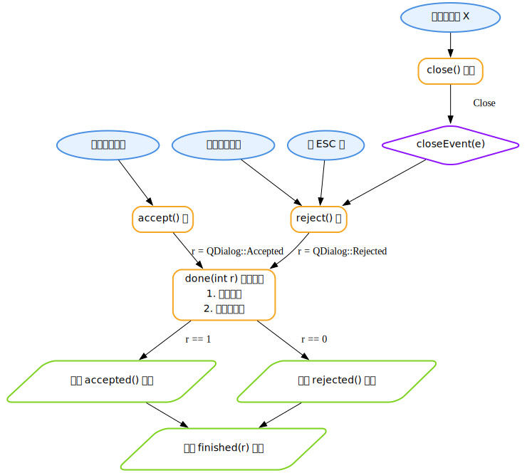
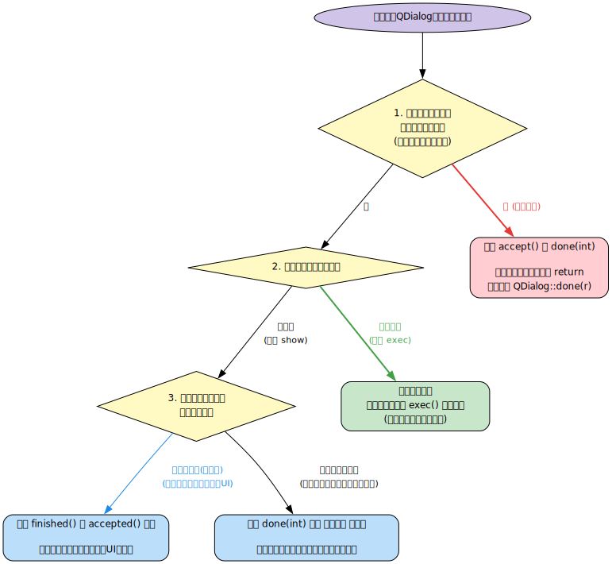

## 移动语义只是将所有权转移，并不会对原始指针造成影响
在 C++ 中，对于 `std::unique_ptr` 的移动语义，其核心机制仅操作“控制权”，不触及“数据内存”。

具体的事实依据与底层逻辑如下：

1. **底层内存未发生移动或改变**：堆内存中的对象始终停留在原有的物理地址，没有任何数据被拷贝或重新分配。原始指针（本质上是一个存储该物理地址的数值）依然指向该绝对地址。
2. **移动语义的本质是变量状态变更**：移动操作（通过移动构造函数或移动赋值运算符）的实际执行动作仅涉及两个智能指针内部成员变量的变更：
   - 将源智能指针内部的地址值复制给目标智能指针。
   - 将源智能指针内部的地址值修改为 `nullptr`。
3. **管理责任的移交**：移动语义只转移了对该内存执行 `delete` 操作的**责任主体**。

**逻辑约束补充**：
虽然移动语义本身不对原始指针造成任何物理或数据上的影响，但它改变了**决定原始指针生命周期的控制方**。从移动完成的那一刻起，原始指针何时失效、何时变为悬垂指针，不再由原智能指针决定，而是绝对依附于接收所有权的新智能指针的状态。
```cpp
#include <iostream>
#include <memory>

int main() {
    // 1. 初始化原始 unique_ptr
    std::unique_ptr<int> ptr1 = std::make_unique<int>(42);

    // 2. 通过 get() 获取原始指针
    int* raw_ptr = ptr1.get();

    // 3. 转移所有权：ptr1 -> ptr2
    std::unique_ptr<int> ptr2 = std::move(ptr1);

    // 【事实检验 1】：原 unique_ptr 已被清空
    std::cout << "ptr1 is null: " << (ptr1 == nullptr ? "true" : "false") << "\n";
    // 输出: ptr1 is null: true

    // 【事实检验 2】：原始指针依然有效，可读取数据
    std::cout << "Value via raw_ptr: " << *raw_ptr << "\n";
    // 输出: Value via raw_ptr: 42

    // 【事实检验 3】：通过原始指针修改内存，数据变化反映在新 unique_ptr 中
    *raw_ptr = 100;
    std::cout << "Value via ptr2: " << *ptr2 << "\n";
    // 输出: Value via ptr2: 100

    // 4. 强制新 unique_ptr 释放内存
    ptr2.reset(); 

    // 【结论】：在此行之后，raw_ptr 成为悬垂指针。
    // *raw_ptr = 200; // <- 若执行此行，即为未定义行为（UB）

    return 0;
}
```
## QTextEdit和QPlainTextEdit有什么区别
`QTextEdit`与`QPlainTextEdit`的核心区别在于底层布局引擎的实现机制，这决定了它们在文本解析能力、内存管理逻辑及性能表现上的差异。

以下是具体的结构性差异：

**1. 支持的数据与排版类型**
*   **QTextEdit**：设计用于处理富文本（Rich Text）。其布局引擎支持HTML 4子集，能够解析和渲染复杂的排版元素，包括多级列表、表格、浮动/内嵌图片、多层级字体及颜色样式。
*   **QPlainTextEdit**：设计用于处理纯文本（Plain Text）。尽管底层同样使用`QTextDocument`，但它使用的是`QPlainTextDocumentLayout`。该引擎将文本严格视为线性排列的段落块（Blocks）。它不支持表格、图片或复杂的层级排版，仅支持基于文本块的基础字符格式（如单行的字体颜色或加粗）。

**2. 性能表现与内存开销**
*   **QTextEdit**：在加载和渲染时，会在内存中构建并维持整个文档的完整DOM树和像素级精确的布局结构。当处理大体积文件（通常大于数兆字节或数万行）时，内存占用极大，且插入新文本或调整窗口大小会导致全局重新计算，引发严重的UI卡顿。
*   **QPlainTextEdit**：采用逐段落（逐行）的动态计算机制。它仅对当前视口（Viewport）可见的文本块及附近区域进行详细的几何布局计算，屏幕外的文本块不消耗渲染计算资源。这种机制使其内存开销远低于`QTextEdit`，能够以极高的帧率处理海量文本数据（如高频刷新的日志文件或极长的源代码）。

**3. 滚动条与几何计算逻辑**
*   **QTextEdit**：垂直滚动条的范围和步长基于文档所有元素精确的像素高度总和。
*   **QPlainTextEdit**：使用近似算法估算文档总高度。它假设每个段落的高度具有一致性，滚动条的滑块大小和位置基于段落数量（Block Count）而非精确像素。因此，当文档极长且包含不同折行数量的段落时，滚动条滑块的长度在滚动过程中可能会出现动态缩放。

**结论适用条件：**
*   若应用场景需要展示或编辑HTML、表格、图片混合排版，必须使用 `QTextEdit`。
*   若应用场景为日志输出窗口、源代码编辑器或处理大于1MB的纯文本文件，必须使用 `QPlainTextEdit` 以避免性能崩溃。
## c_str() and data() perform the same function.
https://en.cppreference.com/w/cpp/string/basic_string/c_str.html
## Qt右上角X或按键盘esc关闭对话框是否会触发reject
**两者的底层行为和触发机制并不相同。** 需要严格区分**槽函数（`reject()` 虚函数）**和**信号（`rejected()`）**。

事实如下：

### 1. 按键盘 Esc 键
- **机制**：触发 `QDialog::keyPressEvent(QKeyEvent *e)`。
- **行为**：Qt 的默认实现会识别 `Qt::Key_Escape`，并**直接调用 `QDialog::reject()` 虚槽函数**。
- **结果**：会触发 `reject()` 槽函数，随后由该槽函数发出 `rejected()` 信号并以 `QDialog::Rejected` 退出事件循环。

### 2. 点击右上角 X 按钮
- **机制**：产生一个窗口关闭事件，触发 `QDialog::closeEvent(QCloseEvent *e)`。
- **行为**：Qt 的默认 `closeEvent` 实现会直接退出事件循环，设定返回值为 `QDialog::Rejected`，并直接发出 `rejected()` 信号。
- **结果**：**不会调用 `QDialog::reject()` 槽函数**。它绕过了该函数，直接发出了信号。

---

### 开发中的实际影响与推断

这种机制差异会导致一个常见的逻辑漏洞：如果你为了在“取消”或“关闭”时执行特定逻辑（例如：二次确认是否放弃修改），而**仅重写了 `virtual void reject()` 函数**：
- 按 Esc 键：会执行你的重写逻辑。
- 点右上角 X：会**绕过**你的重写逻辑，对话框直接关闭。

### 逻辑一致性的解决方案
若要确保点击“取消按钮”、按“Esc键”、点击“右上角X”三者的行为完全一致，必须同时拦截事件：

```cpp
// 1. 重写 reject() 处理 Esc 和 取消按钮
void MyDialog::reject() {
    // 你的自定义逻辑（如确认弹窗）
    // ...
    QDialog::reject(); // 最终调用父类方法关闭
}

// 2. 重写 closeEvent() 处理右上角 X
void MyDialog::closeEvent(QCloseEvent *event) {
    // 将 X 按钮的行为重定向到 reject()
    event->ignore(); 
    this->reject();
}
```

**结论：** 
按 Esc 会触发 `reject()` 槽函数；点击 X 不会触发 `reject()` 槽函数，但会触发 `rejected()` 信号并返回相同的状态码。如果需要统一控制，必须通过重写 `closeEvent` 消除这种差异。
## QDialog对话框关闭流程
```gv
digraph QDialog_Close_Flow {
    fontname = "SimHei";
    rankdir = TB;
    
    // 样式定义
    node [fontname = "SimHei"; penwidth = 2;];
    
    // 用户操作 (椭圆)
    node [shape = ellipse; color = "#4A90E2"; style = filled; fillcolor = "#E6F2FF";];
    act_ok [label = "点击确定按钮";];
    act_cancel [label = "点击取消按钮";];
    act_x [label = "点击右上角 X";];
    act_esc [label = "按 ESC 键";];
    
    // Qt 内置槽函数 (矩形)
    node [shape = box; style = rounded; color = "#F5A623"; fillcolor = "#FFF0D4";];
    slot_accept [label = "accept() 槽";];
    slot_reject [label = "reject() 槽";];
    slot_close [label = "close() 函数";];
    slot_done [label = "done(int r) 核心方法\n1. 隐藏窗口\n2. 设置返回码";];
    
    // 事件 (菱形)
    node [shape = diamond; color = "#9013FE"; fillcolor = "#F4E6FF";];
    event_close [label = "closeEvent(e)";];
    
    // 信号 (平行四边形)
    node [shape = parallelogram; color = "#7ED321"; fillcolor = "#EFFFF0";];
    sig_accepted [label = "发出 accepted() 信号";];
    sig_rejected [label = "发出 rejected() 信号";];
    sig_finished [label = "发出 finished(r) 信号";];
    
    // 逻辑流向
    act_ok -> slot_accept;
    act_cancel -> slot_reject;
    act_esc -> slot_reject;
    
    act_x -> slot_close;
    slot_close -> event_close [label = "产生 Close 事件";];
    event_close -> slot_reject [label = "默认实现";];
    
    // 拦截点提示 (可选)
    // event_close -> "event->ignore()" [label="如果拦截\n中止关闭", style=dashed, color=gray];
    
    slot_accept -> slot_done [label = " r = QDialog::Accepted";];
    slot_reject -> slot_done [label = " r = QDialog::Rejected";];
    
    slot_done -> sig_accepted [label = "如果 r == 1";];
    slot_done -> sig_rejected [label = "如果 r == 0";];
    
    sig_accepted -> sig_finished;
    sig_rejected -> sig_finished;
}
```

## C++/Qt中我要在QDialog对话框关闭后执行某些操作，应重写done还是创建关联finished的槽函数？
在C++/Qt中，决定是**重写 `done()`** 还是 **关联 `finished()` 槽函数**，主要取决于**你的操作属于谁（调用者还是对话框自身）**，以及**对话框是模态还是非模态**。

没有绝对的对错，只有最适合的应用场景。以下是详细的场景分析和建议：

---

### 第一种情况：建议关联 `finished()`（或 `accepted()` / `rejected()`）槽函数

**适用场景：** 对话框关闭后的操作属于**调用者**（比如 MainWindow）。调用者需要根据对话框的返回值更新自己的UI、读取对话框中的数据等。

**优点：** 符合Qt的信号槽机制，**低耦合**。对话框不需要知道它是被谁调用的，只需要负责发射信号。

**用法示例（非模态对话框 `show()`）：**
```cpp
MyDialog *dialog = new MyDialog(this);
// 也可以关联 accepted()（点击确定）或 rejected()（点击取消）
connect(dialog, &QDialog::finished, this, [=](int result){
    if (result == QDialog::Accepted) {
        // 执行操作，例如获取对话框中的数据
        QString data = dialog->getData();
        updateUI(data);
    }
    dialog->deleteLater(); // 如果没有设置 WA_DeleteOnClose，记得清理内存
});
dialog->show();
```

---

### 第二种情况：建议重写 `done(int r)`（或 `accept()` / `reject()`）

**适用场景：** 操作属于**对话框内部逻辑**。比如：对话框关闭前需要保存自身的配置、清理自行申请的特定资源，或者**你需要根据某些条件阻止对话框关闭**。

**优点：** 逻辑封装在对话框类内部，高内聚。

**用法示例：**
```cpp
void MyDialog::done(int r)
{
    if (r == QDialog::Accepted) {
        // 如果用户点击了确定，验证数据
        if (!isDataValid()) {
            QMessageBox::warning(this, "错误", "数据不合法，无法关闭！");
            return; // 直接 return，不调用父类的 done()，对话框就不会关闭
        }
        // 保存内部设置
        saveInternalSettings();
    }
  
    // 资源清理等操作...

    // 必须调用父类的 done，否则对话框无法真正关闭
    QDialog::done(r); 
  
    // 注意：尽量不要在 QDialog::done(r) 之后写访问成员变量的代码，
    // 因为如果设置了 Qt::WA_DeleteOnClose，此时对象可能正在被销毁。
}
```

---

### 第三种情况：最简单且最常用的方法（模态对话框 `exec()`）

如果你使用的是**模态对话框**（通过 `exec()` 阻塞调用），你**既不需要重写 `done`，也不需要写槽函数**。直接在 `exec()` 返回后执行操作即可。

**适用场景：** 绝大多数需要阻塞等待用户选择的弹出窗口。

**用法示例：**
```cpp
MyDialog dialog(this);
if (dialog.exec() == QDialog::Accepted) {
    // 此时对话框已经在屏幕上消失（关闭）了
    // 可以在这里安全地获取数据并执行后续操作
    QString data = dialog.getData();
    // 执行特定操作...
} else {
    // 用户取消了操作
}
```

---

### 总结与原则

你可以根据以下三个问题来快速做出选择：

1. **你用的是 `exec()` 还是 `show()`？**
   * 如果是 `exec()` $\rightarrow$ 直接把操作写在 `exec()` 返回之后的代码里。
2. **需要阻止对话框关闭吗？（比如数据校验没通过）**
   * 需要 $\rightarrow$ 重写 `accept()` 或 `done()`。
3. **关闭后的业务逻辑属于谁？**
   * 属于主窗口（更新外部UI） $\rightarrow$ 关联 `finished()` / `accepted()` 信号。
   * 属于对话框自身（保存对话框内部状态） $\rightarrow$ 重写 `done()` 或放在析构函数中。

```gv
digraph QtDialogDecision {
    // 全局属性设置，指定支持中文的字体
    graph [fontname = "Microsoft Yahei, sans-serif"; rankdir = TB; nodesep = 0.8; ranksep = 0.8;];
    node [fontname = "Microsoft Yahei, sans-serif"; fontsize = 12;];
    edge [fontname = "Microsoft Yahei, sans-serif"; fontsize = 11;];
    
    // --- 定义节点 ---
    
    // 起点
    start [shape = oval;style = filled;fillcolor = "#D1C4E9";label = "需求：在QDialog关闭后执行操作";];
    
    // 判断节点 (菱形)
    check_block [shape = diamond;style = filled;fillcolor = "#FFF9C4";label = "1. 是否需要根据条件\n阻止对话框关闭？\n(如：数据校验未通过)";];
    check_modal [shape = diamond;style = filled;fillcolor = "#FFF9C4";label = "2. 对话框是如何显示的？";];
    check_owner [shape = diamond;style = filled;fillcolor = "#FFF9C4";label = "3. 关闭后的业务逻辑\n主要属于谁？";];
    
    // 结论节点 (圆角矩形)
    action_override_block [shape = box;style = "rounded,filled";fillcolor = "#FFCDD2";label = "重写 accept() 或 done(int)\n\n在满足阻止条件时直接 return\n否则调用 QDialog::done(r)";];
    action_exec [shape = box;style = "rounded,filled";fillcolor = "#C8E6C9";label = "最简单方法：\n直接将代码写在 exec() 返回之后\n(无需重写，无需信号槽)";];
    action_signal [shape = box;style = "rounded,filled";fillcolor = "#BBDEFB";label = "关联 finished() 或 accepted() 信号\n\n优点：低耦合，主窗口更新UI最常用";];
    action_override_done [shape = box;style = "rounded,filled";fillcolor = "#BBDEFB";label = "重写 done(int) 或在 析构函数 中处理\n\n优点：高内聚，适合保存对话框内部状态";];
    
    // --- 定义连接线与逻辑流向 ---
    
    start -> check_block;
    
    // 第一个判断分支
    check_block -> action_override_block [label = " 是 (需要阻止)"; color = "#E53935"; fontcolor = "#E53935"; penwidth = 2;];
    check_block -> check_modal [label = " 否";];
    
    // 第二个判断分支
    check_modal -> action_exec [label = " 模态阻塞\n(使用 exec) "; color = "#43A047"; fontcolor = "#43A047"; penwidth = 2;];
    check_modal -> check_owner [label = " 非模态\n(使用 show) ";];
    
    // 第三个判断分支
    check_owner -> action_signal [label = " 属于调用者(主窗口)\n(如：获取数据并更新主UI)"; color = "#1E88E5"; fontcolor = "#1E88E5";];
    check_owner -> action_override_done [label = " 属于对话框自身\n(如：保存自身配置或清理资源)";];
}
```

## Qt中QDialog的信号accepted/rejected/finished三者有什么关系？
在Qt中，`QDialog`（对话框）的 `accepted()`、`rejected()` 和 `finished(int result)` 这三个信号之间存在着**包含与被包含的因果关系**。

简单来说：**`finished` 是总信号（只要对话框关闭就会触发），而 `accepted` 和 `rejected` 是特定条件下的子信号。**

下面为您详细拆解它们的关系和底层逻辑：

### 1. 核心底层机制：`done(int)`
要理解这三个信号，首先必须知道 `QDialog` 的一个核心函数：`done(int result)`。
* 无论你用什么方式关闭对话框，底层最终都会调用 `done(int result)` 函数。
* `done(int result)` 函数做了两件事：
  1. 隐藏对话框并设置返回值（`result`）。
  2. **发射 `finished(result)` 信号。**
  3. **根据 `result` 的值，选择性地附加发射 `accepted()` 或 `rejected()` 信号。**

---

### 2. 三者的具体区别与触发条件

#### ① `finished(int result)` —— 【万能信号，必定触发】
* **触发条件**：只要对话框结束（关闭），无论是因为确定、取消，还是自定义的关闭方式，这个信号**一定会**被发射。
* **参数**：带有一个整型参数 `result`，代表对话框的退出码。
* **特点**：支持自定义状态。比如你可以调用 `done(2)`，此时会发射 `finished(2)`（注意：此时不会触发 accepted 或 rejected，因为状态码不是0或1）。

#### ② `accepted()` —— 【代表“确定/成功”】
* **触发条件**：当对话框以**接受（Accept）**状态结束时触发。
* **底层对应**：对应退出码 `QDialog::Accepted`（值为 1）。
* **常见触发场景**：
  * 程序中主动调用了 `accept()` 槽函数。
  * 用户点击了连接到 `accept()` 的按钮（如常见的 "OK" 按钮）。
  * 相当于底层调用了 `done(QDialog::Accepted)`。

#### ③ `rejected()` —— 【代表“取消/失败”】
* **触发条件**：当对话框以**拒绝（Reject）**状态结束时触发。
* **底层对应**：对应退出码 `QDialog::Rejected` (值为 0)。
* **常见触发场景**：
  * 程序中主动调用了 `reject()` 槽函数。
  * 用户点击了连接到 `reject()` 的按钮（如 "Cancel" 按钮）。
  * **用户按下了键盘的 `Esc` 键**。
  * **用户点击了窗口右上角的关闭按钮（'X'）**。
  * 相当于底层调用了 `done(QDialog::Rejected)`。

---

### 3. 触发流程总结

| 用户的操作 / 代码调用 | 底层调用的函数 | 触发的信号（顺序） | 退出码 (Return Code) |
| :--- | :--- | :--- | :--- |
| 点击“确定” / 调用 `accept()` | `done(QDialog::Accepted)` | 先 `accepted()`，后 `finished(1)` | 1 (`QDialog::Accepted`) |
| 点击“取消” / 按Esc / 点X / 调用 `reject()` | `done(QDialog::Rejected)` | 先 `rejected()`，后 `finished(0)` | 0 (`QDialog::Rejected`) |
| 调用自定义退出码 `done(88)` | `done(88)` | 只有 `finished(88)` | 88 |

*注：在Qt源码实现中，`accepted()` / `rejected()` 和 `finished()` 的发射顺序可能因Qt版本微调，但它们总是在同一次事件循环中接连触发。*

---

### 4. 实际开发中应该用哪个？

* **只关心成功时**：使用 `accepted()`。
  * *场景*：只有当用户填好了所有表单并点击“确定”时，你才干活。如果用户点取消或直接关窗口，你什么都不用做。
* **只处理取消时**：使用 `rejected()`。
  * *场景*：用户取消了操作，你需要清理一些临时生成的缓存文件。
* **无论如何都要收尾 / 需要判断多种状态**：使用 `finished(int)`。
  * *场景 1*：不管用户是点确定还是取消，你都要释放某些指针或恢复主窗口的状态。
  * *场景 2*：你的对话框不仅有“确定”和“取消”，还有“全部应用”、“暂不处理”等多种自定义操作，你通过 `done(2)`、`done(3)` 传递了不同的退出码，此时只能用 `finished(int)` 并通过 `switch(result)` 来分别处理。