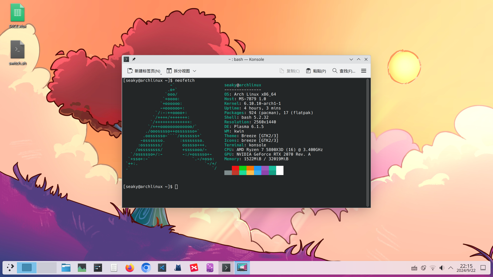

## 0.引子
### 为什么要使用linux作为桌面系统
- 免费
- 综合来说安全性更高
- 可定制性和可掌控性更高，杜绝商业公司系统后台偷偷跑程序
- 强大的包管理，对开源项目友好
- 更有利于对linux及相关技术栈的学习和熟悉
- ...

### 为什么要使用arch linux这个发行版
- 文档完善(archwiki)
- 用户数足够多，碰到问题，较容易在网上找到答案
- 滚动更新，体验最现代化的技术
- 社区发行版，不受到商业公司裹挟，隐私保护也更好
- 遵循KISS原则，非OOTB，适合折腾和学习


关于arch linux中文介绍见此页面：

https://wiki.archlinuxcn.org/wiki/Arch_Linux

### 为什么要使用kde plasma这个桌面环境
- 界面较为现代化、美观
- 默认配置与windows类似，无缝适应
- 主流桌面环境中唯一一个对分数缩放支持较好的

kde plasma桌面截图：

关于kde plasma中文介绍见此页面：

https://kde.org/zh-cn/plasma-desktop/

---
**（后续教程非傻瓜教程，如有不理解请配合查阅archwiki或google/baidu）**
## 1.系统安装
### 安装介质选择
#### 本地硬盘
考虑使用rufus制作arch linux的USB启动盘，若bios无法读取，请重新烧录使用DD模式
#### 外接移动硬盘
使用虚拟机加载iso，安装时选择外接移动硬盘作为安装介质。

这样做的好处：
- 在虚拟机中进行安装，自动连接本机网络，省得配置网络
- 在虚拟机中进行安装，可在安装时随时查阅资料
- 在外接移动硬盘中安装的操作系统，后续可同时在虚拟机或物理机中启动，方便且遇到硬件问题容错更高

### 具体安装流程
在下载完成iso，烧录到启动u盘（或虚拟机加载），在bios加载安装介质后，进入live cd模式命令行界面。
- 配置网络（如在虚拟机环境，可忽略）
	- 使用iwctl，具体可参考 https://linux.cn/article-15067-1.html
- 输入`archinstall`启动安装脚本（不嫌麻烦可以根据archwiki手动安装配置）
- 进入安装选项，选择Mirrors-Mirror region-China，然后Back回退（后续选择选择后均Back回退至安装选项目录）
- 选择Locale-Locale language-zh_CN.UTF-8（按需选择，需要其它系统语言均可）
- 选择Disk configuration-Partitioning-第一项-选择要安装linux系统的硬盘-选择btrfs格式（对其它几个格式有了解也可以按需选择）-yes-Use compression（按需选择是否要使用压缩和写时复制）
- Boot loader确保为grub
- 选择Root password设置根密码（输入密码不会显示到界面中，正常现象）
- 选择User account，创建新用户，然后Confirm and exit
- 选择Profile-type-Desktop-KDE Plasma
- 选择Graphic driver，根据archwiki对应自身显卡品牌页面（如NVIDIA），选择应安装的显卡驱动类型。
- 选择Audio-Pipewire
- 选择Additional packages，输入`firefox kwalletmanager fcitx5-rime fcitx5-qt fcitx5-gtk adobe-source-han-sans-cn-fonts filelight`（为一些预装的软件包，其中adobe-source-han-sans-cn-fonts非常重要，使系统获得中文支持，也可以查看archwiki安装可替代的包）
- 选择Network configuration-第二项（networkmanager）
- 选择Timezone-Asia/Shanghai（你所在时区的城市）
- 选择install进行安装
- 安装完成后选择no，输入shutdown -h now，关机后拔出启动u盘。在bios中设定linux启动支持（如关闭安全启动，默认启动盘设定为linux安装硬盘等）重新开机，即可正常登录系统

## 2.安装后设置
### 开机后中文输入法提示处理
系统设置-虚拟键盘-选择Fcitx 5
### 设置自动登录
系统设置-颜色与主题-登录屏幕（SDDM）-行为-勾选自动登录-应用
### 设置密码库密码为空（防止开机时连接wifi需要输密码）
系统设置-KDE密码库-启动密码库管理器-更改密码-直接确定-是-应用
## 3.kde plasma终端入口
左下角应用程序入口-系统-Konsole终端

或使用快捷键`CTRL+ALT+T`
## 4.软件安装相关
### 4.1.pacman
pacman为arch linux默认包管理器

设置镜像参考：https://mirrors.sjtug.sjtu.edu.cn/docs/archlinux

常用命令：
- 更新系统及pacman安装的软件包：`sudo pacman -Syu`
- 安装软件包 ：`sudo pacman -S 软件包名`
- 删除软件包及其相关依赖：`sudo pacman -Rs 软件包名`

备注：安装或更新后有时需要手动重启操作系统才能生效
### 4.2.安装本地软件包
一般用以安装有特殊功能或不在包管理工具中的开源软件，如clash for windows等

需要`.pkg.tar.zst`格式的软件包安装文件

（没有这种格式的话通过其它转换格式工具转，例如debtap）

命令：`sudo pacman -U 软件包全路径`
### 4.3.flatpak
一个跨发行版的包管理器，flatpak需要手动安装

设置镜像参考：https://mirrors.sjtug.sjtu.edu.cn/docs/flathub

后续即可使用Discover软件中心自行安装软件包（每次打开可能需要稍待片刻）
### 4.4.yay
主要用以安装aur软件包

aur介绍及默认方式软件包安装参考：https://wiki.archlinux.org/title/Arch_User_Repository

yay是一个aur助手，本身也是一个aur软件包，在没有其它aur助手的情况下需要按照默认方式安装

安装后可以很方便地安装aur软件包

常用命令：
- 更新系统、pacman软件包、aur软件包：`yay`
- 安装软件包：`yay 软件包名`

## 5.图形平台
- wayland：先进，新特性（分数缩放、色彩特性等）支持更好
- x11：传统，兼容性更好（尤其对老软件、virtualbox等）

一般默认使用wayland，碰到运行出问题的切换至x11

切换方式：系统设置-颜色与主题-行为-使用会话下拉框切换

或通过bash脚本形式：
```bash
if grep -q "plasmax11" "/etc/sddm.conf.d/kde_settings.conf"; then
    sudo sed -i "s/plasmax11/plasma/g" "/etc/sddm.conf.d/kde_settings.conf"
    echo "Switch to Wayland"
else
    sudo sed -i "s/plasma/plasmax11/g" "/etc/sddm.conf.d/kde_settings.conf"
    echo "Switch to X11"
fi
```
## 6.一些使用经验
### 备份工具：timeshift
推荐使用方式：在进行风险操作前，先将系统更新，重启备份。

如果直接备份，可能会由于滚动更新的原因，回退后无法进入系统。（也因此尽量避免使用timeshift回退）如回滚后无法进入系统，可尝试通过chroot更新系统的方式解决。
### 截图工具：spectacle
### 关闭屏幕保护：
系统设置-锁屏-自动锁定屏幕切换为“不自动锁屏”

系统设置-电源管理-关闭屏幕设为“从不”
### 环境变量设置
在`/etc/environment`文件中添加
### x11应用中文输入法失效的问题
对于Fcitx5，添加环境变量`XMODIFIERS=@im=fcitx`
### 自定义命令行
home/xxx/.bashrc中添加alias xxxx="xxxxxxxx"

如添加`alias ppp="sudo pacman -Syu"`即可在命令行中输入ppp更新系统，方便很多
### 禁用蜂鸣器
参考https://wiki.archlinux.org/title/PC_speaker

现在版本貌似默认禁用了？
### 音箱在中音或低音没声音的问题
先调到模拟高音量，然后再调到数字
### NVIDIA显卡驱动相关
原则上按照wiki处理https://wiki.archlinux.org/title/NVIDIA

对于新显卡，貌似都应该选择nvidia-open？

drm kernel mode设置
- 创建自命名配置文件至/etc/modprobe.d/
- 按照说明添加内核变量

我电脑上是：
```
options nvidia_drm modeset=1
options nvidia_drm fbdev=1
```
若出现多出屏幕的问题，加内核参数至grub中禁用
- 编辑/etc/default/grub
- video=Unknown-1:d
- 参考https://wiki.archlinux.org/title/Nouveau#Phantom_output_issue

若wayland下有黑屏现象，则/etc/modprobe.d/增加
- options nvidia_drm fbdev=1
- 参考https://bbs.archlinux.org/viewtopic.php?id=295918

### 在grub引导中添加本机的windows入口
参考：https://wiki.archlinux.org/title/GRUB#Detecting_other_operating_systems 第4.1.2节
- 记得挂上windows的硬盘
- 执行grub-mkconfig时记得输出到对应目录

`sudo grub-mkconfig -o /boot/grub/grub.cfg`
### 外网相关
可参考：https://www.joeyne.cool/http/proxy/ubuntu-%e5%ae%89%e8%a3%85clash%e5%b9%b6%e9%85%8d%e7%bd%ae%e5%bc%80%e6%9c%ba%e5%90%af%e5%8a%a8/

主文件夹.bashrc中增加：
```bash
alias proxy="export http_proxy=http://127.0.0.1:7890;export https_proxy=http://127.0.0.1:7890"
alias unproxy="unset http_proxy;unset https_proxy"
```
测试：`curl -i google.com`
### vscode安装
安装开源版本`sudo pacman -S code`

获取获取vscode市场`yay -S  code-marketplace`
### 机箱风扇控制：fancontrol-gui
### 在wayland中使用qt软件
安装qt5-wayland及qt6-wayland包
### 在wayland中使用electron软件
添加环境变量：`ELECTRON_OZONE_PLATFORM_HINT=auto`
### vscode/obsidian等electron程序中文输入法问题
运行参数增加`--enable-features=UseOzonePlatform --ozone-platform=wayland --enable-wayland-ime`

应用程序右键-编辑应用程序-应用程序-参数-加空格，将上述字符串添加

参考：https://fcitx-im.org/wiki/Using_Fcitx_5_on_Wayland#Chromium_.2F_Electron
### chroot相关
参考：https://wiki.archlinux.org/title/Chroot
```
# mount -o subvol=@ /dev/sdXY /mnt
# mount -o subvol=@home /dev/sdXY /mnt/home
# mount -o subvol=@pkg /dev/sdXY /mnt/var/cache/pacman/pkg
# mount -o subvol=@log /dev/sdXY /mnt/var/log
# mount /dev/sdXZ /mnt/boot
# arch-chroot /mnt
```
### 列出存在的分区
`lsblk -f`
### 命令行删除文件夹
`rm -r folderName`
参考：https://www.runoob.com/linux/linux-comm-rm.html
### virtualbox
- 安装时选择virtualbox-host-modules-arch，装好后重启
- 将当前用户添加至vboxusers用户组中，重启

/etc/group中`vboxusers:x:108:`后添加用户名
### 系统更新后出现异常
尝试更换上游镜像处理（如清华源）

推测可能是组件推送时间有先后，镜像正好截取了中间时间点
### 查看系统信息
neofetch/fastfetch