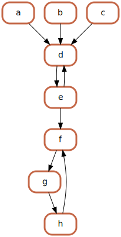

## 什么是 Graphviz？
Graphviz 是一种开源的图形可视化软件。图形可视化是一种将结构性信息表示为抽象图和网络的方式。它在网络、生物信息学、软件工程、数据库和网页设计、机器学习以及其他技术领域的可视化界面中有着重要的应用。
## 功能
Graphviz 布局程序使用一种简单的文本语言描述图形，并生成有用格式的图表，例如网页上的图像和 SVG 格式；用于插入其他文档的 PDF 或 Postscript；或在交互式图形浏览器中展示。Graphviz 提供了许多实用的功能来绘制具体图表，例如颜色、字体、表格节点布局、线条样式、超链接以及自定义形状等选项。
## 例子

通过graphviz由以下dot代码生成上图：
```
file name: example.gv
digraph example{
    fontname = "SimHei";

    node [penwidth=3, fontname="SimHei"]
    node [color="#c46747"]
    node [shape = box, style=rounded]

    a,b,c->d
    d->e
    e->d
    e->f
    f->g
    g->h
    h->f
}
```
更多例子：
https://graphviz.org/gallery/
## 使用场景
有一定复杂度的有向图或无向图(太简单的可以手动布线，太复杂的不适合在平面展示)，由程序根据依赖关系自动绘图。如程序流程图、库依赖图等。
## 使用方式
### 方式1：vscode扩展（推荐）
vscode扩展搜索graphviz挑选扩展安装或从VSIX安装未上架的扩展（如`joaompinto.vscode-graphviz`）。
### 方式2：专门的程序
KGraphViewer和xdot等，功能比较局限，不推荐
### 方式3：命令行
须按官网说明安装graphviz，比较进阶，一般不用
由gv文件生成png图例子：
`dot -Tpng example.gv -o example.png`
## 语法
参考官网gallery，更详细参考官网文档：
https://graphviz.org/documentation/
（常用的其实不多，可以形成自己的套路）

## 前人之述
https://program-think.blogspot.com/2016/02/opensource-review-graphviz.html